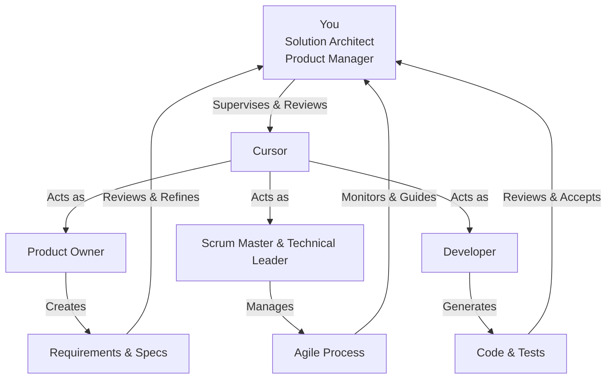

# Using Cursor AI as Your Virtual Scrum Team



## Introduction

- Brief overview of AI pair programming
- Why I chose to experiment with Cursor
- The unique approach of treating Cursor as a full Scrum team

## Setting Up the Development Environment

- Initial setup of Cursor
- Configuring custom instructions
- Establishing coding standards and guidelines

## Working with Cursor as a Product Owner

- How to communicate requirements
- Breaking down features into tasks
- Managing the backlog

### Real examples of requirement discussions

Context: I'm working on a feature to allow users to follow other users. The feature will be used in notification module and content distribution module. Notification module and content distribution module are already implemented.

My prompt:

```plaintext
As a Product Owner, I need to design the follow feature between user. This feature use in notification and content distribution feature.

- write feature design to @business.md 
- add new tables to @schema.prisma. Add index to reduce query time
- add tasks to @backlog.md 
```

Cursor response:

#### business.md

```markdown
## User Following System

### 1. User Following Lifecycle

\```mermaid
stateDiagram-v2
    [*] --> Discover: Find Users
    Discover --> Follow: Follow User
    Follow --> Unfollow: Unfollow User
    Unfollow --> Follow: Follow Again
    Follow --> Notify: Generate Notifications
    Follow --> Feed: Prioritize Content
\```

1. User Discovery
   - Methods:
     - Search by name/username
     - Suggested users based on interests
     - Content engagement patterns
     - Mutual connections
   - Features:
     - User profiles with activity summaries
     - Follow counts and metrics
     - Content previews

2. Following Mechanism
   - Actions:
     - Follow: Create connection
     - Unfollow: Remove connection
   - States:
     - Following: User A follows User B
     - Follower: User B is followed by User A
     - Mutual: Both users follow each other
   - Privacy:
     - Public following lists by default
     - Option for private following

3. Notification Integration
   - Triggers:
     - New follower notifications
     - Followed user activity notifications
     - Priority notifications for followed users
   - Controls:
     - Granular notification preferences
     - Activity threshold filtering
     - Batch notification options

4. Content Distribution
   - Feed Impact:
     - Higher ranking for followed users' content
     - Dedicated "Following" feed option
     - Mixed feed with followed/recommended content
   - Discovery:
     - "People you might know" suggestions
     - "Popular among followers" content
     - Interest-based user recommendations

### 2. Following Analytics

\```mermaid
stateDiagram-v2
    [*] --> Metrics: Track Metrics
    Metrics --> Insights: Generate Insights
    Insights --> Recommendations: Create Recommendations
    Recommendations --> [*]
\```

1. User Metrics
   - Following count
   - Follower count
   - Follower growth rate
   - Engagement from followers
   - Follow-back rate

2. Content Impact
   - Reach amplification
   - Engagement rate from followers vs. non-followers
   - Content distribution effectiveness
   - Notification response rates

3. Network Analysis
   - Connection clusters
   - Influence mapping
   - Interest groupings
   - Content propagation patterns
```

#### schema.prisma

```prisma
// Add this model for user following relationships
model UserFollow {
  id           String   @id @default(uuid())
  followerId   String   @map("follower_id")
  followingId  String   @map("following_id")
  createdAt    DateTime @default(now()) @map("created_at") @db.Timestamptz()
  
  // Relations
  follower     User     @relation("UserFollowers", fields: [followerId], references: [id], onDelete: Cascade)
  following    User     @relation("UserFollowing", fields: [followingId], references: [id], onDelete: Cascade)

  @@unique([followerId, followingId])
  @@index([followerId])
  @@index([followingId])
  @@map("user_follows")
}
```

#### backlog.md

```markdown
### SOC-006: User Following System

1. Requirements:
   - Implement user following functionality
   - Allow users to follow/unfollow other users
   - Display follower and following counts on user profiles
   - Create a "Following" feed view showing only content from followed users
   - Implement notifications for new followers
   - Implement notifications for followed users' activities
   - Prioritize followed users' content in the main feed

2. Acceptance Criteria:
   - Users can follow/unfollow other users with a single click
   - User profiles display accurate follower and following counts
   - Users receive notifications when someone follows them
   - Users receive configurable notifications about followed users' activities
   - The main feed algorithm prioritizes content from followed users
   - A dedicated "Following" feed shows only content from followed users
   - Follow/unfollow actions are responsive (under 500ms)
   - Proper error handling for all operations
   - End-to-end tests verify the following functionality

3. Technical Notes:
   - Implement proper database indexing for efficient queries
   - Use the event bus for notifications
   - Ensure proper cache invalidation when follow status changes
   - Update feed scoring algorithm to consider follow relationships
   - Follow the established module structure pattern
   - Implement repository interfaces with dependency injection

4. Dependencies:
   - Common module with updated barrel exports
   - Social module for feed integration
   - Notification module for activity notifications
```

## Cursor as a Scrum Master & Technical Leader

- Sprint planning and task organization
- Progress tracking
- Issue management
- How Cursor helps maintain development flow

### Real examples of sprint planning

My prompt:

```plaintext
As a Scrum Master, plan the sprint 004 in @tasks.md and @status.md.
- Add SOC-006 and NOT-000 in @backlog.md to @tasks.md follow task template in @task-template.md and ### STEP 3: Create task specification in ## feature design process.
- Break task to small and simple sub tasks.
```

Cursor response:

#### tasks.md

```markdown
# Sprint 004 Planning

## Goals

- Implement user following system
- Refactor notification module following DDD principles
- Enhance content distribution with following-based prioritization
- Improve code quality and maintainability

## Tasks

### SOC-006: Implement User Following System

Status: To Do
Priority: High
Dependencies: None

### Context

- Currently, users cannot follow other users they're interested in
- Need to implement a following system to enhance content discovery and personalization
- This feature will be used by the notification system and content distribution

### Requirements

- Allow users to follow/unfollow other users
- Display follower and following counts on user profiles
- Create a "Following" feed view showing only content from followed users
- Implement notifications for new followers
- Prioritize followed users' content in the main feed

### Acceptance Criteria

1. Users can follow/unfollow other users with a single click
2. User profiles display accurate follower and following counts
3. Users receive notifications when someone follows them
4. The main feed algorithm prioritizes content from followed users
5. A dedicated "Following" feed shows only content from followed users
6. Follow/unfollow actions are responsive (under 500ms)
7. Proper error handling for all operations
8. End-to-end tests verify the following functionality

### Technical Notes

- Use the UserFollow model added to the Prisma schema
- Implement proper database indexing for efficient queries
- Use the event bus for notifications
- Ensure proper cache invalidation when follow status changes
- Update feed scoring algorithm to consider follow relationships
- Follow the established module structure pattern
- Implement repository interfaces with dependency injection

### Sub-tasks

1. Create module structure:
   - Create user-follow module and register in app.module.ts
   - Set up folder structure following module-structure.md
   - Create empty files for all components
   - Define interfaces and DTOs

2. Implement data layer:
   - Create repository interface for user follows
   - Implement Prisma repository
   - Add repository tests
   - Register repository in module

3. Implement service layer:
   - Create UserFollowService with follow/unfollow methods
   - Implement follower/following count methods
   - Add event publishing for follow actions
   - Add service unit tests

4. Implement API layer:
   - Create DTOs for request/response
   - Create controller with follow/unfollow endpoints
   - Add endpoints for getting followers/following lists
   - Add authentication guards
   - Add controller tests

5. Implement following feed:
   - Create service method to get content from followed users
   - Update feed scoring algorithm to prioritize followed users
   - Add "Following" feed endpoint
   - Add feed tests

6. Implement notification integration:
   - Create event handlers for follow events
   - Add notification creation for new followers
   - Test notification flow

7. Add end-to-end tests:
   - Test follow/unfollow functionality
   - Test following feed
   - Test notification generation

... the rest of the tasks and sub-tasks are similar to the above tasks.
```

#### status.md

First version

```markdown
# Sprint 004 Status

## Sprint Goals

- Implement user following system
- Refactor notification module following DDD principles
- Enhance content distribution with following-based prioritization
- Improve code quality and maintainability

## Progress

### SOC-006: Implement User Following System

Status: Not Started
Assigned: TBD
Due: End of Sprint

#### Implementation Steps

1. Create module structure
2. Implement data layer
3. Implement service layer
4. Implement API layer
5. Implement following feed
6. Implement notification integration
7. Add end-to-end tests

#### Blockers

None

... the rest of the tasks and sub-tasks are similar to the above tasks.

## Sub-task Progress

### SOC-006-1: Create User Follow Module Structure

Status: Not Started
Assigned: TBD
Due: Day 2

... the rest of the tasks and sub-tasks are similar to the above tasks.

## Daily Standup Notes

### Day 1

- Sprint planning completed
- Tasks assigned
- Development environment setup

### Day 2

- TBD

... the rest of the daily standup notes are similar to the above tasks.

## Retrospective

### What went well

- TBD

### What could be improved

- TBD

### Action items for next sprint

- TBD
```

In first version, cursor use common format that good for human SCRUM team. I just want to use simple format for cursor.

My prompt:

```plaintext
Make @status.md more simple. I just want to track task status and the rest of work, technical debt.
```

Cursor response:

Second version, cursor use simple format for task status.

```markdown
# Sprint 004 Status

## Tasks Status

### SOC-006: Implement User Following System

Status: Not Started
Priority: High
Due: End of Sprint

#### Remaining Work

- Create module structure
- Implement data layer (repository)
- Implement service layer
- Implement API layer (controller)
- Implement following feed
- Implement notification integration
- Add end-to-end tests

#### Blockers

None

### NOT-000: Refactor Notification Module following DDD

Status: Not Started
Priority: High
Due: End of Sprint

#### Remaining Work

- Create module structure
- Implement domain layer
- Implement data layer
- Implement service layer
- Implement presentation layer
- Implement MQTT integration
- Add end-to-end tests

#### Blockers

None

## Technical Debt

1. Performance Optimization
   - Implement rate limiting for APIs
   - Add performance monitoring for critical endpoints
   - Optimize database queries for feed generation

2. Code Quality
   - Standardize error handling across all modules
   - Complete barrel pattern implementation for all modules
   - Improve test coverage for core services

3. Documentation
   - Update API documentation for refactored endpoints
   - Document notification system architecture
   - Create developer guide for following system integration

## Next Sprint Candidates

- NOT-001: User Notification System
- REC-001: Content Recommendation Engine
- SOC-010: Refactor Comment APIs for Multi-Content Support
```

Second version is good enough for me. The technical debt seems to be project wide, not only for this sprint. However, I think it's good enough for now.

But wait, I look back to task list, ### SOC-006: Implement User Following System is complex. I need to break it down to smaller tasks.

My prompt:

```plaintext
Break down ### SOC-006: Implement User Following System in @tasks.md into smaller tasks. Each smaller task handle 1 item in requirement.
```

Cursor response:

```markdown
### SOC-006-1: Create User Following Module Structure

Status: To Do
Priority: High
Dependencies: None

### Context

- Need to establish the foundation for the user following system
- Must follow the established module structure pattern

### Requirements

- Create the module structure following DDD principles
- Define domain entities and interfaces
- Set up repository interfaces
- Create empty service and controller files

### Acceptance Criteria

1. Module structure follows the pattern in `/docs/module-structure.md`
2. All necessary files are created with proper naming conventions
3. Module is registered in the application

### Technical Notes

- Follow the folder structure in `/docs/module-structure.md`
- Create barrel files for clean exports
- Define clear interfaces for repositories and services

### Sub-tasks

1. Create module folder structure
2. Define domain entities (UserFollow)
3. Create repository interfaces
4. Set up empty service classes
5. Create controller skeletons
6. Register module in app.module.ts
```

Look better. Next, require cursor design API docs and attach to task description.

My prompt:

```plaintext
As a senior technical leader, design API docs for sub-tasks of ### SOC-006: Implement User Following System in @tasks.md and attach to task description.
```

Cursor response:

```markdown
### API Specification

\```typescript
// Follow a user
POST /api/v1/users/following/{targetUserId}

Request:
No body required

Response (201):
{
  id: string;
  followerId: string;
  followingId: string;
  createdAt: Date;
}

// Unfollow a user
DELETE /api/v1/users/following/{targetUserId}

Request:
No body required

Response (200):
No content
\```
```

Look good. I review and update task description a bit. Next, move on to code implementation.

## Cursor as a Developer

- Code generation capabilities
- Code review process
- Testing approach

### Real examples of code improvements

My prompt:

```plaintext
As a senior developer, follow the development process you implement tasks <XXXX> in @tasks.md. Follow code style in @technical.md and `/src/social`. After implementing the feature, update @tasks.md and @status.md.
```

Cursor response:

```markdown

```

## Best Practices I've Discovered

- Effective prompting techniques
- Review and validation strategies
- Managing complex features
- Handling edge cases

## Challenges and Solutions

- Common pitfalls
- Communication barriers
- Technical limitations
- How to overcome these challenges

## Results and Benefits

- Development speed improvements
- Code quality metrics
- Learning outcomes
- Team productivity gains

## Tips for Others

- Getting started recommendations
- Communication patterns that work
- When to use (and not use) Cursor
- Building effective workflows

## Conclusion

- Overall experience summary
- Future possibilities
- Recommendations for teams

## Resources

- Useful links and references
- Tools and plugins
- Documentation resources

Would you like me to elaborate on any of these sections or suggest additional content for specific areas?
