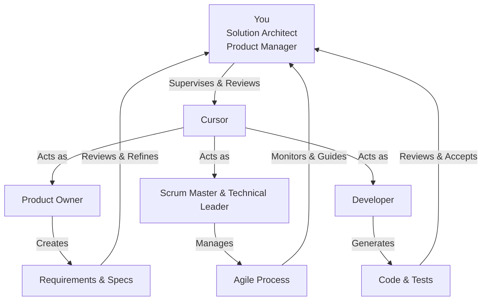

# Using Cursor AI as Your Virtual Scrum Team

As a solution architect, I've discovered that using Cursor AI as a virtual Scrum team significantly increases productivity and code quality. This approach allows me to focus on system design while leveraging AI capabilities across multiple development roles.



## Introduction

### Brief overview of AI pair programming

Pair programming has long been recognized as an effective way to improve developer skills in agile development. AI pair programming takes this concept further, creating a dynamic where you can guide the AI through code reviews and feedback, helping it better understand your project requirements and coding standards.

### Why Cursor?

Cursor stands out by providing:

- An IDE that makes reviewing generated code intuitive
- Clear visualization of code changes (similar to GitHub Pull Requests)
- A 14-day Pro trial period for comprehensive evaluation

### A Novel Approach: Full Scrum Team Simulation

Traditional AI coding assistants typically function as simple code generators. However, I've developed a more comprehensive approach by treating Cursor as a complete Scrum team:

- **Product Owner**: Helps design features and maintain requirements
- **Scrum Master**: Assists with process management
- **Technical Leader**: Ensures architectural consistency
- **Developer**: Generates code and maintains documentation

This approach provides several benefits:

- Better context retention through structured documentation
- Improved code quality through consistent standards
- More efficient feature implementation
- Enhanced project organization

### Pros and Cons of Cursor

Cursor, being powered by LLM, has both advantages and limitations

#### Pros

- Can handle many roles: Product Owner, Scrum Master, Technical Leader, Developer, etc.
- Have good knowledge of many domains.
- Good at programming.
- Understand the project context and code base.

#### Cons

- Limited memory retention, it just remember what you tell it in current session. When start a new session, cursor automatically summarize the previous conversation but it's not good enough.
- It's generalist, it doesn't know specific things about your project.

## Setting Up the Development Environment

### Initial Setup of Cursor

1. Download and install Cursor from [website](https://www.cursor.com/en/pricing)
2. Sign up for a Cursor account (14-day Pro trial available)
3. Open your project folder in Cursor
4. Install recommended extensions for your tech stack

### Configuring Custom Instructions

1. Create a `.cursorrules` file in your project root
2. Define project-specific rules:
   - Code style preferences
   - Project structure requirements
   - Common patterns to follow
   - Error handling conventions
3. Add reference documentation:
   - `/docs/technical.md` for technical guidelines
   - `/docs/business.md` for domain knowledge
   - `/docs/module-structure.md` for architecture patterns

### Establishing Coding Standards and Guidelines

1. Document core principles:
   - Architecture patterns (DDD, Clean Architecture)
   - Code organization rules
   - Naming conventions
   - Testing requirements
2. Create example modules:
   - Reference implementation with best practices
   - Common patterns and structures
   - Error handling examples
   - Test case templates
3. Set up linting and formatting:
   - ESLint/TSLint configuration
   - Prettier settings
   - Git hooks for pre-commit checks

I set up the example project in [base-api-service](https://github.com/reallongnguyen/base-api-service). This project is a NestJS project with Prisma ORM, Postgres, Redis, and Docker. I provide various prompts in `/docs/prompt.md`. You can clone it and try it out.

## Results and Benefits

### 1. Development Speed Improvements

Using Cursor AI as a virtual Scrum team has dramatically improved development velocity:

- **5x Faster Development**: Focus on system design while Cursor handles implementation details
- **Rapid API Development**:
  - Best case: Complete API implementation in ~10 minutes
  - Average case: 30-45 minutes including review and refinement
  - Worst case: Still faster than manual coding due to boilerplate generation

> 💡 **Time Savings Example**: A typical CRUD module with 5 endpoints, DTOs, and tests:
>
> - Manual coding: 4-6 hours
> - With Cursor: 1-1.5 hours including review

### 2. Code Quality Improvements

Cursor consistently maintains high code quality standards:

#### Architecture & Design

- Enforces DDD principles and clean architecture
- Maintains consistent module structure
- Follows SOLID principles automatically

#### Database & Performance

- Generates optimized database schemas
- Automatically adds appropriate indexes
- Example improvements:

  ```sql
  -- Cursor-generated index for efficient user following queries
  CREATE INDEX idx_user_follows_composite 
  ON user_follows(follower_id, following_id);
  ```

#### Best Practices Implementation

- Consistent error handling patterns
- Proper dependency injection
- Comprehensive API documentation
- Thorough test coverage

### 3. Learning & Skill Enhancement

Working with Cursor has accelerated professional growth:

#### Technical Skills

- Deeper understanding of architectural patterns
- Exposure to advanced solutions:
  - HyperLogLog for efficient counting
  - Batch processing patterns
  - Caching strategies
  - Event-driven architectures

#### Process Improvements

- Better sprint planning techniques
- Improved task breakdown strategies
- Enhanced documentation practices

> 💡 **Learning Example**: Cursor suggested using HyperLogLog for follower counting:
>
> ```typescript
> @Injectable()
> export class UserStatsService {
>   async getFollowerCount(userId: string): Promise<number> {
>     const key = `user:${userId}:followers:hll`;
>     return this.redisService.pfcount(key);
>   }
> }
> ```

### 4. Project Management Benefits

The virtual Scrum team approach has improved overall project organization:

#### Documentation Quality

- Automated Swagger documentation
- Consistent README files
- Clear API specifications
- Comprehensive test cases

#### Process Efficiency

- Faster feature iterations
- Reduced technical debt
- Better requirement tracking
- Improved code review process

### 6. Team Collaboration Improvements

Even when working solo, Cursor's virtual team approach provides:

- Multiple perspectives on code design
- Consistent code review feedback
- Regular "standup" checkpoints
- Continuous architectural guidance

This structured approach ensures that even individual developers maintain team-level quality and consistency.

## Working with Cursor as a Product Owner

- How to communicate requirements
- Breaking down features into tasks
- Managing the backlog

Check output of Cursor here: <https://github.com/reallongnguyen/base-api-service/pull/76>

### Real examples of requirement discussions

Context: I'm working on a feature to allow users to follow other users. The feature will be used in notification module and content distribution module. Notification module and content distribution module are already implemented.

My prompt:

```plaintext
As a Product Owner, I need to design the follow feature between user. This feature use in notification and content distribution feature.

- write feature design to @business.md 
- add new tables to @schema.prisma. Add index to reduce query time
- add tasks to @backlog.md 
```

Cursor response:

#### business.md

```markdown
## User Following System

### 1. User Following Lifecycle

\```mermaid
stateDiagram-v2
    [*] --> Discover: Find Users
    Discover --> Follow: Follow User
    Follow --> Unfollow: Unfollow User
    Unfollow --> Follow: Follow Again
    Follow --> Notify: Generate Notifications
    Follow --> Feed: Prioritize Content
\```

1. User Discovery
   - Methods:
     - Search by name/username
     - Suggested users based on interests
     - Content engagement patterns
     - Mutual connections
   - Features:
     - User profiles with activity summaries
     - Follow counts and metrics
     - Content previews

2. Following Mechanism
   - Actions:
     - Follow: Create connection
     - Unfollow: Remove connection
   - States:
     - Following: User A follows User B
     - Follower: User B is followed by User A
     - Mutual: Both users follow each other
   - Privacy:
     - Public following lists by default
     - Option for private following

3. Notification Integration
   - Triggers:
     - New follower notifications
     - Followed user activity notifications
     - Priority notifications for followed users
   - Controls:
     - Granular notification preferences
     - Activity threshold filtering
     - Batch notification options

4. Content Distribution
   - Feed Impact:
     - Higher ranking for followed users' content
     - Dedicated "Following" feed option
     - Mixed feed with followed/recommended content
   - Discovery:
     - "People you might know" suggestions
     - "Popular among followers" content
     - Interest-based user recommendations

### 2. Following Analytics

\```mermaid
stateDiagram-v2
    [*] --> Metrics: Track Metrics
    Metrics --> Insights: Generate Insights
    Insights --> Recommendations: Create Recommendations
    Recommendations --> [*]
\```

1. User Metrics
   - Following count
   - Follower count
   - Follower growth rate
   - Engagement from followers
   - Follow-back rate

2. Content Impact
   - Reach amplification
   - Engagement rate from followers vs. non-followers
   - Content distribution effectiveness
   - Notification response rates

3. Network Analysis
   - Connection clusters
   - Influence mapping
   - Interest groupings
   - Content propagation patterns
```

#### schema.prisma

```prisma
// Add this model for user following relationships
model UserFollow {
  id           String   @id @default(uuid())
  followerId   String   @map("follower_id")
  followingId  String   @map("following_id")
  createdAt    DateTime @default(now()) @map("created_at") @db.Timestamptz()
  
  // Relations
  follower     User     @relation("UserFollowers", fields: [followerId], references: [id], onDelete: Cascade)
  following    User     @relation("UserFollowing", fields: [followingId], references: [id], onDelete: Cascade)

  @@unique([followerId, followingId])
  @@index([followerId])
  @@index([followingId])
  @@map("user_follows")
}
```

#### backlog.md

```markdown
### SOC-006: User Following System

1. Requirements:
   - Implement user following functionality
   - Allow users to follow/unfollow other users
   - Display follower and following counts on user profiles
   - Create a "Following" feed view showing only content from followed users
   - Implement notifications for new followers
   - Implement notifications for followed users' activities
   - Prioritize followed users' content in the main feed

2. Acceptance Criteria:
   - Users can follow/unfollow other users with a single click
   - User profiles display accurate follower and following counts
   - Users receive notifications when someone follows them
   - Users receive configurable notifications about followed users' activities
   - The main feed algorithm prioritizes content from followed users
   - A dedicated "Following" feed shows only content from followed users
   - Follow/unfollow actions are responsive (under 500ms)
   - Proper error handling for all operations
   - End-to-end tests verify the following functionality

3. Technical Notes:
   - Implement proper database indexing for efficient queries
   - Use the event bus for notifications
   - Ensure proper cache invalidation when follow status changes
   - Update feed scoring algorithm to consider follow relationships
   - Follow the established module structure pattern
   - Implement repository interfaces with dependency injection

4. Dependencies:
   - Common module with updated barrel exports
   - Social module for feed integration
   - Notification module for activity notifications
```

## Cursor as a Scrum Master & Technical Leader

- Sprint planning and task organization
- Progress tracking
- Issue management
- How Cursor helps maintain development flow

### Real examples of sprint planning

My prompt:

```plaintext
As a Scrum Master, plan the sprint 004 in @tasks.md and @status.md.
- Add SOC-006 and NOT-000 in @backlog.md to @tasks.md follow task template in @task-template.md and ### STEP 3: Create task specification in ## feature design process.
- Break task to small and simple sub tasks.
```

Cursor response:

#### tasks.md

```markdown
# Sprint 004 Planning

## Goals

- Implement user following system
- Refactor notification module following DDD principles
- Enhance content distribution with following-based prioritization
- Improve code quality and maintainability

## Tasks

### SOC-006: Implement User Following System

Status: To Do
Priority: High
Dependencies: None

### Context

- Currently, users cannot follow other users they're interested in
- Need to implement a following system to enhance content discovery and personalization
- This feature will be used by the notification system and content distribution

### Requirements

- Allow users to follow/unfollow other users
- Display follower and following counts on user profiles
- Create a "Following" feed view showing only content from followed users
- Implement notifications for new followers
- Prioritize followed users' content in the main feed

### Acceptance Criteria

1. Users can follow/unfollow other users with a single click
2. User profiles display accurate follower and following counts
3. Users receive notifications when someone follows them
4. The main feed algorithm prioritizes content from followed users
5. A dedicated "Following" feed shows only content from followed users
6. Follow/unfollow actions are responsive (under 500ms)
7. Proper error handling for all operations
8. End-to-end tests verify the following functionality

### Technical Notes

- Use the UserFollow model added to the Prisma schema
- Implement proper database indexing for efficient queries
- Use the event bus for notifications
- Ensure proper cache invalidation when follow status changes
- Update feed scoring algorithm to consider follow relationships
- Follow the established module structure pattern
- Implement repository interfaces with dependency injection

### Sub-tasks

1. Create module structure:
   - Create user-follow module and register in app.module.ts
   - Set up folder structure following module-structure.md
   - Create empty files for all components
   - Define interfaces and DTOs

2. Implement data layer:
   - Create repository interface for user follows
   - Implement Prisma repository
   - Add repository tests
   - Register repository in module

3. Implement service layer:
   - Create UserFollowService with follow/unfollow methods
   - Implement follower/following count methods
   - Add event publishing for follow actions
   - Add service unit tests

4. Implement API layer:
   - Create DTOs for request/response
   - Create controller with follow/unfollow endpoints
   - Add endpoints for getting followers/following lists
   - Add authentication guards
   - Add controller tests

5. Implement following feed:
   - Create service method to get content from followed users
   - Update feed scoring algorithm to prioritize followed users
   - Add "Following" feed endpoint
   - Add feed tests

6. Implement notification integration:
   - Create event handlers for follow events
   - Add notification creation for new followers
   - Test notification flow

7. Add end-to-end tests:
   - Test follow/unfollow functionality
   - Test following feed
   - Test notification generation

... the rest of the tasks and sub-tasks are similar to the above tasks.
```

#### status.md

First version

```markdown
# Sprint 004 Status

## Sprint Goals

- Implement user following system
- Refactor notification module following DDD principles
- Enhance content distribution with following-based prioritization
- Improve code quality and maintainability

## Progress

### SOC-006: Implement User Following System

Status: Not Started
Assigned: TBD
Due: End of Sprint

#### Implementation Steps

1. Create module structure
2. Implement data layer
3. Implement service layer
4. Implement API layer
5. Implement following feed
6. Implement notification integration
7. Add end-to-end tests

#### Blockers

None

... the rest of the tasks and sub-tasks are similar to the above tasks.

## Sub-task Progress

### SOC-006-1: Create User Follow Module Structure

Status: Not Started
Assigned: TBD
Due: Day 2

... the rest of the tasks and sub-tasks are similar to the above tasks.

## Daily Standup Notes

### Day 1

- Sprint planning completed
- Tasks assigned
- Development environment setup

### Day 2

- TBD

... the rest of the daily standup notes are similar to the above tasks.

## Retrospective

### What went well

- TBD

### What could be improved

- TBD

### Action items for next sprint

- TBD
```

In first version, cursor use common format that good for human SCRUM team. I just want to use simple format for cursor.

My prompt:

```plaintext
Make @status.md more simple. I just want to track task status and the rest of work, technical debt.
```

Cursor response:

Second version, cursor use simple format for task status.

```markdown
# Sprint 004 Status

## Tasks Status

### SOC-006: Implement User Following System

Status: Not Started
Priority: High
Due: End of Sprint

#### Remaining Work

- Create module structure
- Implement data layer (repository)
- Implement service layer
- Implement API layer (controller)
- Implement following feed
- Implement notification integration
- Add end-to-end tests

#### Blockers

None

### NOT-000: Refactor Notification Module following DDD

Status: Not Started
Priority: High
Due: End of Sprint

#### Remaining Work

- Create module structure
- Implement domain layer
- Implement data layer
- Implement service layer
- Implement presentation layer
- Implement MQTT integration
- Add end-to-end tests

#### Blockers

None

## Technical Debt

1. Performance Optimization
   - Implement rate limiting for APIs
   - Add performance monitoring for critical endpoints
   - Optimize database queries for feed generation

2. Code Quality
   - Standardize error handling across all modules
   - Complete barrel pattern implementation for all modules
   - Improve test coverage for core services

3. Documentation
   - Update API documentation for refactored endpoints
   - Document notification system architecture
   - Create developer guide for following system integration

## Next Sprint Candidates

- NOT-001: User Notification System
- REC-001: Content Recommendation Engine
- SOC-010: Refactor Comment APIs for Multi-Content Support
```

Second version is good enough for me. The technical debt seems to be project wide, not only for this sprint. However, I think it's good enough for now.

But wait, I look back to task list, ### SOC-006: Implement User Following System is complex. I need to break it down to smaller tasks.

My prompt:

```plaintext
Break down ### SOC-006: Implement User Following System in @tasks.md into smaller tasks. Each smaller task handle 1 item in requirement.
```

Cursor response:

```markdown
### SOC-006-1: Create User Following Module Structure

Status: To Do
Priority: High
Dependencies: None

### Context

- Need to establish the foundation for the user following system
- Must follow the established module structure pattern

### Requirements

- Create the module structure following DDD principles
- Define domain entities and interfaces
- Set up repository interfaces
- Create empty service and controller files

### Acceptance Criteria

1. Module structure follows the pattern in `/docs/module-structure.md`
2. All necessary files are created with proper naming conventions
3. Module is registered in the application

### Technical Notes

- Follow the folder structure in `/docs/module-structure.md`
- Create barrel files for clean exports
- Define clear interfaces for repositories and services

### Sub-tasks

1. Create module folder structure
2. Define domain entities (UserFollow)
3. Create repository interfaces
4. Set up empty service classes
5. Create controller skeletons
6. Register module in app.module.ts
```

Look better. Next, require cursor design API docs and attach to task description.

My prompt:

```plaintext
As a senior technical leader, design API docs for sub-tasks of ### SOC-006: Implement User Following System in @tasks.md and attach to task description.
```

Cursor response:

```markdown
### API Specification

\```typescript
// Follow a user
POST /api/v1/users/following/{targetUserId}

Request:
No body required

Response (201):
{
  id: string;
  followerId: string;
  followingId: string;
  createdAt: Date;
}

// Unfollow a user
DELETE /api/v1/users/following/{targetUserId}

Request:
No body required

Response (200):
No content
\```
```

Look good. I review and update task description a bit. Next, move on to code implementation.

## Cursor as a Developer

- Code generation capabilities
- Code review process
- Testing approach

### Real examples of code improvements

My prompt:

```plaintext
As a senior developer, follow the development process you implement tasks SOC-006-1 in @tasks.md. Follow code style in @technical.md and @social. After implementing the feature, update @tasks.md and @status.md.
```

Note: social is a example module with good code quality.

Cursor response:


Look good. Cursor follow the folder structure and code style. There are some issues, let's aks cursor to fix them by using Fix in Composer feature or prompt.

My prompt:

```plaintext
Follow @AppError.ts, fix UserFollowError in @user-follow.error.ts 
```

```plaintext
In @user-follow-service.interface.ts, you are importing presentation DTOs, this is not follow clean architecture. Create service layer own Input and Output class.
```

After fixing the issues, I review the code and update task description. This is PR: <https://github.com/reallongnguyen/base-api-service/pull/75>

## Best Practices I've Discovered

### Define .cursorrules for personalization

- Define your code style
- Define workflow

### Make your project is AI friendly

- Make project structure clear and simple.
  - Use DDD principles to design module structure
  - Prevent big modules, prefer small and simple modules
  - Keep single responsibility principle in mind
- Document your project help cursor understand your project:
  - Business domain: @business.md
  - Technical: @technical.md
  - Code style: @code-style.md
  - Project structure: @project-structure.md
  - Task template: @task-template.md
  - Continue to maintain the docs to help cursor understand the latest status of the project.
  - Create module overview docs for each module to help cursor understand the module.
- Modules should be independent and not depend on other modules.
  - Prefer to use event-driven architecture

### Effective prompting techniques

- Use Composer to prompt with multiple files.
- Attach related files to the prompt, attach good quality sample code to follow.
- Task description is a part of prompt. Let add more details to the task description such API docs, suggest package to use, module name, etc.

### Review and validation strategies

- Prefer to use Fix in Composer feature or prompt to fix issues.
- I often use this flow to fix issues and review code:
  - Fix entities layer
  - Fix presentation layer and Swagger docs
  - Fix service layer
  - Fix repository layer
  - Fix test cases
- Confirm project is working after a task is done
  - Confirm swagger docs is updated
  - Test the feature to make sure it's working

### Managing complex features

- Break down complex features into smaller tasks
- Use postmortem docs to help cursor understand the feature
- A feature should be testable

## Challenges and Solutions

### Challenge 1: Limited Context Retention

**Problem:**  
At the start of each session, Cursor has limited understanding of your project context, similar to onboarding a new team member. It only retains information from the current conversation, making it challenging to maintain consistency across sessions.

**Solution:**  

- Provide comprehensive context in your initial prompts:
  - Attach relevant schema files (`schema.prisma`)
  - Include technical documentation (`technical.md`)
  - Reference business requirements (`business.md`)
  - Link to example modules with preferred patterns
- Use the Composer feature to include multiple files in your prompts
- Structure your prompts to include both requirements and context

### Challenge 2: Managing Large Code Generation

**Problem:**  
Cursor can generate substantial amounts of code at once, making code review difficult and increasing the risk of overlooking issues.

**Solution:**  
Break down tasks into smaller, manageable units:

- Focus on one API endpoint or feature at a time
- Follow a clear task structure:

  ```plaintext
  1. Create module structure
  2. Implement data layer
  3. Implement presentation layer
  4. Add business logic
  5. Write tests
  ```

- Review code incrementally rather than all at once
- Use the "Fix in Composer" feature for targeted improvements

### Challenge 3: Maintaining Code Style Consistency

**Problem:**  
Initially, Cursor might generate code that doesn't match your project's style guidelines or architectural patterns.

**Solution:**  

1. Establish Clear References
   - Provide example modules as style guides
   - Reference specific files for pattern matching

   ```plaintext
   Following @content-comment.controller.ts, update swagger docs in 
   @user-follow.controller.ts
   ```

2. Use Explicit Instructions
   - Create detailed `.cursorrules` files
   - Document coding standards in `technical.md`
   - Maintain example implementations

3. Iterative Refinement
   - Review and correct style deviations early
   - Use successful implementations as references for future tasks
   - Build up a library of common patterns

### Challenge 4: Complex Feature Implementation

**Problem:**  
Large features can become unwieldy and difficult to manage when implemented all at once.

**Solution:**  

1. Strategic Feature Breakdown
   - Split features into independent sub-tasks
   - Focus on one domain concept at a time
   - Ensure each sub-task is independently testable

2. Documentation-First Approach
   - Create detailed API specifications before implementation
   - Document domain models and relationships
   - Define clear acceptance criteria

3. Incremental Implementation

   ```plaintext
   Feature: User Following System
   1. Basic follow/unfollow functionality
   2. Follower/following lists
   3. Notification integration
   4. Feed integration
   ```

### Pro Tips
>
> 💡 **Maintain Context**: Create a project-specific prompt template that includes common file references and patterns.
>
> 💡 **Review Strategy**: Focus on reviewing one layer at a time (entities, presentation, service, repository).
>
> 💡 **Quality Assurance**: Always verify generated Swagger docs and run the test suite after implementing each sub-task.

## Conclusion

Using Cursor AI as a virtual Scrum team has transformed my development workflow. By treating Cursor as a full team member - from Product Owner to Developer - I've achieved significant improvements in both productivity and code quality. The key to success has been establishing clear project structure, maintaining comprehensive documentation, and following consistent development patterns.

For teams considering this approach, I recommend:

- Starting with well-defined project guidelines and documentation
- Breaking down complex features into smaller, manageable tasks
- Maintaining example modules as reference implementations
- Regularly reviewing and refining your interaction patterns with Cursor

While Cursor has limitations, particularly around context retention between sessions, its benefits far outweigh the challenges. As AI capabilities continue to evolve, this approach to development will only become more powerful and refined.
