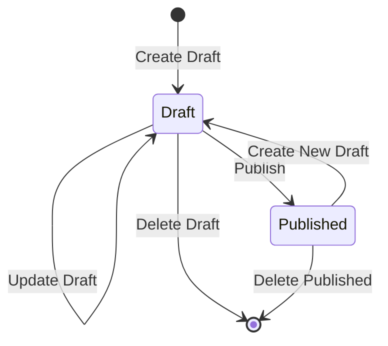
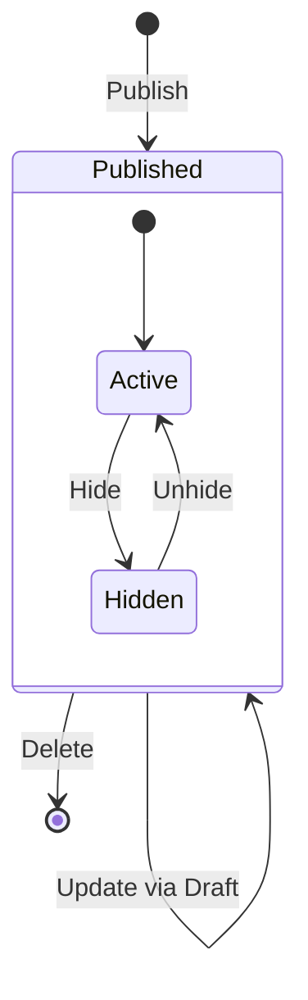
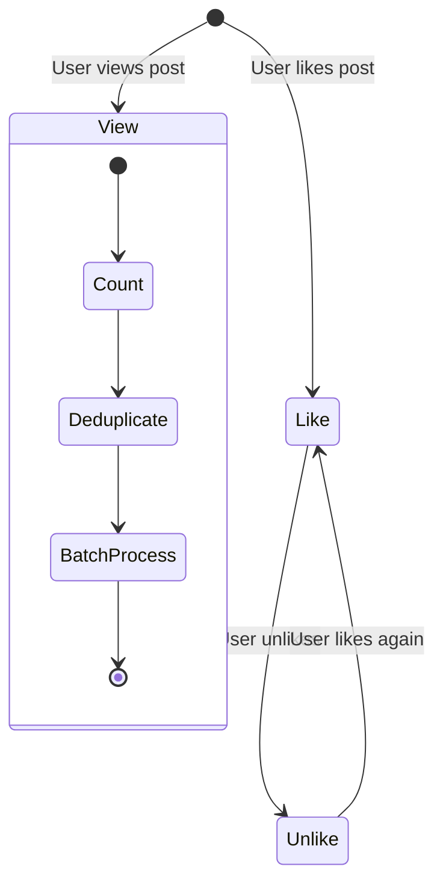
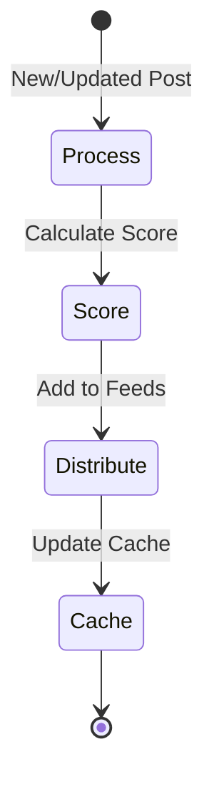
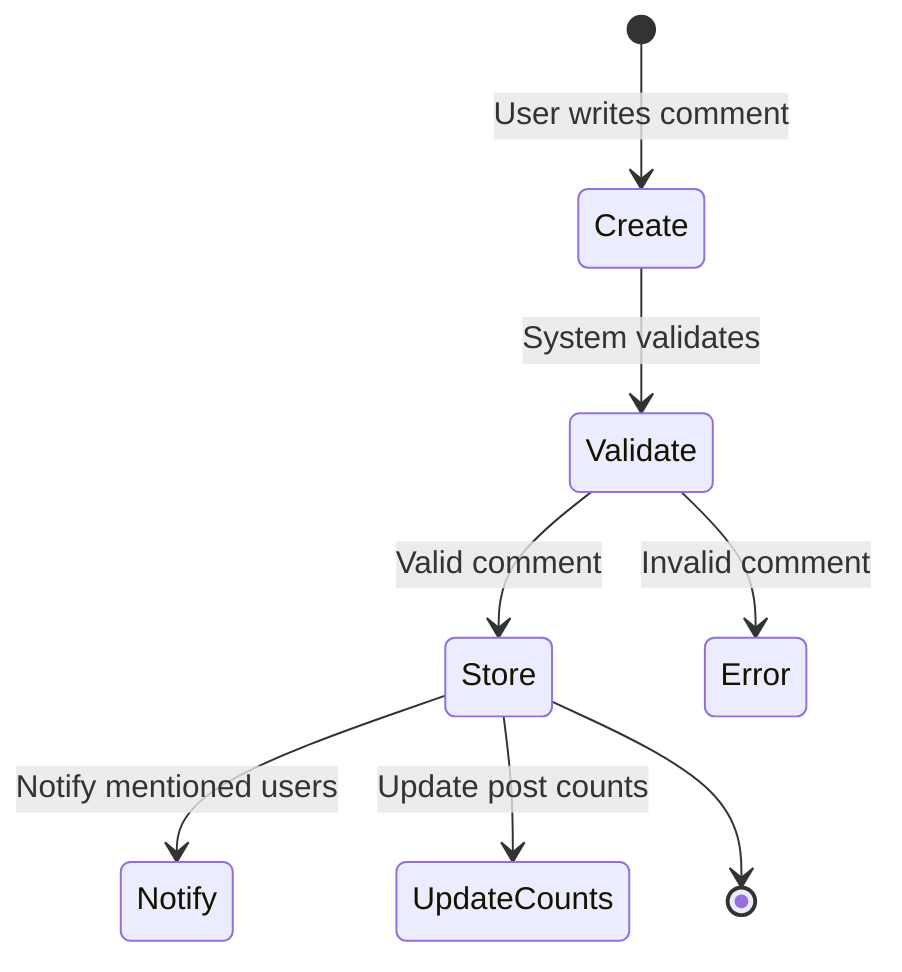
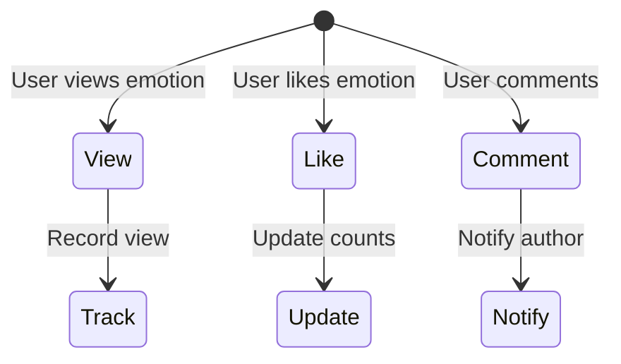
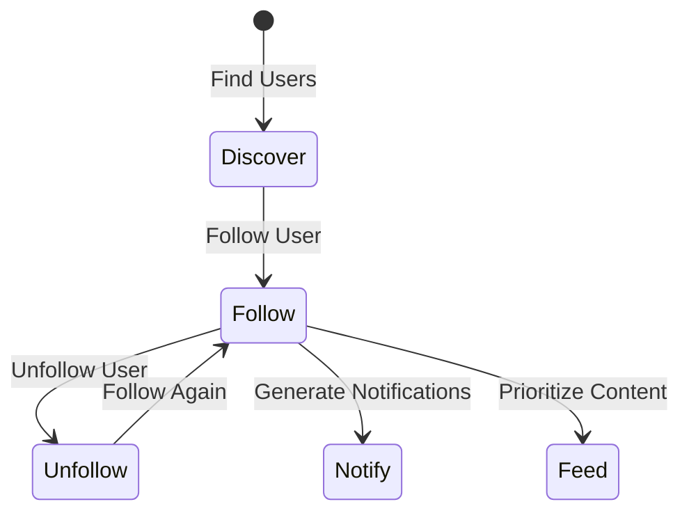
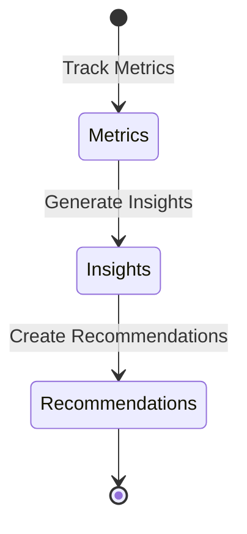
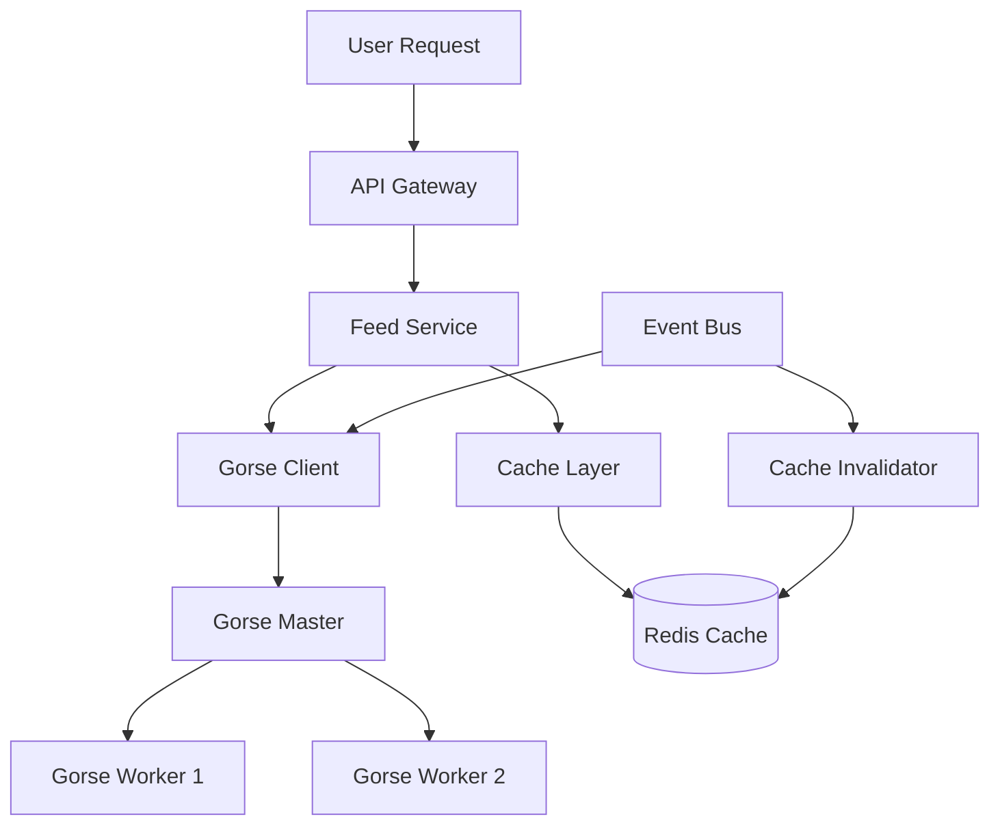
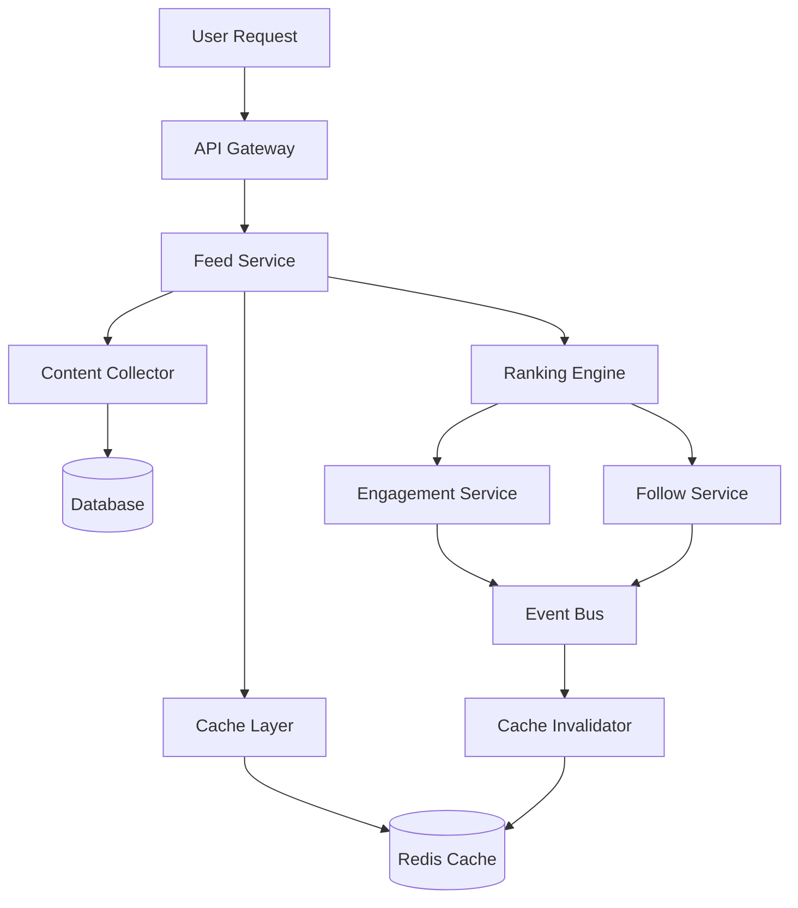

# Business Flow Documentation

## Post Management Flow

### 1. Draft Post Lifecycle

1. Create Draft
   - User creates initial draft
   - System assigns unique draft ID
   - Status set to "DRAFT"
   - Validates:
     - Required fields
     - Content length
     - Topic existence

2. Update Draft
   - User modifies existing draft
   - System maintains version history
   - Validates:
     - Draft existence
     - User ownership
     - Content constraints

3. Publish Draft
   - User requests publication
   - System:
     - Creates published version
     - Deletes draft version
     - Triggers feed distribution
     - Updates search index
   - Validates:
     - Content completeness
     - User permissions
     - Publishing quotas

4. Delete Draft
   - User requests deletion
   - System:
     - Removes draft content
     - Cleans up associated resources
   - Validates:
     - Draft existence
     - User ownership

### 2. Published Post Lifecycle

1. Post Publication
   - System:
     - Creates published record
     - Initializes metrics (views, likes)
     - Triggers notifications
     - Updates feed distribution

2. Post Updates
   - Flow:
     - Create draft from published
     - Update draft
     - Apply changes to published
   - Maintains:
     - Version history
     - Update timestamps
     - Change tracking

3. Post Visibility
   - States:
     - Active: Visible in feeds
     - Hidden: Not visible but exists
   - Controls:
     - User can hide/unhide
     - Admin can moderate

### 3. Social Interactions

1. View Tracking
   - Process:
     - Record unique views
     - Deduplicate within timeframe
     - Batch process for efficiency
   - Features:
     - HyperLogLog for unique counting
     - Redis for temporary storage
     - Periodic database sync

2. Like Management
   - Features:
     - Toggle like status
     - Track like counts
     - Update feed scoring
   - Constraints:
     - One like per user
     - Atomic operations
     - Consistent counting

### 4. Feed Distribution

1. Content Processing
   - Triggers:
     - New post published
     - Post updated
     - Post deleted
   - Actions:
     - Score calculation
     - Feed distribution
     - Cache updates

2. Feed Management
   - Features:
     - Score-based ranking
     - User personalization
     - Cached feed slices
   - Operations:
     - Add new content
     - Remove deleted content
     - Update changed content

### 5. Error Handling

1. Validation Errors
   - User feedback
   - Field-level errors
   - Business rule violations

2. System Errors
   - Retry mechanisms
   - Fallback strategies
   - Error logging

3. Recovery Procedures
   - Data reconciliation
   - Cache rebuilding
   - State recovery

### 6. Monitoring Points

1. Performance Metrics
   - Creation latency
   - Publication success rate
   - Feed distribution time

2. Business Metrics
   - Post creation rate
   - Publication ratio
   - Engagement metrics

3. Error Metrics
   - Validation failure rate
   - System error rate
   - Recovery success rate

### 7. Comment System Flow

1. Comment Creation
   - Process:
     - User writes comment
     - System validates content
     - Stores in database
     - Updates post metrics
   - Features:
     - Markdown support
     - Mention notifications
     - Thread management

2. Comment Engagement
   - Features:
     - Like/unlike comments
     - Reply threading
     - Sort options
   - Constraints:
     - One like per user
     - Thread depth limits
     - Rate limiting

### 8. Emotion Social Flow

1. Emotion Engagement
   - Process:
     - View tracking
     - Like management
     - Comment integration
   - Features:
     - Privacy controls
     - Engagement metrics
     - Support responses

2. Distribution
   - Features:
     - Feed integration
     - Notification system
     - Analytics tracking
   - Privacy:
     - Respect user settings
     - Selective sharing
     - View restrictions

## User Following System

### 1. User Following Lifecycle

1. User Discovery
   - Methods:
     - Search by name/username
     - Suggested users based on interests
     - Content engagement patterns
     - Mutual connections
   - Features:
     - User profiles with activity summaries
     - Follow counts and metrics
     - Content previews

2. Following Mechanism
   - Actions:
     - Follow: Create connection
     - Unfollow: Remove connection
   - States:
     - Following: User A follows User B
     - Follower: User B is followed by User A
     - Mutual: Both users follow each other
   - Privacy:
     - Public following lists by default
     - Option for private following

3. Notification Integration
   - Triggers:
     - New follower notifications
     - Followed user activity notifications
     - Priority notifications for followed users
   - Controls:
     - Granular notification preferences
     - Activity threshold filtering
     - Batch notification options

4. Content Distribution
   - Feed Impact:
     - Higher ranking for followed users' content
     - Dedicated "Following" feed option
     - Mixed feed with followed/recommended content
   - Discovery:
     - "People you might know" suggestions
     - "Popular among followers" content
     - Interest-based user recommendations

### 2. Following Analytics

1. User Metrics
   - Following count
   - Follower count
   - Follower growth rate
   - Engagement from followers
   - Follow-back rate

2. Content Impact
   - Reach amplification
   - Engagement rate from followers vs. non-followers
   - Content distribution effectiveness
   - Notification response rates

3. Network Analysis
   - Connection clusters
   - Influence mapping
   - Interest groupings
   - Content propagation patterns

## Feed Distribution System

### Current Implementation

The current feed system uses Redis sorted sets to store a global feed that is the same for all users. Content is scored based on recency and engagement metrics, but there's no personalization based on user relationships.

### Updated Feed Distribution Strategy: Gorse-Powered Recommendation System

#### Core Philosophy

- **AI-Powered Discovery**: Utilize Gorse's recommendation engine to show users content they're likely to enjoy
- **Multi-Signal Ranking**: Combine Gorse recommendations with social signals and engagement metrics
- **Real-Time Personalization**: Continuously adapt recommendations based on user interactions
- **Efficient Scaling**: Leverage Gorse's distributed architecture for high-performance recommendations

#### Feed Structure

1. **Primary Feed ("For You")**
   - Default view powered by Gorse recommendations
   - Content mix: 70% discovery / 30% followed
   - Personalized based on user behavior and preferences
   - Real-time updates through Gorse's streaming API

2. **Following Feed (Secondary Tab)**
   - Dedicated space for followed content only
   - Chronological or engagement-sorted option
   - Enhanced with Gorse's user similarity features
   - Ensures users can always find content from people they explicitly follow

#### Ranking Factors (For Primary Feed)

1. **Gorse Recommendation Signals**:
   - User-item collaborative filtering
   - Item-item similarity analysis
   - Real-time user feedback processing
   - Automatic model selection and optimization

2. **Content Quality Signals**:
   - Completion rate (how often users view content to completion)
   - Engagement rate (likes, comments, shares relative to views)
   - Freshness (recency bonus)
   - Velocity (how quickly content is gaining engagement)

3. **Social and Personalization Signals**:
   - Following relationships (boost signal)
   - Topic affinity (categories user engages with)
   - Content creator reputation
   - User interaction history

4. **Diversity Factors**:
   - Content type variety (posts, emotions, etc.)
   - Creator diversity (avoid showing too much from same creator)
   - Topic diversity (ensure feed covers various interests)
   - Gorse's built-in diversity mechanisms

#### Implementation Phases

1. **Phase 1: Gorse Integration (Sprint 8)**
   - Set up Gorse infrastructure
   - Implement data synchronization
   - Basic recommendation integration
   - A/B testing framework setup

2. **Phase 2: Enhanced Personalization**
   - User behavior tracking integration
   - Custom recommendation rules
   - Advanced diversity controls
   - Performance optimization

3. **Phase 3: Advanced Features**
   - Real-time recommendation updates
   - Multi-model recommendation strategies
   - Advanced A/B testing
   - Analytics dashboard integration

4. **Phase 4: Optimization & Scale**
   - Distributed Gorse deployment
   - Performance tuning
   - Advanced caching strategies
   - Mobile optimization

#### Technical Architecture

#### Gorse Integration Benefits

1. **Improved Recommendation Quality**:
   - Automatic model selection and optimization
   - Multi-source recommendation support
   - Real-time user feedback incorporation
   - Advanced collaborative filtering

2. **Scalability and Performance**:
   - Distributed architecture support
   - Efficient model training and serving
   - Built-in caching mechanisms
   - Horizontal scaling capability

3. **Developer Experience**:
   - Simple REST API integration
   - Built-in monitoring and metrics
   - Comprehensive documentation
   - Active community support

4. **Business Value**:
   - Faster time to market
   - Reduced development complexity
   - Built-in A/B testing
   - Comprehensive analytics

#### Monitoring and Analytics

1. **Gorse Metrics**:
   - Recommendation quality metrics
   - Model performance statistics
   - System health indicators
   - API latency monitoring

2. **Business Metrics**:
   - User engagement rates
   - Content discovery effectiveness
   - Recommendation diversity
   - A/B test results

3. **System Metrics**:
   - Cache hit rates
   - API response times
   - Resource utilization
   - Error rates

#### Cache Strategy

1. **Multi-Level Caching**:
   - Gorse internal cache
   - Redis feed cache
   - Client-side cache

2. **Cache Policies**:
   - Short TTL for active users (5 minutes)
   - Medium TTL for regular users (15 minutes)
   - Long TTL for static content (1 hour)
   - Intelligent cache warming

3. **Invalidation Strategy**:
   - Event-driven invalidation
   - Selective cache updates
   - Background revalidation
   - Graceful degradation

### Comparison with Major Platforms

#### TikTok

- **Similarities**:
  - AI-powered recommendation engine
  - Real-time personalization
  - Multi-signal ranking
  - Content diversity mechanisms
- **Differences**:
  - Our implementation uses Gorse instead of proprietary AI
  - Simpler initial feature set
  - More transparent recommendation logic
  - Faster iteration cycles

#### Instagram

- **Similarities**:
  - Dual-feed approach (algorithmic main feed + following feed)
  - Engagement metrics as ranking signals
  - Creator diversity considerations
- **Differences**:
  - Instagram started follow-first and evolved to discovery
  - Instagram puts more weight on social graph connections
  - Our approach is discovery-first from the beginning
  - Instagram has more complex content formats (Stories, Reels, Posts)

#### Facebook

- **Similarities**:
  - Personalization based on user behavior
  - Engagement as a key ranking factor
  - Content diversity mechanisms
- **Differences**:
  - Facebook heavily weights social connections (friends, family)
  - Facebook's algorithm considers hundreds more signals
  - Facebook optimizes for "meaningful interactions" vs. pure engagement
  - Our approach is simpler and more focused on content quality

#### Twitter

- **Similarities**:
  - Dual-feed approach ("For You" and "Following")
  - Engagement metrics influence ranking
- **Differences**:
  - Twitter is more chronologically oriented
  - Twitter's content is primarily text-based
  - Our approach puts more emphasis on content quality signals

### Key Advantages of Our Approach

1. **AI-Powered Discovery**: Gorse provides sophisticated recommendation algorithms out of the box

2. **Rapid Implementation**: Using Gorse accelerates development while maintaining quality

3. **Scalable Architecture**: Built-in support for distributed deployment and horizontal scaling

4. **Flexible Integration**: Easy integration with existing systems while allowing future customization

5. **Data-Driven Optimization**: Built-in A/B testing and analytics for continuous improvement

## Feed Distribution System Architecture

### System Architecture Overview

The feed distribution system requires a scalable architecture that can handle personalized content ranking, efficient content delivery, and real-time updates. Below is the detailed architecture design for each implementation phase.

### Phase 1: Basic Discovery Feed Architecture

#### Components

1. **Content Collection Service**
   - **Purpose**: Retrieve recent content from database with basic metadata
   - **Implementation**:
     - Database queries with efficient joins and pagination
     - Content type filtering (posts, emotions)
     - Basic author information inclusion
   - **Technical Stack**:
     - Prisma ORM for database access
     - Repository pattern for data access abstraction
     - Caching of frequent queries with short TTL

2. **Basic Ranking Engine**
   - **Purpose**: Score and rank content based on simple factors
   - **Implementation**:
     - Recency scoring (exponential decay function)
     - Engagement scoring (normalized likes, comments, views)
     - Following relationship boost (1.5x multiplier)
     - Content type diversity enforcement
   - **Technical Stack**:
     - In-memory scoring algorithms
     - Command pattern for follow status checking
     - Sorting and pagination utilities

3. **Feed API Layer**
   - **Purpose**: Expose feed endpoints with proper pagination
   - **Implementation**:
     - Main "For You" feed endpoint
     - Following-only feed endpoint
     - Pagination with cursor-based approach
     - Response caching with user-specific keys
   - **Technical Stack**:
     - NestJS controllers and services
     - DTO validation and transformation
     - Redis for response caching

4. **Event Handlers**
   - **Purpose**: React to system events for feed updates
   - **Implementation**:
     - Content creation/update handlers
     - Follow/unfollow event handlers
     - Engagement event handlers (likes, comments)
     - Cache invalidation triggers
   - **Technical Stack**:
     - Event bus for pub/sub communication
     - Event handlers with retry logic
     - Selective cache invalidation

#### Data Flow

1. User requests feed content
2. System checks cache for existing feed slice
3. If cache miss, content collector retrieves recent content
4. Ranking engine scores and sorts content
5. Response is cached and returned to user
6. Events trigger selective cache invalidation

#### Performance Considerations

- **Database Indexing**:
  - Compound indexes on content type, timestamp, author
  - Indexes on engagement metrics for sorting
  - Partial indexes for active content

- **Caching Strategy**:
  - Cache feed slices by user ID, offset, limit
  - Short TTL (1-5 minutes) for active users
  - Longer TTL (15-30 minutes) for less active users

- **Query Optimization**:
  - Limit initial content collection to recent window (7-14 days)
  - Use database-level pagination before in-memory processing
  - Batch database queries where possible

### Phase 2: Enhanced Personalization Architecture

#### New Components

1. **User Engagement Tracker**
   - **Purpose**: Track and store user engagement patterns
   - **Implementation**:
     - View tracking with completion rates
     - Engagement action recording (likes, comments, shares)
     - Content type preference analysis
     - Creator affinity calculation
   - **Technical Stack**:
     - Event-driven architecture for engagement events
     - Time-series data storage for engagement history
     - Batch processing for aggregations

2. **Content Affinity Service**
   - **Purpose**: Determine content relevance based on user history
   - **Implementation**:
     - Topic extraction and classification
     - User-topic affinity scoring
     - Creator-based affinity calculation
     - Temporal relevance adjustments
   - **Technical Stack**:
     - Simple classification algorithms
     - Affinity scoring models
     - Cached affinity profiles

3. **Enhanced Ranking Engine**
   - **Purpose**: Incorporate personalization signals into ranking
   - **Implementation**:
     - Multi-factor scoring algorithm
     - Personalization signal integration
     - Dynamic weight adjustment based on user behavior
     - Diversity enforcement algorithms
   - **Technical Stack**:
     - Modular scoring components
     - Weighted ranking algorithms
     - A/B testing framework integration

#### Data Flow Enhancements

1. Engagement events flow into engagement tracker
2. Periodic batch jobs update user affinity profiles
3. Ranking engine incorporates affinity data in scoring
4. Content diversity is enforced during ranking
5. Feedback loop captures user response to recommendations

#### Performance Considerations

- **Database Sharding**:
  - Shard engagement data by user ID
  - Implement read replicas for engagement queries
  - Consider time-based partitioning for historical data

- **Computation Optimization**:
  - Pre-compute affinity scores in background jobs
  - Cache user affinity profiles with medium TTL
  - Use approximate algorithms for large-scale computations

- **Memory Management**:
  - Implement LRU caching for active user profiles
  - Compress stored engagement data
  - Prune historical data based on relevance decay

### Phase 3: Advanced Ranking Architecture

#### New Components

1. **Content Completion Tracker**
   - **Purpose**: Track how users consume content to completion
   - **Implementation**:
     - View duration tracking
     - Completion rate calculation
     - Skip/abandon detection
     - Engagement depth analysis
   - **Technical Stack**:
     - Real-time event processing
     - Time-series metrics storage
     - Statistical analysis tools

2. **Trending Detection Service**
   - **Purpose**: Identify rapidly gaining content
   - **Implementation**:
     - Engagement velocity calculation
     - Trend detection algorithms
     - Category-specific trending
     - Anomaly detection for viral content
   - **Technical Stack**:
     - Time-windowed analytics
     - Velocity calculation algorithms
     - Threshold-based detection

3. **Creator Reputation System**
   - **Purpose**: Score content creators based on engagement quality
   - **Implementation**:
     - Historical engagement quality analysis
     - Consistency scoring
     - Audience loyalty metrics
     - Content quality assessment
   - **Technical Stack**:
     - Reputation scoring algorithms
     - Historical data aggregation
     - Decay functions for temporal relevance

4. **A/B Testing Framework**
   - **Purpose**: Test algorithm variations with user segments
   - **Implementation**:
     - User cohort management
     - Algorithm variant assignment
     - Performance metric tracking
     - Statistical significance testing
   - **Technical Stack**:
     - User segmentation system
     - Variant routing middleware
     - Metrics collection and analysis
     - Experiment management dashboard

#### Data Flow Enhancements

1. Content view events include duration and completion data
2. Trending detection runs on scheduled intervals
3. Creator reputation updates daily with new engagement data
4. A/B test assignment happens at request time
5. Metrics collection occurs asynchronously

#### Performance Considerations

- **Distributed Computing**:
  - Implement map-reduce for large-scale analytics
  - Use stream processing for real-time metrics
  - Consider specialized time-series databases

- **Predictive Optimization**:
  - Implement content prefetching based on user patterns
  - Pre-compute expensive ranking factors
  - Use probabilistic data structures for large-scale counting

- **Resource Isolation**:
  - Separate compute resources for analytics vs. serving
  - Implement circuit breakers for non-critical components
  - Define clear SLAs for each system component

### Phase 4: Optimization & Scale Architecture

#### New Components

1. **Real-time Ranking Updates**
   - **Purpose**: Update content rankings in near real-time
   - **Implementation**:
     - Event-driven score recalculation
     - Partial feed regeneration
     - Hot content fast-tracking
     - Dynamic cache invalidation
   - **Technical Stack**:
     - Stream processing framework
     - Partial cache update mechanisms
     - Priority queues for processing

2. **Predictive Content Prefetching**
   - **Purpose**: Prepare content before users request it
   - **Implementation**:
     - Usage pattern analysis
     - Session prediction models
     - Background content preparation
     - Smart cache warming
   - **Technical Stack**:
     - Predictive models
     - Background job scheduling
     - Prioritized content loading

3. **Mobile Optimization Layer**
   - **Purpose**: Optimize delivery for mobile clients
   - **Implementation**:
     - Response size optimization
     - Progressive content loading
     - Network condition adaptation
     - Battery usage optimization
   - **Technical Stack**:
     - Content compression
     - Adaptive delivery APIs
     - Client capability detection

4. **Analytics Dashboard**
   - **Purpose**: Monitor content performance and system health
   - **Implementation**:
     - Real-time content performance metrics
     - Algorithm effectiveness tracking
     - System performance monitoring
     - User engagement visualization
   - **Technical Stack**:
     - Time-series metrics database
     - Real-time dashboard framework
     - Alerting and notification system
     - Visualization components

#### Data Flow Enhancements

1. High-impact events trigger immediate ranking updates
2. System predicts and prepares content for active users
3. Content delivery adapts to client capabilities
4. Performance metrics flow to dashboards in real-time
5. Alerts trigger on anomalies or performance issues

#### Performance Considerations

- **Global Distribution**:
  - Implement CDN for static content
  - Consider edge computing for ranking
  - Geo-distributed database replicas

- **Extreme Scale Techniques**:
  - Implement consistent hashing for sharding
  - Consider specialized databases for different data types
  - Use queue-based load leveling
  - Implement graceful degradation

- **Efficiency Optimizations**:
  - Content bundling for network efficiency
  - Incremental updates to reduce payload size
  - Adaptive TTL based on content volatility
  - Resource-aware scheduling

### System Scalability Considerations

#### Horizontal Scaling

- **Stateless Services**: All API and processing services designed for horizontal scaling
- **Database Scaling**:
  - Read replicas for query-heavy operations
  - Sharding strategy based on user ID and content type
  - Consider NoSQL for engagement data at scale

#### Vertical Scaling

- **Memory Optimization**: Ranking algorithms optimized for memory efficiency
- **CPU Efficiency**: Batch processing for compute-intensive operations
- **I/O Optimization**: Efficient database query patterns and indexes

#### Resilience

- **Circuit Breakers**: Prevent cascade failures in service dependencies
- **Retry Mechanisms**: Automatic retries with exponential backoff
- **Fallback Strategies**: Degraded but functional experience when components fail

#### Monitoring

- **Key Metrics**:
  - Feed generation latency (p95, p99)
  - Cache hit rates
  - Database query performance
  - Event processing throughput
  - Error rates by component

- **Alerting**:
  - SLA breach alerts
  - Error rate thresholds
  - Resource utilization warnings
  - Data inconsistency detection

### Conclusion

This architecture provides a scalable foundation for implementing the TikTok-inspired feed distribution system. By phasing the implementation, we can deliver value early while building toward a sophisticated, personalized content discovery platform. The design emphasizes:

1. **Performance**: Through efficient data access, caching, and computation
2. **Scalability**: Via horizontal scaling and efficient resource usage
3. **Flexibility**: Through modular components and clear interfaces
4. **Resilience**: With proper error handling and fallback strategies
5. **Measurability**: Via comprehensive monitoring and analytics

Each phase builds upon the previous one, allowing for iterative development and testing while maintaining system stability and performance.
