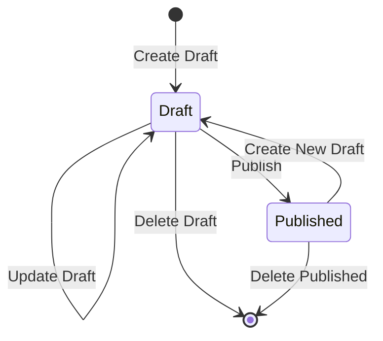
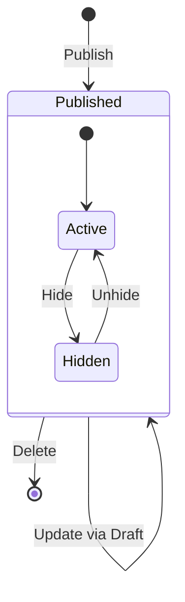
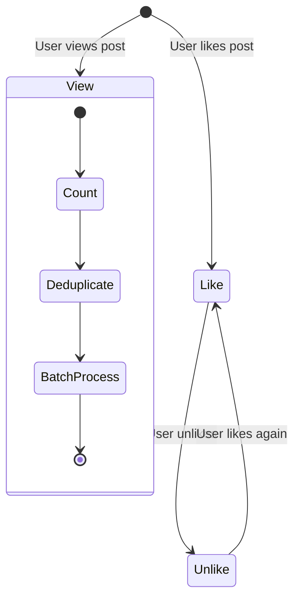
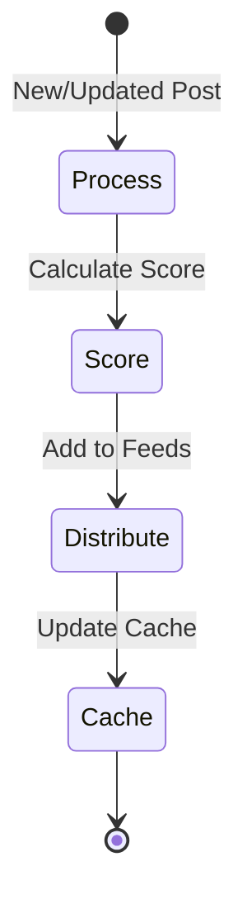

# Business Flow Documentation

## Post Management Flow

### 1. Draft Post Lifecycle

1. Create Draft
   - User creates initial draft
   - System assigns unique draft ID
   - Status set to "DRAFT"
   - Validates:
     - Required fields
     - Content length
     - Topic existence

2. Update Draft
   - User modifies existing draft
   - System maintains version history
   - Validates:
     - Draft existence
     - User ownership
     - Content constraints

3. Publish Draft
   - User requests publication
   - System:
     - Creates published version
     - Deletes draft version
     - Triggers feed distribution
     - Updates search index
   - Validates:
     - Content completeness
     - User permissions
     - Publishing quotas

4. Delete Draft
   - User requests deletion
   - System:
     - Removes draft content
     - Cleans up associated resources
   - Validates:
     - Draft existence
     - User ownership

### 2. Published Post Lifecycle

1. Post Publication
   - System:
     - Creates published record
     - Initializes metrics (views, likes)
     - Triggers notifications
     - Updates feed distribution

2. Post Updates
   - Flow:
     - Create draft from published
     - Update draft
     - Apply changes to published
   - Maintains:
     - Version history
     - Update timestamps
     - Change tracking

3. Post Visibility
   - States:
     - Active: Visible in feeds
     - Hidden: Not visible but exists
   - Controls:
     - User can hide/unhide
     - Admin can moderate

### 3. Social Interactions

1. View Tracking
   - Process:
     - Record unique views
     - Deduplicate within timeframe
     - Batch process for efficiency
   - Features:
     - HyperLogLog for unique counting
     - Redis for temporary storage
     - Periodic database sync

2. Like Management
   - Features:
     - Toggle like status
     - Track like counts
     - Update feed scoring
   - Constraints:
     - One like per user
     - Atomic operations
     - Consistent counting

### 4. Feed Distribution

1. Content Processing
   - Triggers:
     - New post published
     - Post updated
     - Post deleted
   - Actions:
     - Score calculation
     - Feed distribution
     - Cache updates

2. Feed Management
   - Features:
     - Score-based ranking
     - User personalization
     - Cached feed slices
   - Operations:
     - Add new content
     - Remove deleted content
     - Update changed content

### 5. Error Handling

1. Validation Errors
   - User feedback
   - Field-level errors
   - Business rule violations

2. System Errors
   - Retry mechanisms
   - Fallback strategies
   - Error logging

3. Recovery Procedures
   - Data reconciliation
   - Cache rebuilding
   - State recovery

### 6. Monitoring Points

1. Performance Metrics
   - Creation latency
   - Publication success rate
   - Feed distribution time

2. Business Metrics
   - Post creation rate
   - Publication ratio
   - Engagement metrics

3. Error Metrics
   - Validation failure rate
   - System error rate
   - Recovery success rate
