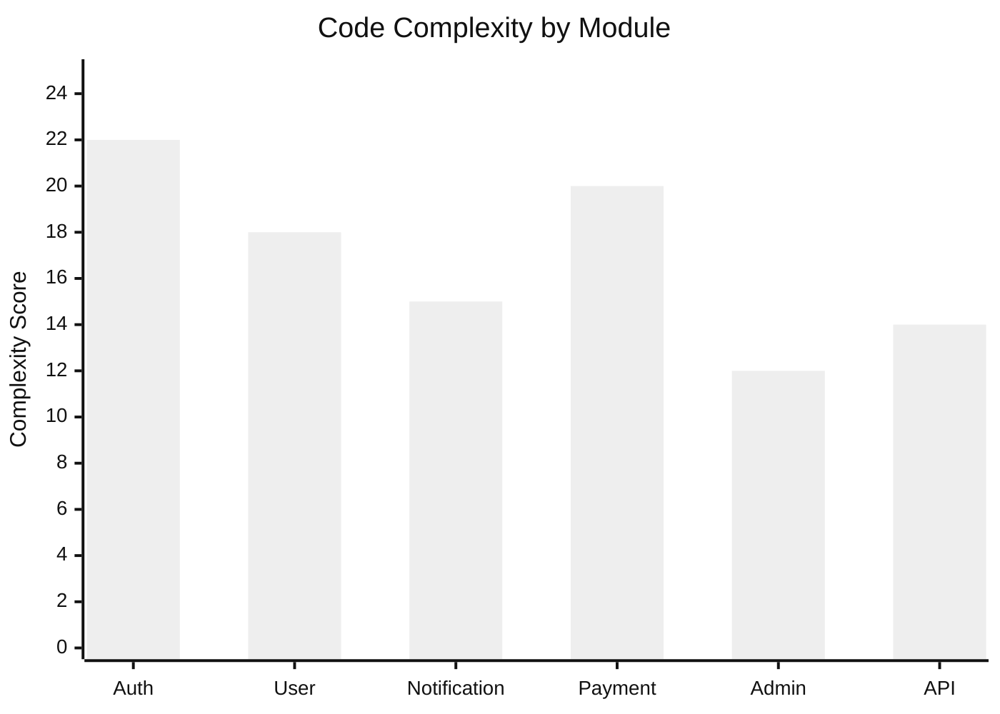

# Code Health Report

Last Updated: **`2023-05-25`**

## Code Quality Summary

Overall Status: 🟢 **Good**

| Metric | Value | Change | Target | Status |
|--------|-------|--------|--------|--------|
| Test Coverage | 83% | +2% | 85% | 🟢 On Track |
| Linting Issues | 12 | -5 | 0 | 🟢 On Track |
| Duplicate Code | 4.5% | -0.3% | <5% | 🟢 On Track |
| Code Complexity | 18 | -2 | <20 | 🟢 On Track |
| Tech Debt (days) | 15 | -3 | <10 | 🟡 At Risk |
| Documentation | 76% | +4% | 80% | 🟢 On Track |

## Technical Debt Items

### High Priority

1. **Authentication Service Refactoring**
   - Estimate: 5 days
   - Impact: High (security, performance)
   - Description: The authentication service has grown organically and needs to be split into smaller, more focused modules.
   - [View affected files](docs/summaries/changes/auth-service-debt-2023-05-20.md)

2. **Database Query Optimization**
   - Estimate: 3 days
   - Impact: High (performance)
   - Description: Several queries in the user and content services need optimization to improve response times.
   - [View affected files](docs/summaries/changes/db-query-debt-2023-05-18.md)

### Medium Priority

3. **API Error Handling Standardization**
   - Estimate: 2 days
   - Impact: Medium (developer experience, user experience)
   - Description: Error handling across API endpoints is inconsistent, making client integration harder.
   - [View affected files](docs/summaries/changes/error-handling-debt-2023-05-15.md)

4. **Frontend Component Duplication**
   - Estimate: 3 days
   - Impact: Medium (maintainability)
   - Description: Several UI components have similar functionality but different implementations.
   - [View affected files](docs/summaries/changes/ui-component-debt-2023-05-10.md)

### Low Priority

5. **Test Helper Utilities**
   - Estimate: 2 days
   - Impact: Low (developer productivity)
   - Description: Create shared test utilities to simplify test setup and reduce duplication.

## Recent Code Improvements

- Standardized error handling in authentication endpoints (2023-05-24)
- Reduced duplicate code in notification templates (2023-05-22)
- Improved test coverage for user service (2023-05-20)
- Fixed inconsistent API response formats (2023-05-19)

## Code Complexity Hotspots

| Module | Files | Complexity | Issues | Coverage |
|--------|-------|------------|--------|----------|
| Authentication | 12 | 22 | 5 | 87% |
| User Management | 15 | 18 | 3 | 85% |
| Notification | 10 | 15 | 1 | 80% |
| Payment | 8 | 20 | 3 | 75% |
| Admin | 14 | 12 | 0 | 90% |
| API Layer | 18 | 14 | 0 | 82% |

## Code Review Statistics

- Average review time: 1.2 days
- Comments per review: 8.3
- Approval rate: 85%
- Top reviewers: @developer1 (15), @developer2 (12), @developer3 (10)

## Planned Refactoring

| Item | Sprint | Assignee | Status |
|------|--------|----------|--------|
| Authentication Service | Current (014) | @developer1 | In Progress |
| Database Queries | Next (015) | @developer2 | Planned |
| API Error Handling | Current (014) | @developer3 | In Progress |
| Frontend Components | Future | TBD | Not Started |

## Documentation Coverage

| Component | Documentation % | Status |
|-----------|-----------------|--------|
| Public APIs | 95% | 🟢 Good |
| Internal APIs | 80% | 🟢 Good |
| Database Schema | 85% | 🟢 Good |
| Deployment Process | 70% | 🟡 Needs Work |
| Testing | 60% | 🟡 Needs Work |

## Recommendations

1. Complete authentication service refactoring in current sprint
2. Schedule database query optimization for next sprint
3. Improve deployment documentation
4. Allocate time for test helper utilities in next sprint
