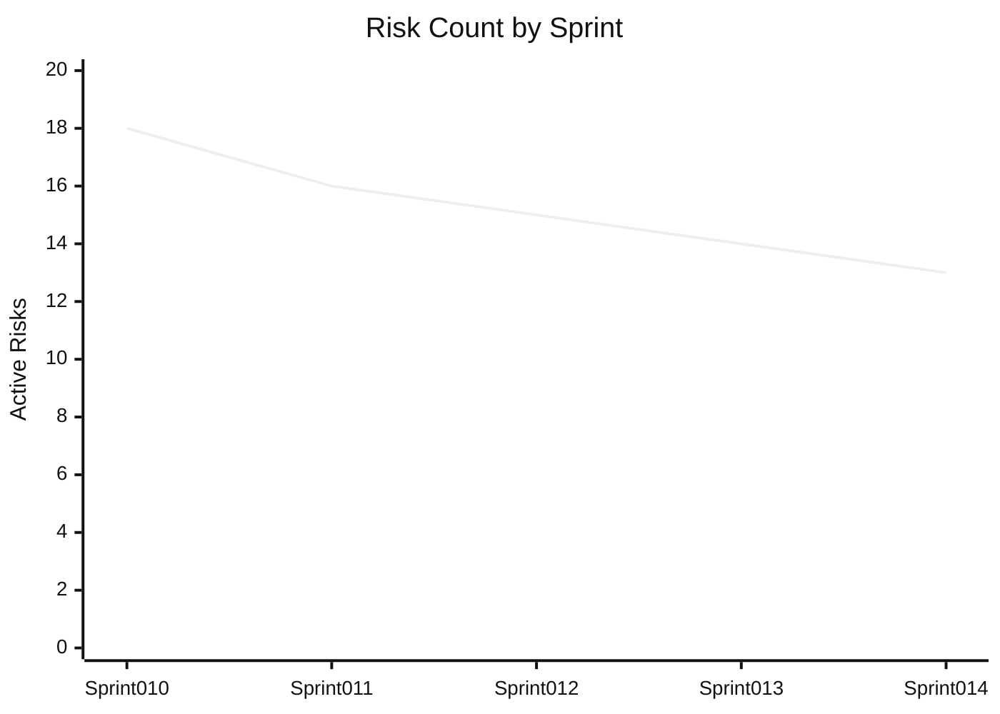
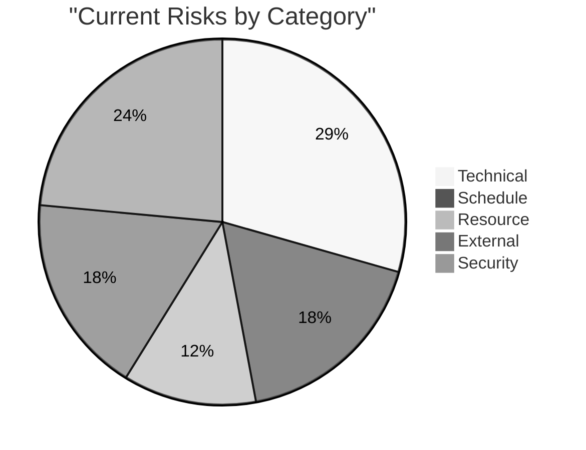

# Project Risk Register

Last Updated: **`2023-05-25`**

## Risk Summary

**Overall Project Risk Level:** 🟡 **Medium**

| Risk Category | Count | Trend | Status |
|---------------|-------|-------|--------|
| Technical | 5 | ⬇️ (-1) | 🟡 Medium |
| Schedule | 3 | ⬆️ (+1) | 🟡 Medium |
| Resource | 2 | ↔️ (0) | 🟢 Low |
| External | 3 | ↔️ (0) | 🔴 High |
| Security | 4 | ⬇️ (-2) | 🟡 Medium |

## Active Risks

### High Priority Risks

| ID | Risk | Category | Impact | Probability | Owner | Status |
|----|------|----------|--------|------------|-------|--------|
| R-12 | Payment gateway integration delay | External | High | High | @productowner | 🔴 Active |
| R-15 | Performance bottlenecks in notification system | Technical | High | Medium | @architect | 🟡 Active |
| R-08 | MFA implementation timeline | Schedule | High | Medium | @developer1 | 🟡 Active |
| R-22 | Data privacy compliance | Security | High | Medium | @testlead | 🟡 Active |

### Medium Priority Risks

| ID | Risk | Category | Impact | Probability | Owner | Status |
|----|------|----------|--------|------------|-------|--------|
| R-18 | API versioning conflicts | Technical | Medium | Medium | @techlead | 🟡 Active |
| R-05 | Resource constraints for performance testing | Resource | Medium | Medium | @scrummaster | 🟡 Active |
| R-14 | Dependency updates breaking changes | Technical | Medium | Medium | @developer2 | 🟡 Active |
| R-19 | External service rate limits | External | Medium | Medium | @developer3 | 🟡 Active |
| R-23 | Sprint capacity overcommitment | Schedule | Medium | Medium | @scrummaster | 🟡 New |

### Low Priority Risks

| ID | Risk | Category | Impact | Probability | Owner | Status |
|----|------|----------|--------|------------|-------|--------|
| R-10 | Documentation gaps | Technical | Low | Medium | @techlead | 🟢 Monitored |
| R-20 | UI design consistency | Technical | Low | Low | @developer3 | 🟢 Monitored |
| R-07 | Team member availability | Resource | Low | Low | @scrummaster | 🟢 Monitored |
| R-21 | External API changes | External | Low | Low | @developer2 | 🟢 Monitored |

## Risk Details

### R-12: Payment gateway integration delay

**Category:** External  
**Impact:** High  
**Probability:** High  
**Owner:** @productowner  
**Status:** 🔴 Active  

**Description:**  
Contract negotiations with the payment provider are taking longer than expected, which may delay the integration of the payment gateway functionality.

**Impact Analysis:**  

- May delay the release of payment processing features
- Subscription management functionality would be affected
- Revenue generation from premium features delayed

**Mitigation Strategy:**  

- Parallel negotiation with backup payment provider
- Develop integration using sandbox environment
- Prepare feature flag to disable payment features if needed
- Prioritize contract negotiation escalation

**Contingency Plan:**  

- Implement temporary manual payment processing system
- Delay subscription feature launch if necessary
- Ship with simulated payment flow for demonstration

**Updates:**

- 2023-05-25: Contract terms under legal review, escalated to executive team
- 2023-05-20: Provided additional requirements to payment provider
- 2023-05-15: Started parallel negotiations with alternate provider

### R-15: Performance bottlenecks in notification system

**Category:** Technical  
**Impact:** High  
**Probability:** Medium  
**Owner:** @architect  
**Status:** 🟡 Active  

**Description:**  
Initial load testing indicates performance bottlenecks in the notification system when scaled beyond 1000 concurrent users.

**Impact Analysis:**  

- System may become unresponsive during peak loads
- Email delivery could be delayed
- Poor user experience for notification-dependent features

**Mitigation Strategy:**  

- Implement queue-based architecture for notifications
- Set up rate limiting and throttling
- Optimize database queries for notification retrieval
- Add caching layer for frequently accessed notification templates

**Contingency Plan:**  

- Fallback to batched processing for notifications
- Temporarily reduce notification frequency during peak times
- Implement circuit breaker pattern to prevent cascading failures

**Updates:**

- 2023-05-25: Queue implementation in progress, 60% complete
- 2023-05-22: Query optimization completed, 30% performance improvement
- 2023-05-18: Identified specific bottlenecks in database queries

## Recently Resolved Risks

| ID | Risk | Category | Resolution Date | Resolution |
|----|------|----------|-----------------|------------|
| R-11 | Authentication security vulnerabilities | Security | 2023-05-24 | Implemented security fixes and passed penetration testing |
| R-17 | Database migration errors | Technical | 2023-05-20 | Created automated migration testing and verification process |
| R-09 | Inconsistent error handling | Technical | 2023-05-18 | Standardized error handling across all API endpoints |

## Risk Trend Analysis

## Risk Management Process

1. **Identification:** Risks are identified during sprint planning, daily standups, and retrospectives
2. **Assessment:** Risks are evaluated for impact and probability
3. **Mitigation:** Strategies are developed to reduce risk likelihood or impact
4. **Monitoring:** Risks are tracked and reassessed regularly
5. **Resolution:** Successfully mitigated risks are documented for future reference

## Risk Management Responsibilities

- **Scrum Master:** Facilitates risk identification and tracking
- **Product Owner:** Assesses business impact and prioritization
- **Technical Leader:** Evaluates technical risks and mitigation strategies
- **Test Leader:** Identifies quality and security risks
- **Developers:** Report implementation risks and technical challenges
- **All Team Members:** Contribute to risk identification and mitigation

## Next Risk Review

Scheduled for: **2023-05-29** (End of Sprint 014)
