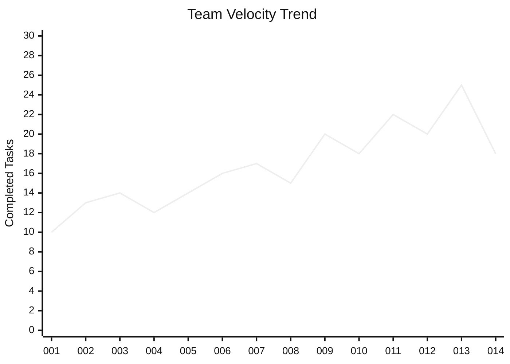
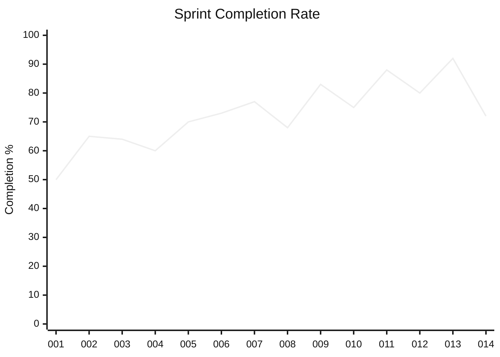

# Sprint History

Last Updated: **`2023-05-25`**

## Sprint Performance Overview

| Sprint | Dates | Velocity | Completion Rate | Story Points | New Issues |
|--------|-------|----------|-----------------|--------------|------------|
| 014 (Current) | 2023-05-15 to 2023-05-29 | 18 | 72% | 45 | 3 |
| 013 | 2023-05-01 to 2023-05-12 | 25 | 92% | 62 | 5 |
| 012 | 2023-04-17 to 2023-04-28 | 20 | 80% | 50 | 8 |
| 011 | 2023-04-03 to 2023-04-14 | 22 | 88% | 55 | 4 |
| 010 | 2023-03-20 to 2023-03-31 | 18 | 75% | 45 | 6 |
| 009 | 2023-03-06 to 2023-03-17 | 20 | 83% | 50 | 7 |
| 008 | 2023-02-20 to 2023-03-03 | 15 | 68% | 38 | 10 |
| 007 | 2023-02-06 to 2023-02-17 | 17 | 77% | 42 | 5 |
| 006 | 2023-01-23 to 2023-02-03 | 16 | 73% | 40 | 8 |
| 005 | 2023-01-09 to 2023-01-20 | 14 | 70% | 35 | 6 |
| 004 | 2022-12-12 to 2022-12-23 | 12 | 60% | 30 | 12 |
| 003 | 2022-11-28 to 2022-12-09 | 14 | 64% | 35 | 9 |
| 002 | 2022-11-14 to 2022-11-25 | 13 | 65% | 32 | 7 |
| 001 | 2022-10-31 to 2022-11-11 | 10 | 50% | 25 | 15 |

## Velocity Trend

## Completion Rate Trend

## Sprint 013 Summary (Last Completed)

**Sprint Dates:** 2023-05-01 to 2023-05-12
**Velocity:** 25 tasks completed
**Story Points:** 62 points completed
**Completion Rate:** 92% (25/27 tasks)

### Key Achievements

- Completed user authentication system implementation
- Launched email notification service
- Finalized admin dashboard design
- Improved test coverage to 81%

### Completed Features

- User Authentication (100%)
- Email Notifications (90%)
- Admin Dashboard (80%)

### Technical Debt Addressed

- Refactored legacy user service code
- Standardized API response formats
- Fixed 12 security vulnerabilities

### Issues and Blockers

- Integration with payment provider delayed
- Performance concerns with notification system at scale
- Mobile API documentation incomplete

### Lessons Learned

1. Breaking down authentication tasks into smaller pieces improved estimation accuracy
2. Daily code reviews led to higher quality and fewer bugs
3. Early architecture review prevented integration issues
4. Testing time was underestimated for complex features

## Sprint 014 Progress (Current)

**Sprint Dates:** 2023-05-15 to 2023-05-29
**Days Remaining:** 4
**Completed Tasks:** 18/25 (72%)
**Remaining Story Points:** 15

### Key Focus Areas

- Completing authentication service
- Implementing notification preferences
- Releasing admin dashboard beta

### At-Risk Items

- MFA implementation might be delayed
- Push notification features may move to next sprint
- Performance testing needs more resources

### Action Items

1. Schedule additional resources for performance testing
2. Re-prioritize remaining sprint tasks
3. Prepare contingency plan for MFA implementation

## Retrospective Themes

### What's Working Well

- Smaller, focused tasks lead to better estimations
- Daily standups help identify blockers early
- Code review process is catching issues before QA
- Documentation improvements helping onboarding

### Areas for Improvement

- Better dependency management between tasks
- More time for technical debt reduction
- Earlier involvement of QA in feature development
- More accurate estimation for complex features

### Actions for Next Sprint

1. Allocate 20% of capacity to technical debt
2. Include QA in sprint planning sessions
3. Improve dependency visualization in sprint planning
4. Schedule mid-sprint architecture review

## Repomix Sprint Summaries

- [Sprint 013 Changes](docs/summaries/changes/sprint-013-changes-2023-05-12.md)
- [Sprint 012 Changes](docs/summaries/changes/sprint-012-changes-2023-04-28.md)
- [Sprint 011 Changes](docs/summaries/changes/sprint-011-changes-2023-04-14.md)
- [Sprint 010 Changes](docs/summaries/changes/sprint-010-changes-2023-03-31.md)
