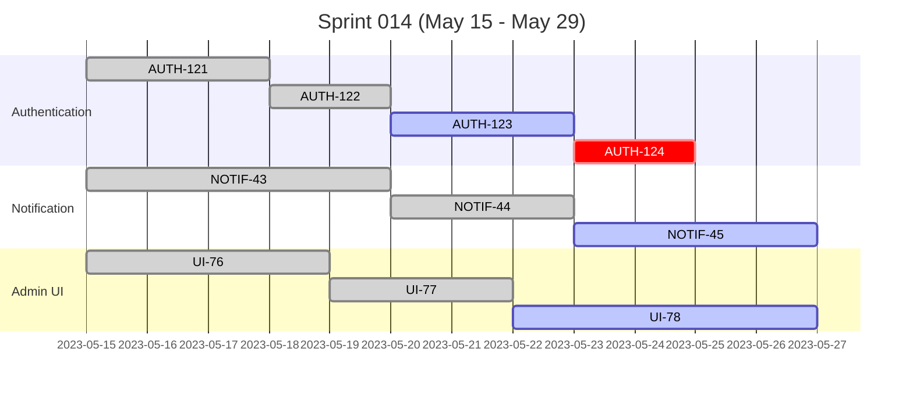
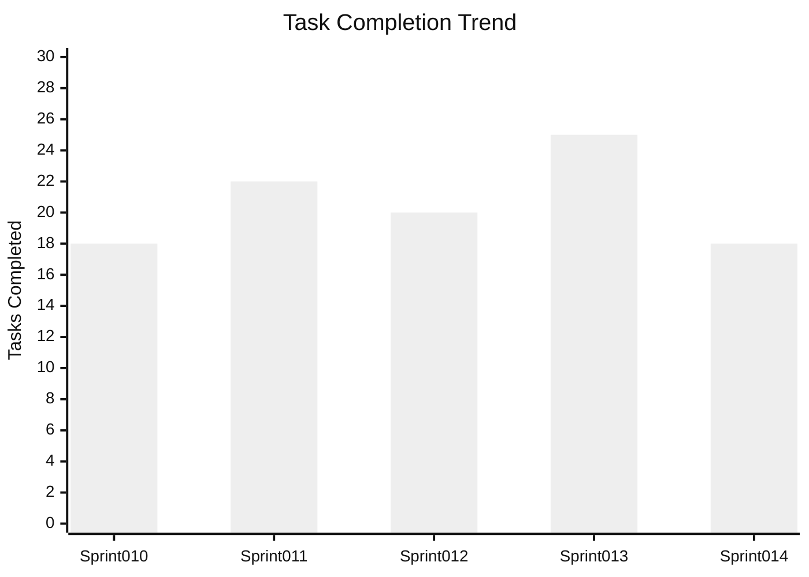
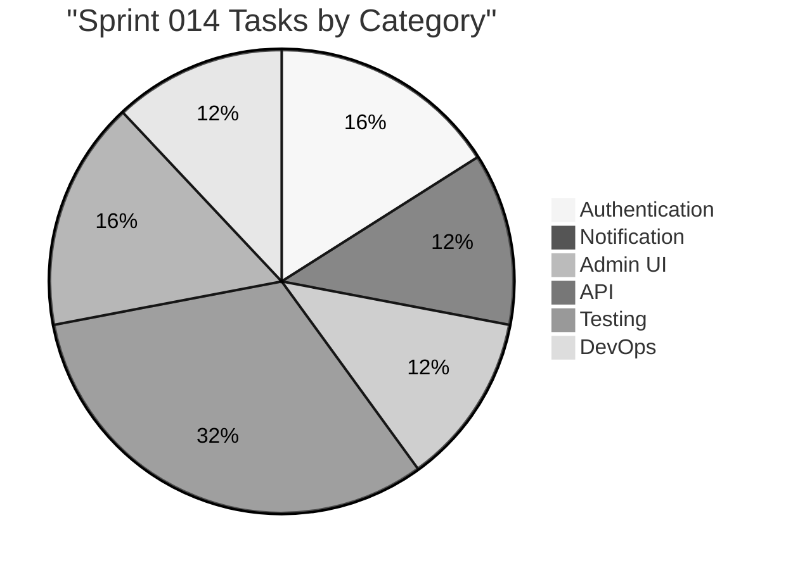

# Task Progress

Last Updated: **`2023-05-25`**

## Current Sprint (014) Progress

**Sprint Completion:** 72% (18/25 tasks)
**Days Remaining:** 4



## Task Status Table

| Task ID | Description | Status | Assignee | Progress | Due Date | Blockers |
|---------|-------------|--------|----------|----------|----------|----------|
| AUTH-121 | User login API | ✅ Done | @developer1 | 100% | 2023-05-18 | None |
| AUTH-122 | Password reset | ✅ Done | @developer1 | 100% | 2023-05-22 | None |
| AUTH-123 | JWT refresh | 🟢 In Progress | @developer1 | 80% | 2023-05-27 | None |
| AUTH-124 | MFA implementation | ⏰ Not Started | @developer1 | 0% | 2023-05-29 | None |
| NOTIF-43 | Email templates | ✅ Done | @developer2 | 100% | 2023-05-20 | None |
| NOTIF-44 | Email sending service | ✅ Done | @developer2 | 100% | 2023-05-23 | None |
| NOTIF-45 | Notification preferences | 🟡 Blocked | @developer2 | 60% | 2023-05-28 | External API credentials |
| UI-76 | Admin layout | ✅ Done | @developer3 | 100% | 2023-05-19 | None |
| UI-77 | User management page | ✅ Done | @developer3 | 100% | 2023-05-24 | None |
| UI-78 | Analytics dashboard | 🟢 In Progress | @developer3 | 40% | 2023-05-30 | None |

## Burndown Chart

```mermaid
%%{init: {'theme': 'neutral'}}%%
xychart-beta
    title "Sprint 014 Burndown"
    x-axis [15, 16, 17, 18, 19, 22, 23, 24, 25, 26, 29]
    y-axis "Tasks Remaining" 25 --> 0
    line [25, 24, 22, 20, 18, 15, 13, 11, 7, ?, ?]
    line [25, 23, 21, 19, 17, 15, 13, 11, 9, 6, 0]
```

## Task Completion Trend



## Velocity by Category



## Recent Task Activity

| Date | Activity | Task ID | Developer |
|------|----------|---------|-----------|
| 2023-05-25 | Completed | UI-77 | @developer3 |
| 2023-05-25 | Started | UI-78 | @developer3 |
| 2023-05-24 | Blocked | NOTIF-45 | @developer2 |
| 2023-05-23 | Completed | NOTIF-44 | @developer2 |
| 2023-05-22 | Completed | AUTH-122 | @developer1 |
| 2023-05-22 | Started | AUTH-123 | @developer1 |

## Task Links

- [Sprint 014 Tasks Board](tasks/sprint-014-tasks.md)
- [Current Sprint Summary](docs/summaries/changes/sprint-014-changes-2023-05-25.md)
