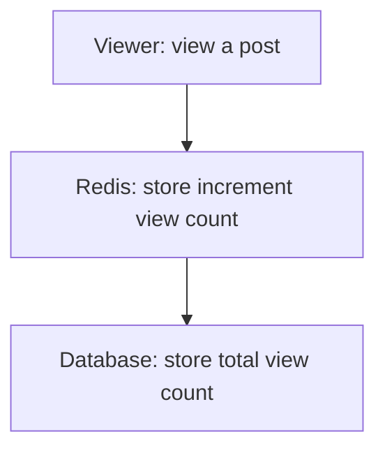

# Technical Overview

This document outlines the technical architecture for an AI-based IDE built using NestJS, Prisma, and TypeScript. The system follows a modular microservices architecture with event-driven communication patterns.

## Technology Stack

- **Backend Framework**: NestJS
- **Language**: TypeScript
- **API docs**: Swagger
- **Database ORM**: Prisma
- **Database**: PostgreSQL
- **Authentication**: JWT + role-based authorization
- **Event Bus**: EventBus module powered by NestJS EventEmitter
- **Caching**: Redis
- **Queue**: BullMQ
- **Real-time**: MQTT
- **Monitoring**: Prometheus, Grafana

## Core Modules

### 1. Common Module

```typescript
// src/common/common.module.ts
@Module({
  imports: [
    AppConfigModule,
    LoggerModule,
    CacheModule.registerAsync<RedisClientOptions>({
      inject: [ConfigService],
      isGlobal: true,
      useFactory: (service: ConfigService) => {
        return {
          stores: [new KeyvRedis(service.get<string>('redis.url'))],
        };
      },
    }),
    BullModule.forRootAsync({
      inject: [ConfigService],
      useFactory: (configService: ConfigService) => ({
        url: configService.get<string>('redis.url'),
      }),
    }),
    EventEmitterModule.forRoot(),
    AuthModule,
    HealthModule,
    PrismaModule,
  ],
})
export class CommonModule {}
```

### 2. Identity Module

```plaintext
// prisma/schema.prisma
model User {
  id              String            @id @default(uuid())
  authId          String            @unique @map("auth_id") @db.Uuid
  email           String?
  phone           String?
  firstName       String            @map("first_name") @db.Text
  lastName        String?           @map("last_name") @db.Text
  avatar          String?           @db.Text
  roles           UserRole[]
  isActive        Boolean           @default(true) @map("is_active")
  createdAt       DateTime          @default(now()) @map("created_at") @db.Timestamptz()
  updatedAt       DateTime          @updatedAt @map("updated_at") @db.Timestamptz()
  userInSpaces    UserInSpaces[]
  activities      UserActivity[]
  publishedPosts  PublishedPost[]   @relation("UserAuthorPosts")
  draftPosts      DraftPost[]
  comments        Comment[]         @relation("UserAuthorComments")
  postLikes       PostLike[]
  commentLikes    CommentLike[]
  bookmarks       Bookmark[]
  feeds           Feed[]
  emotions        UserEmotion[]
  streak          UserStreak?
  achievements    UserAchievement[]
  botInteractions BotInteraction[]

  @@map("users")
}
```


### 3. Notification Module

```plaintext
// prisma/schema.prisma
model Notification {
  id               String    @id @default(uuid())
  key              String
  type             String
  userId           String    @map("user_id")
  /// [NotificationObjectType]
  subjects         Json[]
  subjectCount     Int       @map("subject_count")
  /// [NotificationObjectType]
  diObject         Json?     @map("di_object")
  /// [NotificationObjectType]
  inObject         Json?     @map("in_object")
  /// [NotificationObjectType]
  prObject         Json?     @map("pr_object")
  text             String
  /// [NotificationDecoratorType]
  decorators       Json[]
  link             String?
  notificationTime DateTime  @default(now()) @map("notification_time") @db.Timestamptz()
  viewedAt         DateTime? @map("viewed_at") @db.Timestamptz()
  createdAt        DateTime  @default(now()) @map("created_at") @db.Timestamptz()
  updatedAt        DateTime  @updatedAt @map("updated_at") @db.Timestamptz()

  @@index([userId, notificationTime(sort: Desc)])
  @@index([userId, viewedAt])
  @@index([key], type: Hash)
  @@index([type], type: Hash)
  @@map("notifications")
}
```

### 4. Gamification Module

```plaintext
// prisma/schema.prisma
model UserEmotion {
  id        String   @id @default(uuid())
  userId    String   @map("user_id")
  emotion   String
  intensity Int      @default(1) // Scale of 1-5 for emotion intensity
  note      String?  @db.Text // Optional note about the emotion
  date      DateTime @db.Date // Store just the date for daily tracking
  timestamp DateTime @default(now()) @db.Timestamptz() // Exact time of recording
  metadata  Json?    @default("{}") // Additional data for analytics
  createdAt DateTime @default(now()) @map("created_at") @db.Timestamptz()
  updatedAt DateTime @updatedAt @map("updated_at") @db.Timestamptz()

  user User @relation(fields: [userId], references: [id])

  @@index([userId])
  @@index([date])
  @@index([emotion])
  @@index([userId, date]) // For querying user's emotions by date
  @@map("user_emotions")
}
```

## Event-Driven Architecture

Prefer use event bus to communicate between modules. Use event bus instead of EventEmitter.

### Event Bus Configuration

```typescript
// src/common/event-manager/event-bus.module.ts
@Module({
  imports: [
    EventEmitterModule.forRoot({
      wildcard: true,      // Enable wildcard event listeners
      delimiter: '.',      // Event name delimiter for namespacing
      maxListeners: 20,    // Maximum listeners per event
      verboseMemoryLeak: true, // Log warnings for potential memory leaks
    }),
  ],
  exports: [EVENT_BUS_TOKEN],
})
export class EventBusModule {}
```

### Event Handling Patterns

1. **Publishing Events**

```typescript
@Injectable()
export class UserService {
  constructor(private readonly eventBus: EventBusAdapter) {}

  async createUser(data: CreateUserDto): Promise<User> {
    const user = await this.userRepository.create(data);
    
    // Publish event
    await this.eventBus.publish(
      new UserCreatedEvent({
        userId: user.id,
        email: user.email,
      })
    );

    return user;
  }
}
```

2. **Handling Events**

```typescript
@Injectable()
export class UserActivityHandler {
  constructor(private readonly activityService: UserActivityService) {}

  @OnEvent('user.created')
  async handleUserCreated(event: EventBusMessage<UserCreatedPayload>) {
    await this.activityService.logActivity({
      userId: event.payload.userId,
      type: UserActivityType.ACCOUNT_CREATED,
      metadata: event.metadata,
    });
  }

  @OnEvent('user.*') // Wildcard pattern to handle all user events
  async logAllUserEvents(event: EventBusMessage<unknown>) {
    this.logger.debug(`User event received: ${event.eventName}`);
  }
}
```

3. **Event Validation**

```typescript
// Define event payload validation
export class UserCreatedPayload {
  @IsUUID()
  userId: string;

  @IsEmail()
  email: string;
}

// Create event class
export class UserCreatedEvent extends BaseEvent<UserCreatedPayload> {
  constructor(payload: UserCreatedPayload) {
    super({
      eventName: 'user.created',
      schema: payload,
      version: '1.0.0',
      module: 'identity',
      description: 'Emitted when a new user is created',
    });
  }

  toJSON(): UserCreatedPayload {
    return this.schema.schema;
  }
}
```

### Best Practices

1. **Event Naming**
   - Use dot notation for namespacing: `module.entity.action`
   - Examples: `user.created`, `post.published`, `comment.deleted`
   - Keep names consistent across the application

2. **Event Payload**
   - Keep payloads minimal and focused
   - Include only necessary data
   - Use proper validation
   - Consider versioning for schema changes

3. **Error Handling**
   - Always use try-catch in event handlers
   - Log errors appropriately
   - Consider retry mechanisms for critical events

```typescript
@Injectable()
export class NotificationHandler {
  @OnEvent('user.created')
  async handleUserCreated(event: EventBusMessage<UserCreatedPayload>) {
    try {
      await this.sendWelcomeEmail(event.payload);
    } catch (error) {
      this.logger.error(
        `Failed to send welcome email to user ${event.payload.userId}`,
        error.stack,
      );
      // Consider retry or fallback mechanism
    }
  }
}
```

4. **Testing Events**

```typescript
describe('UserService', () => {
  it('should publish user.created event', async () => {
    const eventBus = app.get<EventBusAdapter>(EventBusAdapter);
    const publishSpy = jest.spyOn(eventBus, 'publish');

    await userService.createUser(userData);

    expect(publishSpy).toHaveBeenCalledWith(
      expect.objectContaining({
        eventName: 'user.created',
        payload: expect.objectContaining({
          userId: expect.any(String),
          email: userData.email,
        }),
      }),
    );
  });
});
```

### Common Event Patterns

1. **Notification Events**

```typescript
// Event payload
interface NotificationEventPayload {
  userId: string;
  type: string;
  data: Record<string, unknown>;
}

// Event handler
@Injectable()
export class NotificationHandler {
  @OnEvent('*.notification')
  async handleNotification(event: EventBusMessage<NotificationEventPayload>) {
    await this.notificationService.send(event.payload);
  }
}
```

2. **Audit Events**

```typescript
// Event payload
interface AuditEventPayload {
  userId: string;
  action: string;
  resource: string;
  changes?: Record<string, unknown>;
}

// Event handler
@Injectable()
export class AuditHandler {
  @OnEvent('*.audit')
  async handleAudit(event: EventBusMessage<AuditEventPayload>) {
    await this.auditService.log(event.payload);
  }
}
```

3. **Cache Invalidation Events**

```typescript
// Event handler
@Injectable()
export class CacheHandler {
  @OnEvent('*.updated')
  async handleUpdate(event: EventBusMessage<unknown>) {
    const cacheKey = this.getCacheKey(event);
    await this.cacheService.invalidate(cacheKey);
  }
}
```

### Performance Considerations

1. **Async Event Handling**
   - Use `emitAsync` for asynchronous event handling
   - Consider using queues for long-running tasks
   - Monitor event processing times

2. **Memory Management**
   - Set appropriate maxListeners
   - Clean up listeners when no longer needed
   - Monitor for memory leaks

3. **Error Recovery**
   - Implement retry mechanisms
   - Use dead letter queues
   - Log failed events for manual recovery

## Database Schema

### Prisma Schema

Read `prisma/schema.prisma`

## Security Implementations

### Authentication Guard

```typescript
// src/common/auth/adapter/presentation/nestjs/auth.guard.ts
@Injectable()
export class AuthGuard implements CanActivate {
  constructor(private readonly jwtGuard: JWTGuard) {}

  async canActivate(context: ExecutionContext): Promise<boolean> {
    return this.jwtGuard.canActivate(context);
  }
}
```

### Authorization Guard

```typescript
// src/common/auth/adapter/presentation/nestjs/role.guard.ts
@Injectable()
export class RolesGuard implements CanActivate {
  constructor(private readonly reflector: Reflector) {}

  canActivate(context: ExecutionContext): boolean {
    const requiredRoles = this.reflector.getAllAndOverride<Role[]>(ROLES_KEY, [
      context.getHandler(),
      context.getClass(),
    ]);

    if (!requiredRoles) {
      return true;
    }

    const { authCtx } = context.switchToHttp().getRequest();

    if (!authCtx) {
      throw new AppError('common.invalidToken');
    }

    if (!authCtx.isUser()) {
      throw new AppError('common.requireUser');
    }

    if (requiredRoles.find((role) => authCtx.getUser().roles.includes(role))) {
      return true;
    }

    throw new AppError('common.noPrivilege', {
      roles: requiredRoles.join(', '),
    });
  }
}
```

## Error handle

### App Error Definition

Define app error per module

```typescript
// src/identity/entities/user-error.map.ts
export const userErrorMap: ErrorMap = {
  ...commonErrorMap,
  user: {
    create: {},
    get: {
      notFound: {
        status: HttpStatus.NOT_FOUND,
        message: 'User not found',
      },
    },
    profile: {
      get: {
        notFound: {
          status: HttpStatus.NOT_FOUND,
          message: 'User profile not found',
        },
      },
    },
    // AI-powered code
  },
};
```

### Define API docs

```typescript
// src/identity/presentation/rest/user.controller.ts
  @ErrorResponse('user.create', userErrorMap, { hasValidationErr: true })
  async create(
    @Body() userData: CreateUserDto,
    @AuthContext() authCtx: AuthCtx,
  ): Promise<UserDto> {
    // AI-powered code
  }
```

### Throw app error

```typescript
// src/identity/services/user.service.ts
throw new AppError('user.profile.get.notFound');
```

## Swagger document

Using @nestjs/swagger to create API docs for each API

### API definition

```typescript
// src/identity/presentation/rest/user.controller.ts
// 201 response
  @ApiOperation({ summary: 'Create user' })
  @CreatedResponse(UserDto)
  @ErrorResponse('user.create', userErrorMap, { hasValidationErr: true })

// 200 response
  @ApiOperation({
    summary: 'Bulk user operations (update/delete/deactivate/activate)',
  })
  @OkResponse(BulkOperationResultDto)
  @ErrorResponse('user.bulk', userErrorMap, { hasValidationErr: true })

// 200 response with pagination
  @ApiOperation({ summary: 'Get many users' })
  @PaginatedResponse(UserDto)
  @ErrorResponse('user.list', userErrorMap, { hasValidationErr: true })
```

### Model define

```typescript
// src/identity/presentation/rest/input/activity-filters.dto.ts
export class ActivityFiltersDto {
  @ApiPropertyOptional()
  @IsOptional()
  @IsDate()
  startDate?: Date;

  @ApiPropertyOptional()
  @IsOptional()
  @IsDate()
  endDate?: Date;

  @ApiPropertyOptional()
  @IsOptional()
  @IsString()
  activityType?: string;

  @ApiPropertyOptional()
  @IsOptional()
  @IsNumber()
  offset?: number;

  @ApiPropertyOptional()
  @IsOptional()
  @IsNumber()
  limit?: number;
}
```

## Deployment Architecture

### Docker Configuration

```dockerfile
# Dockerfile
FROM node:22-alpine3.20 AS builder

ENV NODE_ENV build

USER node
WORKDIR /home/node

COPY package.json yarn.lock ./
RUN yarn install

COPY --chown=node:node . .

RUN npx prisma generate \
    && yarn build

# ---

FROM node:22-alpine3.20

ENV NODE_ENV production

USER node
WORKDIR /home/node

COPY --from=builder --chown=node:node /home/node/package.json /home/node/yarn.lock ./
COPY --from=builder --chown=node:node /home/node/node_modules/ ./node_modules/
COPY --from=builder --chown=node:node /home/node/dist/ ./dist/

CMD ["yarn", "start:prod"]
```

### Docker Compose Setup

```yaml
# docker-compose.yml
services:
  postgres:
    image: postgres
    restart: unless-stopped
    volumes:
      - pg-data:/var/lib/postgresql/data
    environment:
      POSTGRES_USER: ${POSTGRES_USER}
      POSTGRES_PASSWORD: ${POSTGRES_PASSWORD}
      POSTGRES_DB: ${POSTGRES_DB}
    ports:
      - 5432:5432

  redis:
    image: redis/redis-stack
    restart: unless-stopped
    ports:
      - 6379:6379
    # environment:
    #   REDIS_ARGS: --requirepass ${REDIS_PASSWORD}
    volumes:
      - redis-data:/data

  mqtt01:
    image: emqx:latest
    restart: unless-stopped
    ports:
      - 18083:18083
      - 1883:1883
      - 8883:8883
      - 8083:8083
      - 8084:8084
    volumes:
      - vol-emqx01-data:/opt/emqx/data
      - vol-emqx01-log:/opt/emqx/log
    environment:
      - 'EMQX_NODE__NAME=emqx@node01.emqx.io'
      - 'EMQX_CLUSTER__DISCOVERY_STRATEGY=static'
      - 'EMQX_CLUSTER__STATIC__SEEDS=[emqx@node01.emqx.io, emqx@node02.emqx.io]'
    networks:
      vpc-bridge:
        aliases:
          - node01.emqx.io

  mqtt02:
    image: emqx:latest
    restart: unless-stopped
    ports:
      - 28083:18083
      - 2883:1883
      - 9883:8883
      - 9083:8083
      - 9084:8084
    volumes:
      - vol-emqx02-data:/opt/emqx/data
      - vol-emqx02-log:/opt/emqx/log
    environment:
      - 'EMQX_NODE__NAME=emqx@node02.emqx.io'
      - 'EMQX_CLUSTER__DISCOVERY_STRATEGY=static'
      - 'EMQX_CLUSTER__STATIC__SEEDS=[emqx@node01.emqx.io, emqx@node02.emqx.io]'
    networks:
      vpc-bridge:
        aliases:
          - node02.emqx.io

volumes:
  pg-data:
  redis-data:
  vol-emqx01-data:
  vol-emqx01-log:
  vol-emqx02-data:
  vol-emqx02-log:

networks:
  vpc-bridge:
    driver: bridge
```

## Scaling Considerations

1. **Horizontal Scaling**

   - Use Kubernetes for container orchestration
   - Implement load balancing at the API Gateway level
   - Scale individual microservices independently

2. **Performance Optimization**

   - Implement caching strategies using Redis
   - Optimize database queries and indexes
   - Use MQTT for real-time features

3. **Monitoring and Logging**
   - Implement ELK stack for centralized logging
   - Use Prometheus and Grafana for metrics
   - Set up application performance monitoring

## Development Workflow

1. **Local Development**

   ```bash
   # Start development environment
   yarn run start:dev

   # Run database migrations
   npx prisma db push
   export ROOT_USER_AUTH_ID=86f41bd0-a011-45a2-837d-36ff38f6e8da
   npx prisma db seed

   # Generate new migration
   npx prisma migrate dev --name <migration_name>
   ```

2. **Testing Strategy**

   TBD

## Future Considerations

1. **Production ready**

   - OpenAPI documentation

2. **Extensibility**

   - Microservices-ready architecture
   - Portable Module
   - API versioning strategy

3. **Developer Experience**
   - Interactive documentation
   - Developer portal
   - API playground

### View Tracking Implementation

A viewer can view a post multiple times, each time should be counted as 1 view. A viewer can only view a post once in a period of 10 minutes.

Post view count is near real-time, but not 100% accurate. It will be updated every 1 minute.



1. Architecture:
   - HyperLogLog for unique view counting
   - List for batching view records
   - Periodic sync to database
   - Configurable batch size and timeout

2. Key Structure:

   ```
   post:{postId}:views:increment     -> HyperLogLog (unique viewers)
   post:{postId}:views:recent    -> String with TTL (deduplication)
   post-views-batch             -> List (pending records)
   post-views-batch:start      -> String (batch start time)
   ```

3. Flow:

   ```
   1. Check recent views (deduplication)
   2. Add to HyperLogLog if unique
   3. Add to batch list
   4. Process batch if full or timeout reached
   5. Periodic sync to database
   ```

4. Configuration:

   ```typescript
   const VIEW_BATCH_SIZE = 100;
   const VIEW_BATCH_TIMEOUT = 1000; // ms
   const VIEW_RECENT_TTL = 600; // 10 minutes
   const VIEW_SYNC_INTERVAL = 60; // 1 minutes
   ```

## Known Issues and Considerations

1. Performance
   - Add rate limiting for search queries
   - Add performance monitoring for list endpoints
   - Consider implementing cursor-based pagination for large datasets

2. View Tracking
   - Redis memory usage needs monitoring for HyperLogLog growth
   - View batching could lose data on service restart
   - Need cleanup strategy for old view records

3. Like System
   - Race conditions possible on concurrent like/unlike
   - Like count might become inconsistent under high load
   - Consider implementing optimistic locking

## Social Engagement System

### Interface Definitions

```typescript
interface ILikeable {
  like(userId: string): Promise<void>;
  unlike(userId: string): Promise<void>;
  getLikeCount(): Promise<number>;
  isLikedBy(userId: string): Promise<boolean>;
}

interface IViewable {
  view(viewerHash: string, viewerId?: string): Promise<void>;
  getViewCount(): Promise<number>;
}

interface ICommentable {
  comment(userId: string, content: any): Promise<Comment>;
  getComments(options: PaginationOptions): Promise<Comment[]>;
  getCommentCount(): Promise<number>;
}
```

### Redis Implementation

#### Key Patterns

```
{type}:{id}:likes:set          // Set of user IDs who liked
{type}:{id}:views:hll          // HyperLogLog of viewer hashes
{type}:{id}:views:recent:{hash} // Recent view tracking with TTL
{type}:likes:batch             // List of pending like updates
{type}:views:batch             // List of pending view updates
```

#### Batch Processing

```typescript
export interface BatchProcessorConfig<T> {
  // Function to process the batch
  processBatch: (items: T[]) => Promise<void>;
  // Redis key for the batch list
  batchKey?: string;
  // Maximum size of a batch before processing
  batchSize?: number;
  // Maximum time (ms) to wait before processing an incomplete batch
  batchTimeout?: number;
  // Optional function to validate item before adding to batch
  validateItem?: (item: T) => boolean | Promise<boolean>;
  // Optional custom logger
  logger?: Logger;
  // Optional timer interval (ms) to check if batch should be processed
  timerInterval?: number;
}

export class RedisBatchProcessor<T> {
  constructor(redis: Redis, config: BatchProcessorConfig<T>) {
    // ...
  }

  async add(item: T): Promise<void> {
    // ...
  }
}
```

## Technical Debt

### Social module

- Use social event in common module instead of creating it in social
- Prevent user like a post multiple time
- Prevent user unlike a post that he hasn't liked yet

### Notification module

- Combine notification by key
- Change column name di_object -> direct_object
- Notification template API may not work
- Remove redundant groupKey, groupCount, and lastEventId fields from notification table
  - Currently using key field for grouping
  - groupKey and related fields are unused
  - This will simplify the grouping logic and database schema

### Identity

- Don't emit profile.updated event if user use upsert account API

## Notification System Architecture

### Overview

The notification system follows a three-stage pipeline architecture: Producer → Consumer → Delivery. This design ensures reliable notification processing, proper grouping, and efficient delivery across multiple channels.

### Components Flow

#### 1. Producer Stage (NotificationProducerService)

**Responsibility**: Converts domain events into notification requests

- **Input**: Domain events (PostLikedEvent, CommentAddedEvent, etc.)
- **Processing**:
  - Creates NotificationCreateInput
  - Assigns unique grouping key
  - Sets notification type and target user
  - Configures content metadata and deep links
- **Output**: Queued notification request (via Bull Queue)

#### 2. Consumer Stage (NotificationConsumerService)

**Responsibility**: Processes notification requests with grouping and rendering

- **Input**: NotificationCreateInput from queue
- **Processing**:
  - Validates user notification preferences
  - Applies notification grouping strategies
  - Renders notification text using templates
  - Manages concurrent updates with RedLock
- **Output**: Persisted Notification entity

#### 3. Delivery Stage (NotificationDeliveryService)

**Responsibility**: Delivers notifications through configured channels

- **Input**: Notification entity
- **Processing**:
  - Checks channel preferences
  - Formats for each channel
  - Implements retry logic
  - Records delivery metrics
- **Output**: Channel-specific deliveries (MQTT, etc.)

### Implementing New Notification Types

When adding a new notification type:

1. **Producer Changes**:
   - Create event type in domain
   - Add handler method in NotificationProducerService
   - Configure notification metadata and grouping key

2. **Consumer Changes**:
   - Add grouping strategy if needed
   - Create notification templates
   - Configure template rendering

3. **Delivery Changes**:
   - Add channel-specific formatting if needed
   - Configure delivery preferences

### Best Practices

1. **Event Design**:
   - Use descriptive event names
   - Include all necessary context
   - Follow existing event patterns

2. **Notification Grouping**:
   - Define clear grouping rules
   - Consider time windows
   - Handle edge cases

3. **Template Management**:
   - Support multiple languages
   - Use consistent variables
   - Include proper escaping

4. **Error Handling**:
   - Implement proper retries
   - Log failures appropriately
   - Monitor delivery rates

### Performance Considerations

1. **Producer**:
   - Queue configuration
   - Backoff strategies
   - Concurrency limits

2. **Consumer**:
   - Grouping window size
   - Lock timeouts
   - Database optimization

3. **Delivery**:
   - Channel timeouts
   - Retry policies
   - Resource limits
