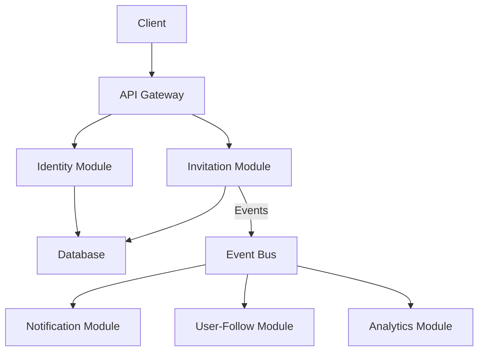

# User Invitation System - Technical Design Document

## 1. Architecture Overview

The User Invitation System will follow our established microservice architecture patterns, utilizing:

- Repository pattern for data access
- Service interfaces for business logic
- Event-driven communication for cross-module integration
- REST controllers for API endpoints



## 2. Database Schema

### 2.1 New Schema

Add the following to `prisma/schema.prisma`:

```prisma
model Invitation {
  id            String    @id @default(uuid())
  code          String    @unique // Unique invitation code
  inviterId     String    @map("inviter_id")
  message       String?   @db.Text // Optional personal message
  email         String?   // Optional target email
  status        InvitationStatus @default(PENDING)
  acceptedBy    String?   @map("accepted_by")
  acceptedAt    DateTime? @map("accepted_at")
  expiresAt     DateTime? @map("expires_at") // Optional expiration
  createdAt     DateTime  @default(now()) @map("created_at") @db.Timestamptz()
  updatedAt     DateTime  @updatedAt @map("updated_at") @db.Timestamptz()
  
  inviter       User      @relation("UserInvitations", fields: [inviterId], references: [id])
  invitee       User?     @relation("UserInvitedBy", fields: [acceptedBy], references: [id])

  @@index([inviterId])
  @@index([code])
  @@map("invitations")
}

enum InvitationStatus {
  PENDING
  ACCEPTED
  EXPIRED

  @@map("invitation_status")
}
```

### 2.2 User Model Updates

Modify the existing User model in `prisma/schema.prisma`:

```prisma
model User {
  // ... existing fields

  // Add these new relations
  sentInvitations     Invitation[] @relation("UserInvitations")
  invitedBy           Invitation?  @relation("UserInvitedBy")

  // ... existing relations
}
```

## 3. Module Structure

Create a new module with the following structure:

```
src/
└── invitation/
    ├── entities/
    │   ├── invitation.entity.ts
    │   ├── invitation.errors.ts
    │   └── events/
    │       ├── invitation-created.event.ts
    │       └── invitation-accepted.event.ts
    ├── repositories/
    │   └── invitation.repository.ts
    ├── services/
    │   ├── invitation.service.ts
    │   └── interfaces/
    │       ├── invitation-repository.interface.ts
    │       └── invitation-service.interface.ts
    ├── presentation/
    │   ├── invitation.controller.ts
    │   ├── handlers/
    │   │   └── invitation-accepted.handler.ts
    │   └── dtos/
    │       ├── create-invitation.dto.ts
    │       ├── invitation-response.dto.ts
    │       └── verify-invitation.dto.ts
    └── invitation.module.ts
```

## 4. Service Design

### 4.1 Invitation Service Interface

```typescript
export interface IInvitationService {
  /**
   * Create a new invitation
   * @param userId ID of the user creating the invitation
   * @param options Optional settings for the invitation
   * @returns The created invitation
   */
  createInvitation(userId: string, options?: CreateInvitationOptions): Promise<Invitation>;

  /**
   * Verify if an invitation code is valid
   * @param code Invitation code to verify
   * @returns Invitation details if valid, null otherwise
   */
  verifyInvitation(code: string): Promise<InvitationVerificationResult | null>;

  /**
   * Mark an invitation as accepted by a user
   * @param code Invitation code
   * @param userId ID of the user who accepted the invitation
   * @returns Updated invitation
   */
  acceptInvitation(code: string, userId: string): Promise<Invitation>;

  /**
   * Get invitations sent by a user
   * @param userId ID of the user
   * @param pageOptions Pagination options
   * @returns Paged result of invitations
   */
  getUserInvitations(userId: string, pageOptions: PageOptionsDto): Promise<PagedResult<InvitationDto>>;

  /**
   * Get invitation statistics for a user
   * @param userId ID of the user
   * @returns Statistics about sent and accepted invitations
   */
  getUserInvitationStats(userId: string): Promise<InvitationStatsDto>;
}
```

### 4.2 Invitation Repository Interface

```typescript
export interface IInvitationRepository {
  /**
   * Create a new invitation
   * @param invitationData Invitation data
   * @returns Created invitation
   */
  create(invitationData: CreateInvitationData): Promise<Invitation>;

  /**
   * Find invitation by code
   * @param code Invitation code
   * @returns Invitation if found, null otherwise
   */
  findByCode(code: string): Promise<Invitation | null>;

  /**
   * Update invitation status
   * @param id Invitation ID
   * @param status New status
   * @param acceptedBy Optional user ID who accepted
   * @returns Updated invitation
   */
  updateStatus(id: string, status: InvitationStatus, acceptedBy?: string): Promise<Invitation>;

  /**
   * Get invitations by inviter ID
   * @param inviterId User ID of inviter
   * @param pageOptions Pagination options
   * @returns Paged invitations
   */
  findByInviterId(inviterId: string, pageOptions: PageOptionsDto): Promise<[Invitation[], number]>;

  /**
   * Get invitation statistics for a user
   * @param userId User ID
   * @returns Count of sent and accepted invitations
   */
  getInvitationStats(userId: string): Promise<{sent: number, accepted: number}>;
}
```

## 5. API Endpoints

### 5.1 Invitation Controller

```
POST /api/invitations - Create new invitation
GET /api/invitations - Get current user's invitations
GET /api/invitations/stats - Get invitation statistics
GET /api/invitations/:code/verify - Verify invitation code
```

## 6. Events

### 6.1 Invitation Created Event

```typescript
export class InvitationCreatedEvent {
  constructor(
    public readonly invitationId: string,
    public readonly inviterId: string,
    public readonly code: string,
    public readonly email?: string,
    public readonly timestamp: Date = new Date(),
  ) {}
}
```

### 6.2 Invitation Accepted Event

```typescript
export class InvitationAcceptedEvent {
  constructor(
    public readonly invitationId: string,
    public readonly inviterId: string,
    public readonly inviteeId: string,
    public readonly code: string,
    public readonly timestamp: Date = new Date(),
  ) {}
}
```

## 7. Integration Points

### 7.1 Identity Module Integration

Modify the registration flow in the identity module to:

1. Accept an optional invitation code parameter
2. Verify the invitation code with the invitation service
3. Create the user account as normal
4. Call invitation service to mark invitation as accepted

### 7.2 User-Follow Module Integration

Create a handler that listens for the `InvitationAcceptedEvent` and:

1. Automatically creates a follow relationship between invitee and inviter
2. Ensures idempotent operation in case of retries

### 7.3 Notification Module Integration

Create a handler that listens for the `InvitationAcceptedEvent` and:

1. Creates a notification for the inviter
2. Delivers the notification through configured channels

## 8. Security Considerations

1. **Invitation Code Generation**: Use secure random string generation for invitation codes
2. **Rate Limiting**: Implement rate limiting on invitation creation (10/day per user)
3. **Expiration**: Support optional expiration for invitation codes
4. **Validation**: Ensure invitations can only be accepted once
5. **Authorization**: Only allow users to view their own sent invitations

## 9. Performance Considerations

1. **Indexing**: Ensure proper database indexes on invitation code and user IDs
2. **Caching**: Consider caching frequent invitation verifications
3. **Async Processing**: Use event-driven architecture for non-critical operations

## 10. Testing Strategy

1. **Unit Tests**:
   - Test invitation service with mocked repository
   - Test invitation code generation and validation

2. **Integration Tests**:
   - Test database operations with test database
   - Test event handling across modules

3. **E2E Tests**:
   - Test full invitation flow from creation to acceptance
   - Test registration with invitation code

## 11. Migration Plan

1. Create database migration for new schema
2. Implement invitation module with core functionality
3. Integrate with identity module for registration flow
4. Implement event handlers for follow relationship and notifications
5. Deploy in stages with feature flag control

## 12. Monitoring and Analytics

1. Track invitation creation and acceptance rates
2. Monitor for unusual activity patterns
3. Collect analytics on invitation conversion rates
4. Set up alerts for abnormal usage patterns
