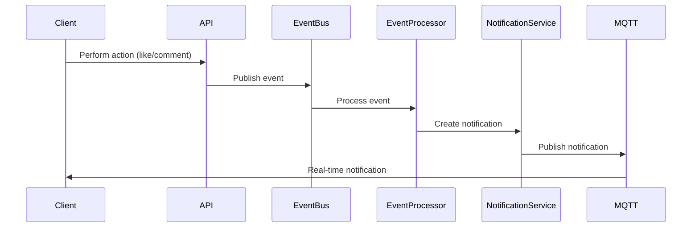

# Notification System Technical Design

## 1. Event System Architecture

### 1.1 Event Types

```typescript
// Base event interface
interface BaseEvent<T extends string, P> {
  type: T;
  version: string;
  timestamp: Date;
  producer: string;
  metadata: Record<string, unknown>;
  payload: P;
}

// Social interaction events
interface LikeEventPayload {
  actorId: string;
  contentType: 'POST' | 'EMOTION';
  contentId: string;
  targetUserId: string;
}

interface CommentEventPayload {
  actorId: string;
  contentType: 'POST' | 'EMOTION';
  contentId: string;
  commentId: string;
  targetUserId: string;
  preview?: string;
}

interface FollowEventPayload {
  followerId: string;
  followingId: string;
}

// Event type definitions
type LikeEvent = BaseEvent<'LIKE_CREATED' | 'LIKE_DELETED', LikeEventPayload>;
type CommentEvent = BaseEvent<'COMMENT_CREATED' | 'COMMENT_REPLIED', CommentEventPayload>;
type FollowEvent = BaseEvent<'FOLLOW_CREATED' | 'FOLLOW_DELETED', FollowEventPayload>;
```

### 1.2 Event Validation Schema

```typescript
import { IsString, IsDate, IsEnum, ValidateNested, IsUUID } from 'class-validator';

export class BaseEventDto {
  @IsString()
  type: string;

  @IsString()
  version: string;

  @IsDate()
  timestamp: Date;

  @IsString()
  producer: string;
}

export class LikeEventDto extends BaseEventDto {
  @IsUUID()
  actorId: string;

  @IsEnum(['POST', 'EMOTION'])
  contentType: 'POST' | 'EMOTION';

  @IsUUID()
  contentId: string;

  @IsUUID()
  targetUserId: string;
}
```

## 2. Database Schema Updates

### 2.1 Event Tracking

```prisma
// Add to schema.prisma

enum EventType {
  LIKE_CREATED
  LIKE_DELETED
  COMMENT_CREATED
  COMMENT_REPLIED
  FOLLOW_CREATED
  FOLLOW_DELETED
}

model Event {
  id          String    @id @default(uuid())
  type        EventType
  version     String
  producer    String
  payload     Json
  metadata    Json      @default("{}")
  processedAt DateTime? @map("processed_at")
  createdAt   DateTime  @default(now()) @map("created_at")

  @@index([type])
  @@index([processedAt])
  @@map("events")
}

// Update Notification model
model Notification {
  // ... existing fields ...
  
  // Add new fields for grouping
  groupKey    String?   @map("group_key")
  groupCount  Int       @default(1) @map("group_count")
  lastEventId String?   @map("last_event_id")
  
  // Add new indexes
  @@index([groupKey])
  @@index([userId, type, createdAt])
}
```

## 3. API Contracts

### 3.1 Notification Preferences API

\`\`\`typescript
// DTOs
interface UpdateNotificationPreferenceDto {
  type: string;
  channels: string[];
  enabled: boolean;
}

interface NotificationPreferenceResponseDto {
  id: string;
  type: string;
  channels: string[];
  enabled: boolean;
  updatedAt: Date;
}

// Endpoints
@Controller('notification-preferences')
class NotificationPreferenceController {
  @Get()
  getPreferences(): Promise<NotificationPreferenceResponseDto[]>

  @Put(':type')
  updatePreference(
    @Param('type') type: string,
    @Body() dto: UpdateNotificationPreferenceDto
  ): Promise<NotificationPreferenceResponseDto>
}
\`\`\`

### 3.2 Notification Delivery API

\`\`\`typescript
// DTOs
interface NotificationResponseDto {
  id: string;
  type: string;
  text: string;
  link?: string;
  subjects: NotificationObjectType[];
  subjectCount: number;
  notificationTime: Date;
  viewedAt?: Date;
}

// Endpoints
@Controller('notifications')
class NotificationController {
  @Get()
  getNotifications(
    @Query('page') page: number,
    @Query('limit') limit: number,
    @Query('viewed') viewed?: boolean
  ): Promise<PaginatedResponse<NotificationResponseDto>>

  @Post(':id/view')
  markAsViewed(@Param('id') id: string): Promise<void>

  @Post('view-all')
  markAllAsViewed(): Promise<void>
}
\`\`\`

## 4. Event Processing Flow



## 5. Monitoring and Metrics

### 5.1 Key Metrics

1. Event Processing:
   - Event processing latency
   - Event processing success rate
   - Event backlog size

2. Notification Delivery:
   - Delivery latency
   - Success rate
   - Queue size

3. MQTT Metrics:
   - Connection count
   - Message throughput
   - Delivery success rate

### 5.2 Alert Thresholds

1. Processing Latency:
   - Warning: > 500ms
   - Critical: > 2000ms

2. Queue Size:
   - Warning: > 1000 events
   - Critical: > 5000 events

3. Error Rate:
   - Warning: > 1%
   - Critical: > 5%

## 6. Implementation Guidelines

### 6.1 Event Processing

1. Use event sourcing pattern
2. Implement idempotent processing
3. Add retry mechanism with exponential backoff
4. Implement dead letter queue for failed events

### 6.2 Notification Grouping

1. Group similar notifications within 5-minute window
2. Update existing notifications instead of creating new ones
3. Implement smart text generation for grouped notifications

### 6.3 Performance Optimization

1. Use Redis for temporary event storage
2. Implement batch processing for high-volume events
3. Use materialized views for notification queries
4. Implement proper database indexing

### 6.4 Error Handling

1. Define specific error types
2. Implement proper error logging
3. Add monitoring for error patterns
4. Create error recovery procedures

## 7. Security Considerations

1. Event validation
2. User permission checking
3. Rate limiting
4. MQTT authentication and authorization
