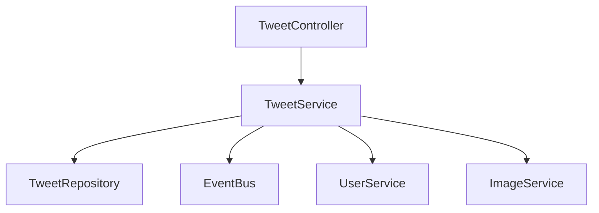

# TWEET-001: Tweet Module Technical Design

## Overview

This document outlines the technical design for addressing critical bugs and implementing enhancements in the tweet module.

## Current Architecture

The tweet module follows a layered architecture:



## Identified Issues

1. **User Data Fetching**
   - Missing batch fetching in getTweets
   - No caching strategy
   - Incomplete error handling

2. **Race Conditions**
   - No optimistic locking
   - Potential data loss during concurrent updates
   - Missing version control

3. **Image Processing**
   - Incomplete validation
   - Missing cleanup for orphaned images
   - No size/format restrictions

4. **Event Publishing**
   - No retry mechanism
   - Missing monitoring
   - Incomplete error handling

## Technical Design

### 1. User Data Enhancement

```typescript
// src/content/tweet/services/tweet-user.service.ts
@Injectable()
export class TweetUserService {
  constructor(
    private readonly commandBus: CommandBus,
    @Inject(CACHE_MANAGER) private readonly cacheService: ICacheManager,
    private readonly logger: Logger,
  ) {}

  async getUsersForTweets(tweets: Tweet[]): Promise<Map<string, UserInfo>> {
    const userIds = [...new Set(tweets.map(t => t.userId))];
    const cacheKeys = userIds.map(id => `user:${id}`);
    const cachedData = await this.cacheService.getMany(cacheKeys);
    
    const missingIds = userIds.filter((_, i) => !cachedData[i]);
    if (missingIds.length > 0) {
      // Use existing GetUsersCommand from identity module
      const command = new GetUsersCommand(missingIds);
      const users = await this.commandBus.execute<GetUsersCommand, UserInfo[]>(command);
      
      await Promise.all(
        users.map(user => 
          this.cacheService.set(`user:${user.id}`, user, { ttl: 900 })
        )
      );
      
      return new Map([
        ...users.map(u => [u.id, u]),
        ...cachedData
          .filter(Boolean)
          .map((data, i) => [userIds[i], data as UserInfo])
      ]);
    }
    
    return new Map(
      cachedData
        .filter(Boolean)
        .map((data, i) => [userIds[i], data as UserInfo])
    );
  }
}

// src/content/tweet/tweet.module.ts
@Module({
  imports: [
    CqrsModule,
    // Import IdentityModule to use its commands
    IdentityModule,
  ],
  providers: [
    TweetUserService,
    // ... other providers
  ],
  // ... rest of module config
})
export class TweetModule {}

// The following types are from the identity module
// src/identity/entities/commands/get-users.command.ts
export interface UserInfo {
  id: string;
  firstName: string;
  lastName: string;
  avatarUrl: string | null;
}
```

### 2. Optimistic Locking Implementation

```typescript
export class Tweet {
  constructor(
    readonly id: string,
    readonly content: string,
    readonly images: string[],
    readonly userId: string,
    readonly isArchived: boolean,
    readonly version: number,
    readonly createdAt: Date,
    readonly updatedAt: Date,
  ) {}

  update(content: string, images: string[]): Tweet {
    return new Tweet(
      this.id,
      content,
      images,
      this.userId,
      this.isArchived,
      this.version + 1,
      this.createdAt,
      new Date(),
    );
  }
}
```

### 3. Image Processing Enhancement

```typescript
@Injectable()
export class TweetImageService {
  private readonly validFormats = ['jpg', 'jpeg', 'png', 'gif'];
  private readonly maxSizeBytes = 5 * 1024 * 1024; // 5MB

  async validateAndProcessImages(
    images: string[],
    tweetId: string,
  ): Promise<string[]> {
    if (images.length > 4) {
      throw new BadRequestException('Maximum 4 images allowed per tweet');
    }

    const validationPromises = images.map(url => this.validateImage(url));
    const results = await Promise.allSettled(validationPromises);
    
    const validUrls = results
      .filter((r): r is PromiseFulfilledResult<string> => r.status === 'fulfilled')
      .map(r => r.value);

    if (validUrls.length !== images.length) {
      throw new BadRequestException('One or more images failed validation');
    }

    return validUrls;
  }

  private async validateImage(url: string): Promise<string> {
    // Implementation details for image validation
  }
}
```

### 4. Event Publishing Enhancement

```typescript
@Injectable()
export class TweetEventService extends BaseEventPublisher {
  private static readonly MAX_RETRIES = 3;
  private static readonly RETRY_DELAY = 1000; // 1 second

  constructor(
    @InjectEventBus() eventBus: IEventBus,
    @Inject(LOGGER) logger: ILogger,
  ) {
    super(eventBus, logger);
  }

  async publishWithRetry(event: TweetEvent): Promise<void> {
    let retries = 0;
    while (retries < TweetEventService.MAX_RETRIES) {
      try {
        await this.eventBus.publish(event);
        return;
      } catch (error) {
        retries++;
        this.logger.warn(
          `Failed to publish event ${event.constructor.name}. ` +
          `Attempt ${retries}/${TweetEventService.MAX_RETRIES}`,
          error,
        );
        if (retries < TweetEventService.MAX_RETRIES) {
          await new Promise(resolve => 
            setTimeout(resolve, TweetEventService.RETRY_DELAY * retries)
          );
        }
      }
    }
    
    // After max retries, log for manual reconciliation
    this.logger.error(
      `Failed to publish event ${event.constructor.name} after ${retries} attempts`,
      { event, error: error.message }
    );
  }
}
```

## Database Changes

```sql
-- Add version column for optimistic locking
ALTER TABLE tweets ADD COLUMN version INT NOT NULL DEFAULT 0;

-- Add indexes for performance
CREATE INDEX idx_tweets_userid_createdat ON tweets(user_id, created_at DESC);
CREATE INDEX idx_tweets_version ON tweets(version);
```

## Integration Points

1. **User Service Integration**
   - Batch fetching of user data
   - Caching with 15-minute TTL
   - Fallback to basic user info on failure

2. **Image Service Integration**
   - Validation of image URLs
   - Format and size restrictions
   - Cleanup of orphaned images

3. **Event Bus Integration**
   - Retry mechanism with exponential backoff
   - Event reconciliation process
   - Monitoring and alerting

## Error Handling Strategy

1. **User Data Errors**
   - Return basic user info on fetch failure
   - Cache negative results for 5 minutes
   - Log errors for monitoring

2. **Concurrent Update Errors**
   - Retry operation with fresh data
   - Maximum 3 retry attempts
   - Return conflict error after max retries

3. **Image Processing Errors**
   - Validate before saving tweet
   - Clean up on partial failure
   - Return detailed validation errors

4. **Event Publishing Errors**
   - Retry with exponential backoff
   - Store failed events for reconciliation
   - Alert on persistent failures

## Monitoring and Metrics

1. **Performance Metrics**
   - Tweet operation latency
   - Cache hit/miss ratio
   - Event publishing success rate

2. **Error Metrics**
   - Failed user data fetches
   - Image validation failures
   - Event publishing failures

3. **Business Metrics**
   - Tweet creation rate
   - Image upload frequency
   - User engagement rate

## Rollout Strategy

1. **Phase 1: Database Migration**
   - Add version column
   - Create new indexes
   - Backfill existing data

2. **Phase 2: Service Updates**
   - Deploy new services
   - Enable caching
   - Monitor performance

3. **Phase 3: Feature Enablement**
   - Enable optimistic locking
   - Activate enhanced validation
   - Enable event retry mechanism

## Testing Strategy

1. **Unit Tests**
   - Service logic
   - Validation rules
   - Error handling

2. **Integration Tests**
   - User data fetching
   - Image processing
   - Event publishing

3. **Performance Tests**
   - Concurrent updates
   - Cache effectiveness
   - Event publishing under load

```
