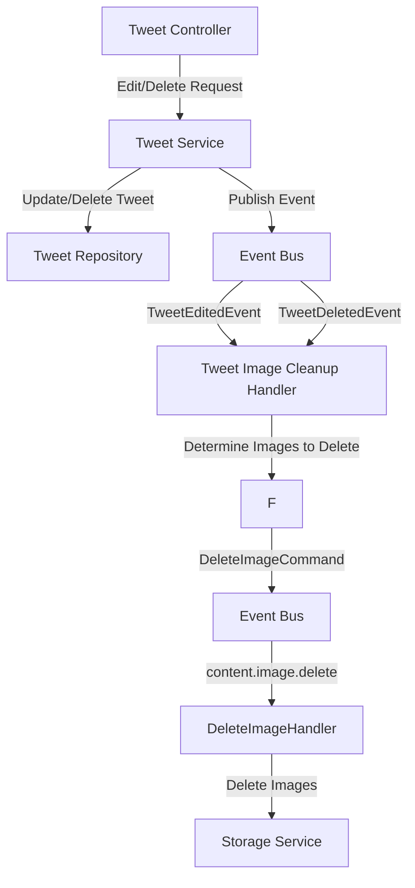

# Tweet Image Cleanup Technical Design

## Overview

This document outlines the technical design for implementing the cleanup of tweet images when tweets are edited or deleted (TWE-001.7). The goal is to prevent orphaned files in the storage system and optimize storage usage.

## Existing Architecture

After reviewing the codebase, we discovered that there's already an event-driven architecture in place for image deletion:

1. The `DeleteImageCommand` in `src/common/event-manager/entities/events/commands/delete-image.command.ts`
2. The `DeleteImageHandler` in `src/storage/presentation/handlers/delete-image.handler.ts`
3. The `ContentEventSchemas.DELETE_IMAGE` event schema in `src/common/event-manager/entities/events/schemas/content.events.ts`

We will leverage this existing infrastructure to implement our tweet image cleanup solution.

## Implementation Approach



## Components

### 1. Events (Already Existing & New)

#### TweetEditedEvent (Already Existing)

```typescript
// This event is already defined in ContentEventSchemas.TWEET_UPDATED
// From src/common/event-manager/entities/events/schemas/content.events.ts
class TweetUpdatedEventPayload {
  @IsUUID()
  tweetId: string;

  @IsUUID()
  userId: string;

  @IsString()
  @IsOptional()
  content?: string;

  @IsArray()
  @IsString({ each: true })
  @IsOptional()
  images?: string[];
}
```

#### TweetDeletedEvent (Already Existing)

```typescript
// This event is already defined in ContentEventSchemas.TWEET_DELETED
// From src/common/event-manager/entities/events/schemas/content.events.ts
class TweetDeletedEventPayload {
  @IsUUID()
  tweetId: string;

  @IsUUID()
  userId: string;
}
```

#### DeleteImageCommand (Already Existing)

```typescript
// Already implemented in src/common/event-manager/entities/events/commands/delete-image.command.ts
export class DeleteImageCommand extends BaseEvent<{ imageUrl: string }> {
  private readonly imageUrlData: string;

  constructor(imageUrl: string) {
    super(ContentEventSchemas.DELETE_IMAGE, {
      correlationId: uuid(),
    });
    this.imageUrlData = imageUrl;
  }

  toJSON(): { imageUrl: string } {
    return {
      imageUrl: this.imageUrlData,
    };
  }
}
```

### 2. Event Handlers

#### TweetImageCleanupHandler (New)

```typescript
import { Injectable, Logger } from '@nestjs/common';
import { OnEvent } from '@nestjs/event-emitter';
import { EventEmitter2 } from '@nestjs/event-emitter';
import { ContentEventSchemas } from 'src/common/event-manager/entities/events/schemas';
import { DeleteImageCommand } from 'src/common/event-manager/entities/events/commands/delete-image.command';
import { TweetRepository } from 'src/content/tweet/repositories/tweet.repository';

@Injectable()
export class TweetImageCleanupHandler {
  private readonly logger = new Logger(TweetImageCleanupHandler.name);

  constructor(
    private readonly eventEmitter: EventEmitter2,
    private readonly tweetRepository: TweetRepository,
  ) {}

  @OnEvent(ContentEventSchemas.TWEET_UPDATED.eventName)
  async handleTweetUpdated(payload: any): Promise<void> {
    try {
      const { tweetId, images: newImages } = payload;
      
      // Get the tweet from database to compare old and new images
      const tweet = await this.tweetRepository.findById(tweetId);
      if (!tweet) {
        this.logger.warn(`Tweet not found for cleanup: ${tweetId}`);
        return;
      }
      
      const oldImages = tweet.images || [];
      const imagesToDelete = oldImages.filter(
        image => !newImages?.includes(image)
      );
      
      await this.deleteImages(imagesToDelete);
    } catch (error) {
      this.logger.error(`Error handling tweet update for image cleanup: ${error.message}`, error.stack);
      // Don't rethrow to avoid affecting the main tweet update flow
    }
  }

  @OnEvent(ContentEventSchemas.TWEET_DELETED.eventName)
  async handleTweetDeleted(payload: any): Promise<void> {
    try {
      const { tweetId } = payload;
      
      // Since the tweet is already deleted at this point, we need to retrieve the images
      // from a pre-delete snapshot or from a transaction context
      // For simplicity, we can fetch this from a cache or use a pre-delete hook
      
      // Alternative implementation: the tweet service can pass the images in the payload
      // when emitting the TWEET_DELETED event
      const cachedTweet = await this.tweetRepository.findDeletedTweetImages(tweetId);
      if (!cachedTweet || !cachedTweet.images) {
        this.logger.warn(`No images found for deleted tweet: ${tweetId}`);
        return;
      }
      
      await this.deleteImages(cachedTweet.images);
    } catch (error) {
      this.logger.error(`Error handling tweet deletion for image cleanup: ${error.message}`, error.stack);
      // Don't rethrow to avoid affecting the main tweet deletion flow
    }
  }

  private async deleteImages(images: string[]): Promise<void> {
    if (!images.length) return;
    
    this.logger.log(`Queueing ${images.length} images for deletion`);
    
    // Process deletions sequentially to avoid overwhelming the event bus
    for (const imageUrl of images) {
      try {
        const command = new DeleteImageCommand(imageUrl);
        this.eventEmitter.emit(ContentEventSchemas.DELETE_IMAGE.eventName, command);
        this.logger.debug(`Queued image for deletion: ${imageUrl}`);
      } catch (error) {
        this.logger.error(`Failed to queue image deletion for ${imageUrl}: ${error.message}`, error.stack);
        // Continue with other images even if one fails
      }
    }
  }
}
```

#### DeleteImageHandler (Already Exists)

This handler is already implemented in `src/storage/presentation/handlers/delete-image.handler.ts` and works with the existing `FileService.deleteFile` method:

```typescript
@Injectable()
export class DeleteImageHandler {
  private readonly logger = new Logger(DeleteImageHandler.name);

  constructor(private readonly fileService: FileService) {}

  @OnEvent(ContentEventSchemas.DELETE_IMAGE.eventName)
  async execute(command: DeleteImageCommand): Promise<void> {
    try {
      const { imageUrl } = command.payload;
      this.logger.debug(`Deleting image: ${imageUrl}`);
      await this.fileService.deleteFile(imageUrl);
    } catch (error) {
      this.logger.error(`Failed to delete image: ${error.message}`, error);
      throw error;
    }
  }
}
```

### 3. Service Modifications

#### Tweet Repository Extension

Add a method to retrieve images for deleted tweets (used in the cleanup handler):

```typescript
// In tweet.repository.ts

@Injectable()
export class TweetRepository {
  // ... existing methods

  /**
   * Find images associated with a deleted tweet
   * This method can use a cache or transaction context to retrieve
   * tweet images after the tweet has been deleted
   */
  async findDeletedTweetImages(tweetId: string): Promise<{ images: string[] } | null> {
    // Implementation depends on how we choose to cache this information
    // Could be in-memory, Redis, or another data store
    // For initial implementation, we might store this in a temporary table
    // or via a pre-delete hook
    return this.deletedTweetsCache.get(tweetId);
  }
}
```

#### Tweet Service Modifications

Enhance the tweet service to capture images before deletion:

```typescript
// In tweet.service.ts

@Injectable()
export class TweetService {
  // ... existing methods and constructor

  async delete(userId: string, tweetId: string): Promise<void> {
    // Get tweet to extract images before deletion
    const tweet = await this.tweetRepository.findOneOrFail(tweetId);
    
    // Check ownership
    if (tweet.authorId !== userId) {
      throw new UnauthorizedException('You can only delete your own tweets');
    }
    
    // Cache the tweet images for cleanup
    if (tweet.images?.length) {
      await this.tweetRepository.cacheDeletedTweetImages(tweetId, tweet.images);
    }
    
    // Delete tweet
    await this.tweetRepository.delete(tweetId);
    
    // Emit event for cleanup
    // Include the images in the payload to avoid having to cache them
    this.eventEmitter.emit(ContentEventSchemas.TWEET_DELETED.eventName, {
      tweetId,
      userId,
      images: tweet.images || [], // Add images to the event payload
    });
  }
}
```

## Error Handling and Resilience

1. **Event Handler Errors**: Errors in the TweetImageCleanupHandler will be logged but won't affect the main tweet operations. This ensures that tweet edits and deletions complete even if image cleanup fails.

2. **Redundant Cleanup Mechanism**: By leveraging the existing DeleteImageHandler and DeleteImageCommand, we ensure a standardized approach to image deletion.

3. **Transaction Handling**: The main tweet operation and event publishing should be part of the same transaction to ensure events are only published when the tweet operation succeeds.

## Caching Strategy for Deleted Tweet Images

We have two approaches for handling the images of deleted tweets:

1. **Include Images in Event Payload**: Modify the TWEET_DELETED event to include images, eliminating the need for caching.

2. **Cache Before Deletion**: Store tweet images in a temporary cache before deletion, to be retrieved by the cleanup handler.

The first approach is simpler and more reliable, as it avoids synchronization issues with caches.

## Testing Strategy

1. **Unit Tests**:
   - Test TweetImageCleanupHandler with mock event emitter and repository
   - Test edge cases (empty image arrays, null values)

2. **Integration Tests**:
   - Test the flow from tweet update/delete to image cleanup
   - Verify DeleteImageCommand is emitted with correct parameters
   - Mock the storage service to verify deletion calls

3. **End-to-End Tests**:
   - Test complete workflows with actual storage interactions in a test environment

## Implementation Plan

1. Create the TweetImageCleanupHandler
2. Modify the Tweet Service to include images in deletion events
3. Add caching mechanism for deleted tweet images if needed
4. Add unit and integration tests
5. Add metrics and monitoring
