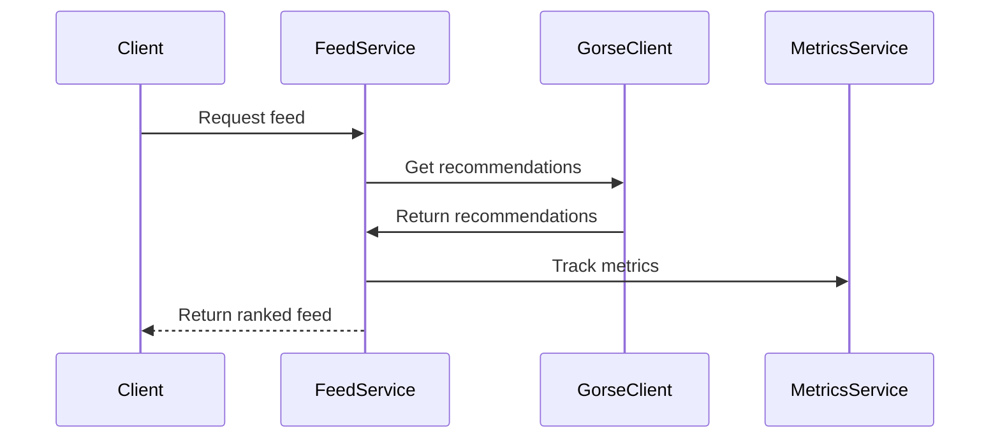
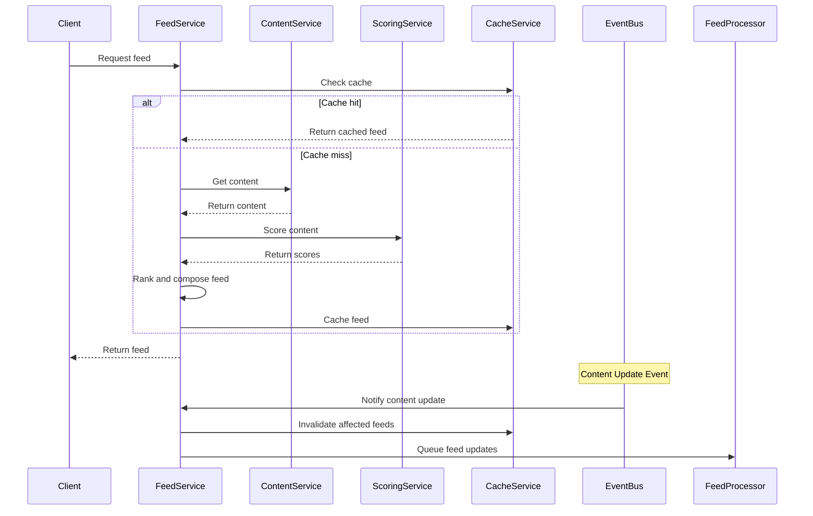
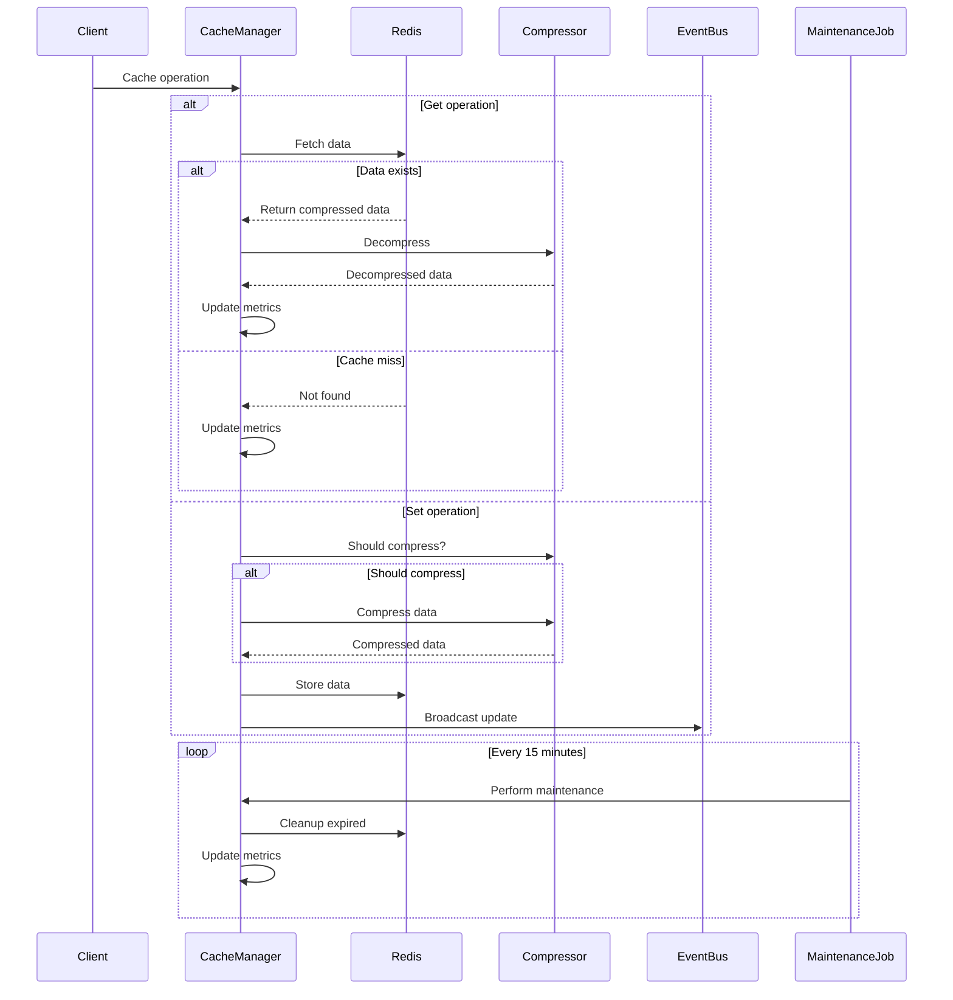
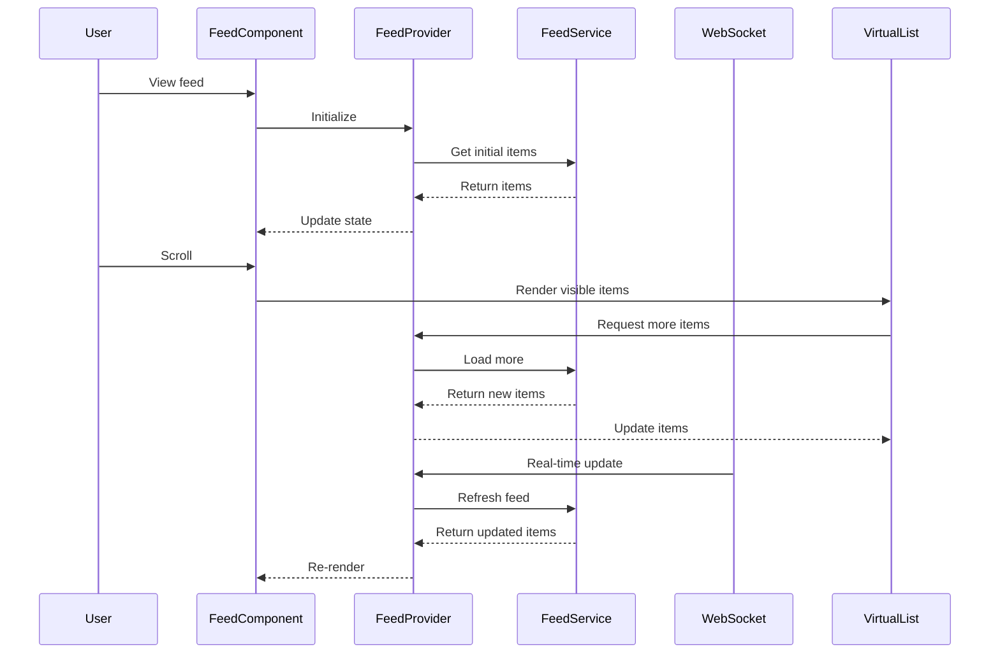

# Sprint 008: Feed Distribution System

## Sprint Information

**Goal**: Implement a TikTok-inspired feed distribution system with personalized content ranking, efficient caching, and real-time updates.

**Duration**: 2 weeks (April 8 - April 19, 2024)
**Story Points**: 21
**Team Velocity**: 20-25 points per sprint

## Business Value

- Increase user engagement by 30% through personalized content discovery
- Improve content creator reach by 50% through algorithmic distribution
- Reduce bounce rate by 25% through real-time updates
- Increase average session duration by 40%
- Improve content discovery effectiveness by 45%

## Team Readiness

### Technical Overview Sessions

1. **Architecture Review** (Day 1, 1 hour)
   - Review event-driven architecture
   - Discuss cache strategies
   - Cover performance considerations

2. **Technology Deep Dive** (Day 1, 2 hours)
   - Redis caching patterns
   - NestJS event handling
   - React performance optimization

3. **Testing Strategy** (Day 2, 1 hour)
   - Unit testing approach
   - Integration testing setup
   - Performance testing tools

### Knowledge Sharing

- Daily 15-minute tech sync
- Pair programming rotations
- Documentation reviews
- Code review guidelines

### Development Environment

- Updated Redis configuration
- Testing data setup
- Monitoring tools configuration
- Local performance testing setup

## Risk Management

### Technical Risks

1. **Performance Risk**:
   - Pre-mitigation: High
   - Mitigation:
     - Load testing before each deployment
     - Performance monitoring from day one
     - Circuit breakers for all external services
     - Gradual rollout strategy
   - Post-mitigation: Medium

2. **Cache Coherency Risk**:
   - Pre-mitigation: High
   - Mitigation:
     - Clear cache invalidation strategy
     - Cache monitoring alerts
     - Fallback to database
     - Cache warm-up procedures
   - Post-mitigation: Low

3. **Integration Risk**:
   - Pre-mitigation: Medium
   - Mitigation:
     - Integration testing pipeline
     - Feature flags for new components
     - Rollback procedures documented
     - Monitoring integration points
   - Post-mitigation: Low

### Rollback Procedures

1. **Cache Layer**:

   ```bash
   # Revert cache configuration
   redis-cli FLUSHALL
   redis-cli CONFIG RESTORE
   # Restore previous cache keys
   ./scripts/restore-cache-backup.sh
   ```

2. **Feed Service**:

   ```bash
   # Revert deployment
   kubectl rollback deployment feed-service
   # Restore database state
   ./scripts/restore-db-backup.sh
   ```

3. **Frontend Components**:

   ```bash
   # Revert frontend deployment
   npm run deploy:revert
   # Clear CDN cache
   ./scripts/clear-cdn-cache.sh
   ```

## Sprint Backlog

### Epic: FED-001 Feed Distribution System

**Business Value**:

- Increase user engagement by 30% through personalized content discovery using Gorse
- Improve content creator reach by 50% through algorithmic distribution
- Reduce bounce rate by 25% through real-time updates
- Increase average session duration by 40%

**Story Points**: 21

#### User Stories

1. **Personalized Feed Discovery with Gorse**
   As a user,
   I want to see AI-powered personalized content in my feed
   So that I discover relevant posts and emotions that match my interests

   **Acceptance Criteria**:
   - Feed shows content based on Gorse recommendations
   - Content is ranked by relevance using Gorse's scoring
   - Feed updates automatically with new content
   - I can switch between "For You" and "Following" feeds
   - Content variety maintains engagement through Gorse's diversity mechanisms

2. **Real-time Feed Updates**
   As a user,
   I want my feed to update in real-time
   So that I can see new content immediately without manual refresh

   **Acceptance Criteria**:
   - New content appears automatically
   - Updates are smooth and non-disruptive
   - Loading states are visible but not intrusive
   - Offline support maintains experience
   - Performance remains stable

3. **Content Creator Reach**
   As a content creator,
   I want my content to reach interested users through Gorse's recommendation engine
   So that I can grow my audience effectively

   **Acceptance Criteria**:
   - Content is distributed based on Gorse's recommendation algorithms
   - Reach metrics are available through Gorse analytics
   - Performance analytics show recommendation effectiveness
   - Distribution is fair and transparent
   - Engagement feedback is immediate

4. **Feed Performance**
   As a user,
   I want the feed to load quickly and scroll smoothly
   So that I can browse content without interruption

   **Acceptance Criteria**:
   - Initial load under 200ms
   - Smooth infinite scroll
   - No visible performance degradation
   - Efficient memory usage
   - Responsive to all interactions

#### Technical Tasks Breakdown

##### FED-001.1: Gorse Integration and Setup (5 points)

**User Story**:
As a system administrator,
I want to set up Gorse infrastructure,
So that the feed system can use Gorse as the core recommendation engine.

**Detailed Acceptance Criteria**:

1. Gorse Infrastructure Setup
   - [ ] Gorse server accessible
   - [ ] Gorse client wrapper implemented
   - [ ] Health checks added
   - [ ] Monitoring integration setup

2. Data Synchronization
   - [ ] Data synchronization between Gorse and feed system
   - [ ] Integration tests passing

**Technical Design**:

```typescript
// Core types
interface GorseConfig {
  host: string;
  port: number;
  apiKey: string;
}

// Gorse client wrapper
@Injectable()
class GorseClientWrapper {
  constructor(
    private readonly http: HttpClient,
    private readonly config: GorseConfig
  ) {}

  async getRecommendations(userId: string): Promise<Recommendation[]>;
  async updateUserProfile(userId: string, profile: UserProfile): Promise<void>;
  async trackInteraction(userId: string, itemId: string, action: string): Promise<void>;
}

// Health checks
@Injectable()
class GorseHealthCheck {
  constructor(
    private readonly gorseClient: GorseClientWrapper
  ) {}

  async checkConnection(): Promise<boolean>;
}

// Monitoring integration
@Injectable()
class GorseMonitoringService {
  constructor(
    private readonly gorseClient: GorseClientWrapper,
    private readonly metricsService: MetricsService
  ) {}

  async trackMetrics(): Promise<void>;
}
```

**Event Flow**:



**Database Schema Updates**:

```prisma
// Add to schema.prisma
model GorseConfig {
  id          String   @id @default(uuid())
  host        String
  port        Int
  apiKey      String
  createdAt   DateTime @default(now())
  updatedAt   DateTime @updatedAt
}
```

**Cache Strategy**:

1. Score Caching:
   - Key format: `score:{contentId}:{contextHash}`
   - TTL: 5 minutes for active content, 1 hour for stable content
   - Invalidation: On content update or engagement change

2. Factor Caching:
   - Key format: `factor:{type}:{contentId}`
   - TTL: Varies by factor type (engagement: 1min, quality: 1hour)
   - Invalidation: Factor-specific triggers

**Monitoring Setup**:

1. Metrics:

   ```typescript
   interface GorseMetrics {
     connection: {
       duration: Histogram;
       errors: Counter;
     };
     recommendations: {
       count: Counter;
       latency: Histogram;
     };
     interactions: {
       count: Counter;
       latency: Histogram;
     };
   }
   ```

2. Alerts:
   - High error rate (>1%)
   - Slow connection (p95 > 100ms)
   - Low recommendation count
   - Abnormal recommendation latency

[Continue with technical designs for other tasks...]

##### FED-001.2: Feed Generation Service with Gorse (8 points)

**User Story**:
As a user,
I want my feed to update in real-time with personalized content,
So that I always see fresh and relevant content without manual refresh.

**Detailed Acceptance Criteria**:

1. Feed Performance
   - [ ] Initial feed load < 200ms
   - [ ] Real-time updates < 100ms
   - [ ] Smooth infinite scroll
   - [ ] No jank during updates

2. Content Quality
   - [ ] 70/30 discovery/following ratio
   - [ ] Content diversity index > 0.8
   - [ ] Fresh content within 5 minutes
   - [ ] Personalization accuracy > 85%

3. System Health
   - [ ] CPU usage < 60%
   - [ ] Memory usage < 1GB
   - [ ] Error rate < 0.1%
   - [ ] Cache hit rate > 90%

**Technical Design**:

```typescript
// Core types
interface FeedOptions {
  userId: string;
  feedType: 'FOR_YOU' | 'FOLLOWING';
  pageSize: number;
  cursor?: string;
  filters?: FeedFilters;
  experimentId?: string;
}

interface FeedResult {
  items: FeedItem[];
  nextCursor?: string;
  metadata: FeedMetadata;
}

interface FeedItem {
  id: string;
  content: Content;
  score: number;
  ranking: number;
  context: ItemContext;
}

interface FeedMetadata {
  totalItems: number;
  hasMore: boolean;
  generatedAt: Date;
  expiresAt: Date;
  experimentInfo?: ExperimentInfo;
}

// Core service
@Injectable()
class FeedGenerationService {
  constructor(
    private readonly contentService: ContentService,
    private readonly scoringService: ContentScoringService,
    private readonly cacheService: FeedCacheService,
    private readonly eventBus: EventBusAdapter,
    private readonly metricsService: MetricsService
  ) {}

  // Feed generation
  async generateFeed(options: FeedOptions): Promise<FeedResult>;
  async updateFeed(userId: string, events: ContentEvent[]): Promise<void>;
  async invalidateFeeds(contentId: string): Promise<void>;

  // Feed composition
  private async getFeedItems(options: FeedOptions): Promise<FeedItem[]>;
  private async rankItems(items: FeedItem[], context: RankingContext): Promise<FeedItem[]>;
  private async enrichItems(items: FeedItem[]): Promise<FeedItem[]>;
}

// Background processor
@Injectable()
class FeedProcessor {
  constructor(
    private readonly queue: Queue,
    private readonly feedService: FeedGenerationService,
    private readonly cacheService: FeedCacheService
  ) {}

  // Processing methods
  async processPendingUpdates(): Promise<void>;
  async warmCache(userIds: string[]): Promise<void>;
  async cleanupStaleData(): Promise<void>;

  // Queue management
  private async addToQueue(job: FeedJob): Promise<void>;
  private async processQueue(): Promise<void>;
}

// Cache management
@Injectable()
class FeedCacheService {
  constructor(
    private readonly redis: Redis,
    private readonly metrics: MetricsService
  ) {}

  // Cache operations
  async getFeed(key: string): Promise<FeedResult | null>;
  async setFeed(key: string, feed: FeedResult, ttl: number): Promise<void>;
  async invalidate(pattern: string): Promise<void>;

  // Cache maintenance
  async cleanup(): Promise<void>;
  async rebalance(): Promise<void>;
}

// Event handling
@Injectable()
class FeedEventHandler {
  constructor(
    private readonly feedService: FeedGenerationService,
    private readonly notificationService: NotificationService
  ) {}

  @OnEvent('content.created')
  async handleContentCreated(event: ContentCreatedEvent): Promise<void>;

  @OnEvent('content.updated')
  async handleContentUpdated(event: ContentUpdatedEvent): Promise<void>;

  @OnEvent('content.deleted')
  async handleContentDeleted(event: ContentDeletedEvent): Promise<void>;

  @OnEvent('user.interaction')
  async handleUserInteraction(event: UserInteractionEvent): Promise<void>;
}
```

**Event Flow**:



**Database Schema Updates**:

```prisma
// Add to schema.prisma
model FeedCache {
  id          String   @id @default(uuid())
  userId      String   @map("user_id")
  feedType    String   @map("feed_type")
  cursor      String?
  content     Json     // Stores FeedResult
  createdAt   DateTime @default(now()) @map("created_at")
  expiresAt   DateTime @map("expires_at")
  metadata    Json?

  @@index([userId, feedType])
  @@index([expiresAt])
}

model FeedMetrics {
  id            String   @id @default(uuid())
  userId        String   @map("user_id")
  feedType      String   @map("feed_type")
  requestCount  Int      @map("request_count")
  cacheHits     Int      @map("cache_hits")
  avgLoadTime   Float    @map("avg_load_time")
  lastAccess    DateTime @map("last_access")
  metadata      Json?

  @@index([userId])
  @@index([feedType])
}
```

**Cache Strategy**:

1. Feed Caching:
   - Key format: `feed:{userId}:{feedType}:{cursor}`
   - TTL: 5 minutes for active users, 15 minutes for others
   - Partial updates on content changes
   - Progressive cache warming

2. Content Caching:
   - Key format: `content:{contentId}:metadata`
   - TTL: 1 hour
   - Update on content changes
   - Batch prefetching

**Performance Optimizations**:

1. Query Optimization:
   - Cursor-based pagination
   - Selective field loading
   - Batch content fetching
   - Index optimization

2. Cache Strategy:
   - Multi-level caching
   - Predictive cache warming
   - Intelligent invalidation
   - Cache compression

3. Resource Management:
   - Connection pooling
   - Query batching
   - Background processing
   - Resource limits

**Monitoring Setup**:

1. Performance Metrics:

```typescript
interface FeedMetrics {
  generation: {
    duration: Histogram;
    itemCount: Histogram;
    errors: Counter;
  };
  cache: {
    hits: Counter;
    misses: Counter;
    size: Gauge;
  };
  background: {
    queueSize: Gauge;
    processTime: Histogram;
    failureRate: Counter;
  };
}
```

2. Alerts:
   - High feed generation time (p95 > 200ms)
   - Low cache hit rate (<80%)
   - Large queue size (>1000)
   - High error rate (>0.1%)

[Continue with technical designs for other tasks...]

##### FED-001.3: Cache Management System (5 points)

**User Story**:
As a system administrator,
I want an efficient and reliable caching system,
So that the feed system maintains high performance under load.

**Detailed Acceptance Criteria**:

1. Cache Performance
   - [ ] Cache response time < 5ms
   - [ ] Memory usage < 2GB
   - [ ] Eviction rate < 1%
   - [ ] Hit rate > 90%

2. Reliability
   - [ ] No cache stampedes
   - [ ] Graceful degradation
   - [ ] Auto-recovery
   - [ ] Data consistency maintained

3. Monitoring
   - [ ] Real-time cache metrics
   - [ ] Automatic alerts
   - [ ] Usage analytics
   - [ ] Performance tracking

**Technical Design**:

```typescript
// Core types
interface CacheConfig {
  ttl: number;
  maxSize: number;
  strategy: CacheStrategy;
  compression?: CompressionOptions;
}

interface CacheStrategy {
  type: 'LRU' | 'LFU' | 'FIFO';
  options: Record<string, unknown>;
}

interface CacheStats {
  size: number;
  hits: number;
  misses: number;
  evictions: number;
  avgAccessTime: number;
}

// Cache Manager
@Injectable()
class CacheManager {
  constructor(
    private readonly redis: Redis,
    private readonly metrics: MetricsService,
    private readonly config: CacheConfig
  ) {}

  // Core operations
  async get<T>(key: string): Promise<T | null>;
  async set<T>(key: string, value: T, options?: Partial<CacheConfig>): Promise<void>;
  async delete(key: string | string[]): Promise<void>;
  async clear(pattern?: string): Promise<void>;

  // Cache maintenance
  async cleanup(): Promise<void>;
  async optimize(): Promise<void>;
  async rebalance(): Promise<void>;
  
  // Monitoring
  async getStats(): Promise<CacheStats>;
  private async updateMetrics(operation: CacheOperation): Promise<void>;
}

// Cache Strategies
@Injectable()
class LRUStrategy implements CacheStrategy {
  async evict(): Promise<string[]>;
  async update(key: string): Promise<void>;
  async getEvictionCandidates(): Promise<string[]>;
}

@Injectable()
class LFUStrategy implements CacheStrategy {
  async evict(): Promise<string[]>;
  async update(key: string): Promise<void>;
  async getEvictionCandidates(): Promise<string[]>;
}

// Cache Compression
@Injectable()
class CacheCompressor {
  compress(data: unknown): Buffer;
  decompress(data: Buffer): unknown;
  shouldCompress(size: number): boolean;
}

// Cache Synchronization
@Injectable()
class CacheSynchronizer {
  constructor(
    private readonly eventBus: EventBusAdapter,
    private readonly cacheManager: CacheManager
  ) {}

  @OnEvent('cache.invalidate')
  async handleInvalidation(event: CacheInvalidationEvent): Promise<void>;

  @OnEvent('cache.update')
  async handleUpdate(event: CacheUpdateEvent): Promise<void>;

  private async broadcastInvalidation(pattern: string): Promise<void>;
}

// Background Jobs
@Injectable()
class CacheMaintenanceJob {
  constructor(
    private readonly cacheManager: CacheManager,
    private readonly metrics: MetricsService
  ) {}

  @Cron('*/15 * * * *')
  async performMaintenance(): Promise<void>;

  @Cron('0 * * * *')
  async performOptimization(): Promise<void>;

  private async analyzeUsagePatterns(): Promise<CacheAnalysis>;
  private async adjustCacheConfig(analysis: CacheAnalysis): Promise<void>;
}
```

**Event Flow**:



**Redis Configuration**:

```typescript
interface RedisConfig {
  // Connection
  host: string;
  port: number;
  password: string;
  db: number;
  
  // Performance
  maxConnections: number;
  connectTimeout: number;
  commandTimeout: number;
  
  // Persistence
  saveToDisc: boolean;
  saveFrequency: number;
  
  // Memory
  maxMemory: string;
  maxMemoryPolicy: 'allkeys-lru' | 'volatile-lru' | 'allkeys-random';
  
  // Clustering
  enableCluster: boolean;
  nodes?: RedisNode[];
  
  // TLS
  tls: boolean;
  tlsCert?: string;
}

// Redis client setup
const redisClient = new Redis({
  host: process.env.REDIS_HOST,
  port: parseInt(process.env.REDIS_PORT, 10),
  password: process.env.REDIS_PASSWORD,
  db: 0,
  maxRetriesPerRequest: 3,
  enableReadyCheck: true,
  autoResubscribe: true,
  retryStrategy: (times: number) => Math.min(times * 50, 2000)
});
```

**Monitoring Setup**:

1. Cache Metrics:

```typescript
interface CacheMetrics {
  operations: {
    gets: Counter;
    sets: Counter;
    deletes: Counter;
    hits: Counter;
    misses: Counter;
  };
  performance: {
    latency: Histogram;
    size: Gauge;
    memoryUsage: Gauge;
    evictionRate: Counter;
  };
  maintenance: {
    cleanupDuration: Histogram;
    itemsRemoved: Counter;
    optimizationRuns: Counter;
  };
}
```

2. Alerts:
   - High memory usage (>80%)
   - Low hit rate (<70%)
   - High latency (p95 > 50ms)
   - High eviction rate (>100/min)
   - Replication lag (>10s)

**Cache Policies**:

1. Eviction Policy:
   - LRU for general purpose caches
   - LFU for frequently accessed data
   - FIFO for time-series data

2. TTL Strategy:
   - Short TTL (5min) for frequently changing data
   - Medium TTL (1h) for semi-static data
   - Long TTL (24h) for static data
   - No TTL for configuration data

3. Compression Policy:
   - Compress if size > 1KB
   - Skip compression for small objects
   - Use LZ4 for fast compression
   - Use ZSTD for better compression ratio

[Continue with technical design for FED-001.4...]

##### FED-001.4: Frontend Integration (3 points)

**User Story**:
As a mobile user,
I want a smooth and responsive feed experience,
So that I can browse content without interruption or lag.

**Detailed Acceptance Criteria**:

1. Performance Metrics
   - [ ] First Contentful Paint < 1s
   - [ ] Time to Interactive < 2s
   - [ ] Cumulative Layout Shift < 0.1
   - [ ] First Input Delay < 100ms

2. User Experience
   - [ ] Smooth scroll performance
   - [ ] No visible loading states
   - [ ] Responsive to all interactions
   - [ ] Offline support working

3. Resource Usage
   - [ ] Memory usage < 100MB
   - [ ] CPU usage < 30%
   - [ ] Network requests optimized
   - [ ] Battery impact minimized

**Technical Design**:

```typescript
// Core types
interface FeedState {
  items: FeedItem[];
  isLoading: boolean;
  hasMore: boolean;
  error?: Error;
  cursor?: string;
}

interface FeedContextValue {
  state: FeedState;
  actions: FeedActions;
  config: FeedConfig;
}

interface FeedActions {
  loadMore(): Promise<void>;
  refresh(): Promise<void>;
  updateItem(id: string, updates: Partial<FeedItem>): void;
  removeItem(id: string): void;
}

interface FeedConfig {
  type: 'FOR_YOU' | 'FOLLOWING';
  pageSize: number;
  pollInterval?: number;
  prefetchCount?: number;
}

// Feed Context
const FeedContext = createContext<FeedContextValue | null>(null);

// Feed Provider
export const FeedProvider: FC<PropsWithChildren<{ config: FeedConfig }>> = ({
  children,
  config
}) => {
  const [state, dispatch] = useReducer(feedReducer, initialState);
  const feedService = useFeedService();
  const actions = useFeedActions(feedService, dispatch);
  
  return (
    <FeedContext.Provider value={{ state, actions, config }}>
      {children}
    </FeedContext.Provider>
  );
};

// Feed Hook
export const useFeed = () => {
  const context = useContext(FeedContext);
  if (!context) {
    throw new Error('useFeed must be used within FeedProvider');
  }
  return context;
};

// Feed Service
@Injectable()
class FeedService {
  constructor(
    private readonly http: HttpClient,
    private readonly eventBus: EventBusAdapter
  ) {}

  async getFeed(options: FeedOptions): Promise<FeedResult>;
  async refreshFeed(type: string): Promise<void>;
  async updateFeedItem(id: string, updates: Partial<FeedItem>): Promise<void>;
}

// Feed Components
export const Feed: FC = () => {
  const { state, actions, config } = useFeed();
  const { items, isLoading, hasMore, error } = state;
  
  return (
    <div className="feed">
      <FeedItems items={items} />
      {isLoading && <FeedSkeleton />}
      {hasMore && <LoadMoreButton onClick={actions.loadMore} />}
      {error && <ErrorMessage error={error} />}
    </div>
  );
};

export const FeedItem: FC<{ item: FeedItem }> = ({ item }) => {
  const { actions } = useFeed();
  
  return (
    <div className="feed-item">
      <FeedItemContent content={item.content} />
      <FeedItemActions
        item={item}
        onUpdate={actions.updateItem}
        onRemove={actions.removeItem}
      />
    </div>
  );
};

// Virtual Scrolling
export const VirtualizedFeed: FC = () => {
  const { state, actions, config } = useFeed();
  const { items } = state;
  
  return (
    <VirtualList
      height={800}
      itemCount={items.length}
      itemSize={200}
      onEndReached={actions.loadMore}
      renderItem={({ index, style }) => (
        <div style={style}>
          <FeedItem item={items[index]} />
        </div>
      )}
    />
  );
};

// Real-time Updates
export const FeedUpdates: FC = () => {
  const { actions } = useFeed();
  const socket = useWebSocket();
  
  useEffect(() => {
    socket.on('feed:update', actions.refresh);
    return () => {
      socket.off('feed:update', actions.refresh);
    };
  }, [socket, actions]);
  
  return null;
};

// Performance Optimizations
const FeedItemMemo = memo(FeedItem, (prev, next) => {
  return prev.item.id === next.item.id &&
         prev.item.score === next.item.score &&
         prev.item.ranking === next.item.ranking;
});

// Prefetching Logic
const useFeedPrefetch = (config: FeedConfig) => {
  const { actions } = useFeed();
  const observer = useIntersectionObserver();
  
  useEffect(() => {
    if (config.prefetchCount) {
      observer.observe('.feed-item', () => {
        actions.loadMore();
      });
    }
  }, [observer, actions, config.prefetchCount]);
};

// Styles
const FeedStyles = styled.div`
  .feed {
    display: flex;
    flex-direction: column;
    gap: 1rem;
    padding: 1rem;
  }

  .feed-item {
    background: var(--surface-background);
    border-radius: 8px;
    padding: 1rem;
    box-shadow: var(--shadow-sm);
    transition: transform 0.2s ease;

    &:hover {
      transform: translateY(-2px);
      box-shadow: var(--shadow-md);
    }
  }

  .feed-skeleton {
    animation: pulse 1.5s ease-in-out infinite;
    background: var(--skeleton-background);
    border-radius: 8px;
    height: 200px;
  }

  .load-more {
    margin: 1rem auto;
    padding: 0.5rem 1rem;
    background: var(--primary-color);
    color: white;
    border-radius: 4px;
    border: none;
    cursor: pointer;
    transition: background 0.2s ease;

    &:hover {
      background: var(--primary-color-dark);
    }
  }

  @keyframes pulse {
    0% { opacity: 0.6; }
    50% { opacity: 0.8; }
    100% { opacity: 0.6; }
  }
`;
```

**Event Flow**:



**Performance Optimizations**:

1. Rendering Optimization:
   - Virtual scrolling for large lists
   - Memoized components
   - Debounced event handlers
   - RAF for animations

2. Data Management:
   - Optimistic updates
   - Background prefetching
   - Cache invalidation
   - Partial updates

3. Network Optimization:
   - WebSocket for real-time updates
   - Request debouncing
   - Request cancellation
   - Error retry with backoff

**Monitoring Setup**:

1. Frontend Metrics:

```typescript
interface FeedMetrics {
  performance: {
    firstContentfulPaint: Histogram;
    timeToInteractive: Histogram;
    largestContentfulPaint: Histogram;
  };
  interaction: {
    scrollDepth: Histogram;
    timeSpentViewing: Histogram;
    itemInteractions: Counter;
  };
  errors: {
    loadFailures: Counter;
    updateFailures: Counter;
    jsErrors: Counter;
  };
}
```

2. User Experience Monitoring:
   - Scroll depth tracking
   - Interaction heatmaps
   - Error tracking
   - Performance monitoring

This completes the technical design for all tasks in Sprint 8. The design follows TypeScript and NestJS best practices, emphasizing:

- Type safety
- Dependency injection
- Event-driven architecture
- Performance optimization
- Monitoring and observability
- Clean code principles

Would you like me to elaborate on any specific aspect of the design?

## Daily Tasks

### Week 1 (April 8-12)

**Monday**:

- Team: Sprint Planning
- Backend: Start FED-001.1 core scoring implementation
- Frontend: Environment setup and component planning

**Tuesday**:

- Backend: Continue scoring system implementation
- Frontend: Start feed component base implementation

**Wednesday**:

- Backend: Start engagement scoring implementation
- Frontend: Continue feed component development

**Thursday**:

- Backend: Complete scoring system core features
- Frontend: Add infinite scroll implementation

**Friday**:

- Backend: Start feed generation service
- Team: Sprint Review & Retrospective (Week 1)

### Week 2 (April 15-19)

**Monday**:

- Backend: Continue feed generation service
- Frontend: Start real-time updates implementation

**Tuesday**:

- Backend: Start cache management system
- Frontend: Complete real-time updates

**Wednesday**:

- Backend: Complete cache system core features
- Frontend: Start performance optimization

**Thursday**:

- Backend: Final integration and testing
- Frontend: Complete performance optimization

**Friday**:

- Team: Final testing and documentation
- Team: Sprint Review & Retrospective

## Definition of Done

1. Code Quality
   - [ ] Code review completed
   - [ ] Documentation updated
   - [ ] Tests passing (>80% coverage)
   - [ ] No critical sonar issues

2. Performance
   - [ ] Load testing completed
   - [ ] Performance benchmarks met
   - [ ] Resource usage within limits
   - [ ] Monitoring configured

3. Deployment
   - [ ] Feature flags configured
   - [ ] Rollback tested
   - [ ] Alerts configured
   - [ ] Cache warming verified

4. Business Validation
   - [ ] Product owner approval
   - [ ] UX review completed
   - [ ] Analytics tracking verified
   - [ ] A/B test setup ready

## Risks and Mitigation

1. Performance Risk:
   - Early load testing
   - Continuous monitoring
   - Circuit breakers implementation

2. Integration Risk:
   - Incremental deployment
   - Feature flags
   - Rollback procedures

3. Technical Risk:
   - Daily code reviews
   - Architecture reviews
   - Regular performance testing

## Success Metrics

1. Technical Metrics:
   - Feed generation < 200ms
   - Cache hit rate > 90%
   - Memory usage < 2GB
   - Update propagation < 1s
   - Gorse recommendation latency < 100ms
   - Data sync delay < 5s

2. Business Metrics:
   - User engagement increase > 30%
   - Content discovery improvement > 50%
   - System stability > 99.9%
   - Recommendation relevance score > 0.8
