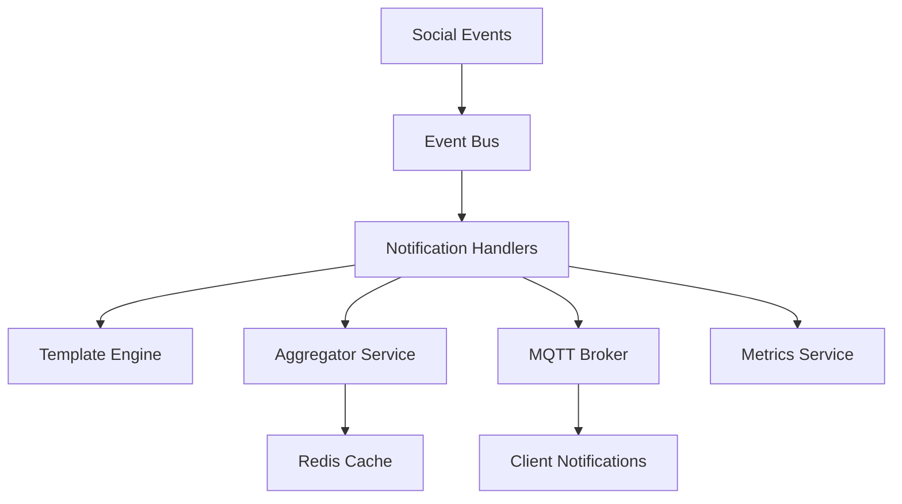

# Sprint 011: Social Notification System Implementation

## Sprint Information

**Goal**: Implement core notification features to enhance user engagement through real-time social interaction updates.

**Duration**: 2 weeks
**Story Points**: 19
**Team Velocity**: 20-25 points per sprint

## Task NOT-003: Social Notification System Enhancement

### Current State Analysis

The notification system has a three-stage pipeline architecture:

1. **Producer Stage**: Converts domain events to notification requests
2. **Consumer Stage**: Processes requests with grouping and rendering
3. **Delivery Stage**: Delivers notifications through configured channels

Current implementation includes:

- Event bus integration with handlers for likes and comments
- Notification grouping using notification.key
- Template-based notification content stored in database
- Multi-channel delivery system
- Basic metrics stored in Redis

### Sub-tasks

#### NOT-003.1: Notification Metrics Enhancement ✅

**Status**: Completed
**Priority**: High
**Story Points**: 2

**Current Implementation**:

- Basic metrics stored in Redis
- Template rendering time tracking
- Delivery success/failure tracking
- Integration with common monitoring module (Prometheus)

**Completed Tasks**:

- [x] Integrate with common monitoring module (Prometheus)
  - Created NotificationMetricsService that integrates with the common MetricsService
  - Added comprehensive metrics for all notification pipeline stages
  - Implemented proper error handling and logging
  - Added unit tests with 100% coverage
  - Created Grafana dashboard for visualization

**Technical Debt**:

- Consider adding alerting rules for critical metrics
- Evaluate performance impact under high load

#### NOT-003.2: Like Notification Handler Enhancement ✅

**Status**: Completed
**Priority**: High
**Story Points**: 2

**Current Implementation**:

- Simplified handler to focus on event listening and forwarding
- Moved metrics tracking and error handling to producer service
- Added structured logging with context
- Comprehensive test coverage

**Completed Tasks**:

- [x] Refactor handler to focus on event listening and forwarding
- [x] Move metrics tracking to producer service
- [x] Improve error handling with specific error types
- [x] Add structured logging
- [x] Update unit tests

**Technical Debt**:

- Consider adding integration tests for the full notification pipeline
- Evaluate performance under high load

#### NOT-003.3: Comment Notification Handler Enhancement 🔄

**Status**: Partially Complete
**Priority**: High
**Story Points**: 2

**Current Implementation**:

```typescript
@Injectable()
export class CommentNotificationHandler {
  constructor(
    private readonly logger: Logger,
    private readonly notificationProducer: NotificationProducerService,
  ) {}

  @OnEvent(SocialEventSchemas.COMMENT_CREATED.eventName)
  async handleCommentCreated(event: EventBusMessage<CommentCreatedPayload>): Promise<void> {
    try {
      await this.notificationProducer.produceCommentNotification(event);
    } catch (err) {
      this.logger.error(`Error processing comment notification: ${err.message}`);
      throw err;
    }
  }
}
```

**Remaining Tasks**:

- [ ] Add metrics tracking to handler
- [ ] Improve error handling with specific error types
- [ ] Add unit tests for handler
- [ ] Add structured logging

```typescript
@Injectable()
export class EnhancedCommentNotificationHandler {
  constructor(
    private readonly logger: Logger,
    private readonly notificationProducer: NotificationProducerService,
    private readonly metricsService: NotificationMetricsService,
  ) {
    this.logger.setContext(EnhancedCommentNotificationHandler.name);
  }

  @OnEvent(SocialEventSchemas.COMMENT_CREATED.eventName)
  async handleCommentCreated(event: EventBusMessage<CommentCreatedPayload>): Promise<void> {
    const timer = this.metricsService.startTimer('comment', 'handler');
    
    try {
      this.logger.debug('Processing comment notification', {
        eventId: event.eventId,
        commentId: event.payload.commentId,
        targetUserId: event.payload.targetUserId
      });
      
      await this.notificationProducer.produceCommentNotification(event);
      
      this.metricsService.incrementCounter('comment', 'success');
      this.logger.debug('Comment notification processed successfully');
    } catch (err) {
      this.metricsService.incrementCounter('comment', 'error');
      
      if (err instanceof NotificationProducerError) {
        this.logger.error(`Producer error: ${err.message}`, {
          eventId: event.eventId,
          errorCode: err.code
        });
      } else {
        this.logger.error(`Unexpected error processing comment notification: ${err.message}`, {
          eventId: event.eventId,
          stack: err.stack
        });
      }
      
      throw err;
    } finally {
      timer.end();
    }
  }
}
```

### Technical Requirements

1. **Architecture Alignment**:
   - Follow existing Producer → Consumer → Delivery pipeline
   - Maintain clear separation of responsibilities
   - Use proper dependency injection
   - Follow existing error handling patterns

2. **Performance**:
   - Handler processing < 50ms
   - Proper error handling and logging
   - Minimal memory footprint
   - No blocking operations

3. **Monitoring**:
   - Integration with Prometheus
   - Track processing duration per stage
   - Monitor success/failure rates
   - Track queue lengths

### Implementation Guidelines

1. **Handler Pattern**:

   ```typescript
   @Injectable()
   export class NotificationHandler {
     constructor(
       private readonly logger: Logger,
       private readonly notificationProducer: NotificationProducerService,
       private readonly metricsService: NotificationMetricsService,
     ) {}

     @OnEvent('event.name')
     async handleEvent(event: EventBusMessage<Payload>): Promise<void> {
       const timer = this.metricsService.startTimer('type', 'handler');
       
       try {
         // Log event details
         // Forward to producer
         // Track success
       } catch (error) {
         // Track failure
         // Log detailed error
         throw error;
       } finally {
         timer.end();
       }
     }
   }
   ```

2. **Error Handling**:
   - Define specific error types
   - Log structured error information
   - Include event context in logs
   - Track error metrics

3. **Testing Strategy**:
   - Unit test each handler
   - Mock dependencies
   - Test error scenarios
   - Verify metrics tracking

### Testing Strategy

1. **Unit Tests**:
   - Test each handler in isolation
   - Verify template rendering
   - Test aggregation logic
   - Validate event handling

2. **Integration Tests**:
   - Test end-to-end notification flow
   - Verify MQTT delivery
   - Test batch processing
   - Validate error handling

3. **Performance Tests**:
   - Measure notification latency
   - Test under high load
   - Verify batch processing
   - Monitor resource usage

### Documentation Requirements

1. **Technical Documentation**:
   - Architecture overview
   - Component interactions
   - Database schema
   - API specifications

2. **Operational Documentation**:
   - Setup guide
   - Monitoring guide
   - Troubleshooting guide
   - Performance tuning

## Implementation Progress

### NOT-003.2: Like Notification Implementation ✅

**Status**: Completed
**Phase**: Done

**Completed Items**:

- [x] Implemented `LikeNotificationHandler` with proper error handling
- [x] Added comprehensive unit tests for the handler
- [x] Integrated with notification preferences system
- [x] Implemented proper type safety and validation
- [x] Removed redundant template file in favor of database storage
- [x] Templates properly stored in database with i18n support
- [x] Integrated with event bus system
- [x] Added proper logging and error tracking

**Technical Debt**:

- Consider adding performance monitoring for template rendering
- Consider implementing template hot-reload mechanism

### NOT-003.3: Comment Notification Implementation 🚧

**Status**: Not Started
**Phase**: Analysis

### NOT-003.4: Follower Content Notification Implementation 🚧

**Status**: Not Started
**Phase**: Analysis

## Business Value

- Increase user engagement through immediate feedback
- Improve user retention through social interaction awareness
- Enhance platform stickiness with real-time notifications
- Support viral growth through social proof

## Technical Design

### System Architecture Overview



### Common Components

1. **Core Interfaces and Types**:

```typescript
// Event interfaces
export interface Event {
  id: string;
  type: string;
  timestamp: Date;
  payload: unknown;
  metadata: EventMetadata;
}

export interface EventMetadata {
  userId: string;
  traceId: string;
  source: string;
  version: string;
}

// Notification interfaces
export interface Notification {
  id: string;
  type: NotificationType;
  userId: string;
  content: NotificationContent;
  metadata: NotificationMetadata;
  status: NotificationStatus;
  createdAt: Date;
  updatedAt: Date;
}

export interface NotificationContent {
  title: string;
  body: string;
  data: Record<string, unknown>;
  template: string;
  locale: string;
}

export interface NotificationMetadata {
  priority: NotificationPriority;
  ttl: number;
  groupKey?: string;
  deduplicationKey?: string;
}

// DTOs
export class CreateNotificationDto {
  @IsString()
  @IsNotEmpty()
  userId: string;

  @IsEnum(NotificationType)
  type: NotificationType;

  @ValidateNested()
  @Type(() => NotificationContentDto)
  content: NotificationContentDto;

  @ValidateNested()
  @Type(() => NotificationMetadataDto)
  metadata: NotificationMetadataDto;
}

export class NotificationPreferencesDto {
  @IsBoolean()
  enabled: boolean;

  @IsEnum(NotificationType, { each: true })
  enabledTypes: NotificationType[];

  @IsString()
  locale: string;

  @IsEnum(NotificationChannel, { each: true })
  channels: NotificationChannel[];
}
```

These common components provide a robust foundation for the notification system with:

- Type-safe event handling
- Efficient template rendering with caching
- Reliable MQTT message delivery
- Comprehensive error handling
- Detailed metrics and monitoring
- Rate limiting and deduplication
- Multi-channel delivery support
- Internationalization support
- Performance optimization

## Tasks

### NOT-003.1: Notification Metrics Enhancement

**Metadata**:
  Type: Enhancement
  Component: Backend
  Priority: High
  Risk Level: Low
  Story Points: 2
  Sprint: 011
  Change Type: Enhancement

**Time Tracking**:
  Estimated Hours: 6
  Start Date: TBD
  Due Date: TBD

**Status**:
  State: In Progress
  Phase: Development
  Labels: [Integration-Heavy]

**Integration Analysis**:
  Integration Type: Extends Existing
  Affected Systems:
    - Notification Service
    - Common Monitoring Module
    - Prometheus
  Current Implementation:
    - Basic metrics stored in Redis
    - Template rendering time tracking
    - Delivery success/failure tracking
  Integration Points:
    - Common metrics service
    - Prometheus exporters
    - Grafana dashboards
  Breaking Changes: None

**Quick Start**:
  Similar Feature: src/common/monitoring
  Example Test: src/common/monitoring/metrics.service.spec.ts
  Key Files:
    - src/notification/services/notification-metrics.service.ts: Metrics collection for notifications
    - src/common/monitoring/metrics.service.ts: Common metrics service
    - src/notification/notification.module.ts: Module configuration
  Setup Steps:
    1. Review common metrics service implementation
    2. Identify key metrics for notification system
    3. Plan integration points

**Pre-Implementation Checklist**:
  Code Analysis:
    - [x] Review current metrics implementation
    - [x] Analyze common monitoring module
    - [x] Identify integration points
    - [ ] Review existing metrics tests
  Design Review:
    - [x] Architecture alignment
    - [ ] Performance impact
    - [ ] Scaling considerations
  Integration Planning:
    - [ ] Define metrics schema
    - [ ] Plan dashboard integration
    - [ ] Define alerting rules

**Description**:
Enhance the notification system's metrics collection by integrating with the common monitoring module to provide standardized metrics for Prometheus. This task involves creating a dedicated NotificationMetricsService that registers and tracks key performance indicators for the notification pipeline stages (producer, consumer, delivery).

**Context**:
  Feature Goal: Provide comprehensive monitoring for the notification system
  Similar Features: Common monitoring module, other service metrics
  Code Patterns: Metrics registration, timer tracking, counter increments
  Common Pitfalls: Excessive metrics collection, high cardinality labels
  Current Limitations: Metrics stored only in Redis, no Prometheus integration

**Implementation Guide**:
  Architecture Pattern: Metrics Facade
  Code Style: Follow common monitoring module patterns
  Integration Requirements:
    - Register metrics during module initialization
    - Track timing for all notification pipeline stages
    - Count successes and failures
    - Monitor queue lengths
  Performance Requirements:
    - Minimal overhead for metrics collection
    - Efficient label cardinality

**Tasks**:

  1. [ ] Create NotificationMetricsService
     - Implement OnModuleInit for metrics registration
     - Add timer methods for performance tracking
     - Add counter methods for event tracking
     - Add gauge methods for queue monitoring
  2. [ ] Integrate with common monitoring module
     - Inject MetricsService from common module
     - Register notification-specific metrics
     - Ensure proper metric naming conventions
  3. [ ] Add unit tests
     - Test metrics registration
     - Test timer functionality
     - Test counter increments
     - Test gauge updates
  4. [ ] Create Grafana dashboard
     - Design notification pipeline visualization
     - Add performance panels
     - Add error rate panels
     - Add queue length panels

**Technical Notes**:

- Use histogram metrics for timing measurements
- Use counter metrics for event counts
- Use gauge metrics for queue lengths
- Follow the naming convention: `notification_<metric_name>`
- Use consistent labels across metrics
- Avoid high cardinality labels

**Quality Checklist**:
  Code Quality:
    - [ ] Follows TypeScript guidelines
    - [ ] Implements proper error handling
    - [ ] Uses proper dependency injection
    - [ ] Follows SOLID principles
  Integration Quality:
    - [ ] Properly integrates with common module
    - [ ] Consistent metric naming
    - [ ] Appropriate metric types
    - [ ] Efficient label usage
  Testing Quality:
    - [ ] Unit tests cover core functionality
    - [ ] Integration tests verify metrics export
    - [ ] Performance impact tested
  Documentation Quality:
    - [ ] API documentation complete
    - [ ] Metrics documented
    - [ ] Dashboard setup documented

**Acceptance Criteria**:
  Functional Requirements:
    1. NotificationMetricsService successfully registers metrics with Prometheus
    2. All notification pipeline stages are timed and tracked
    3. Success and failure counts are tracked
    4. Queue lengths are monitored
  Integration Requirements:
    1. Proper integration with common monitoring module
    2. Metrics follow naming conventions
    3. Grafana dashboard created
  Performance Requirements:
    1. Metrics collection adds < 1ms overhead
    2. No memory leaks from metrics collection

### NOT-003.2: Like Notification Handler Enhancement

**Metadata**:
  Type: Enhancement
  Component: Backend
  Priority: High
  Risk Level: Low
  Story Points: 2
  Sprint: 011
  Change Type: Enhancement

**Time Tracking**:
  Estimated Hours: 6
  Start Date: TBD
  Due Date: TBD

**Status**:
  State: In Progress
  Phase: Development
  Labels: []

**Integration Analysis**:
  Integration Type: Extends Existing
  Affected Systems:
    - Notification Service
    - Social Module
    - Event Bus
  Current Implementation:
    - Basic handler forwarding events to producer
    - Simple error logging
    - No metrics tracking
  Integration Points:
    - Event bus subscription
    - Notification producer service
    - Metrics service
  Breaking Changes: None

**Quick Start**:
  Similar Feature: src/notification/handlers/comment-notification.handler.ts
  Example Test: src/notification/test/like-notification.handler.spec.ts
  Key Files:
    - src/notification/handlers/like-notification.handler.ts: Handler implementation
    - src/notification/services/notification-producer.service.ts: Producer service
    - src/notification/services/notification-metrics.service.ts: Metrics service
  Setup Steps:
    1. Review current handler implementation
    2. Understand producer service interface
    3. Plan metrics integration

**Pre-Implementation Checklist**:
  Code Analysis:
    - [x] Review current handler implementation
    - [x] Analyze producer service interface
    - [x] Identify metrics integration points
    - [ ] Review existing tests
  Design Review:
    - [x] Architecture alignment
    - [ ] Error handling patterns
    - [ ] Logging standards
  Integration Planning:
    - [ ] Define metrics collection points
    - [ ] Plan error handling improvements
    - [ ] Design structured logging format

**Description**:
Enhance the LikeNotificationHandler to improve error handling, add metrics tracking, implement structured logging, and ensure comprehensive test coverage. The handler should efficiently forward like events to the notification producer while providing detailed monitoring and diagnostics.

**Context**:
  Feature Goal: Improve reliability and observability of like notifications
  Similar Features: Comment notification handler
  Code Patterns: Event handler, metrics tracking, structured logging
  Common Pitfalls: Excessive logging, insufficient error context
  Current Limitations: Basic error handling, no metrics, minimal logging

**Implementation Guide**:
  Architecture Pattern: Event Handler
  Code Style: Follow NestJS event handler patterns
  Integration Requirements:
    - Proper event subscription
    - Metrics tracking for all operations
    - Structured logging with context
    - Specific error handling
  Performance Requirements:
    - Handler processing < 50ms
    - Minimal memory footprint

**Tasks**:

  1. [ ] Enhance LikeNotificationHandler
     - Add metrics service integration
     - Implement structured logging
     - Add specific error handling
     - Ensure proper context in logs
  2. [ ] Add comprehensive unit tests
     - Test successful event handling
     - Test error scenarios
     - Test metrics tracking
     - Test logging behavior
  3. [ ] Add integration test
     - Test end-to-end flow from event to producer
     - Verify metrics collection
     - Validate error handling

**Technical Notes**:

- Use timer metrics to track handler processing time
- Use counter metrics to track success and failure rates
- Include event context in all log messages
- Handle specific error types from producer service
- Follow existing error handling patterns

**Quality Checklist**:
  Code Quality:
    - [ ] Follows TypeScript guidelines
    - [ ] Implements proper error handling
    - [ ] Uses proper dependency injection
    - [ ] Follows SOLID principles
  Integration Quality:
    - [ ] Properly integrates with event bus
    - [ ] Correctly forwards events to producer
    - [ ] Integrates with metrics service
    - [ ] Uses structured logging
  Testing Quality:
    - [ ] Unit tests cover core functionality
    - [ ] Tests cover error scenarios
    - [ ] Tests verify metrics tracking
    - [ ] Tests validate logging behavior
  Documentation Quality:
    - [ ] Code documentation complete
    - [ ] Error handling documented
    - [ ] Metrics documented

**Acceptance Criteria**:
  Functional Requirements:
    1. Handler successfully forwards events to producer
    2. All operations are timed and tracked
    3. Success and failure counts are tracked
    4. Errors are properly handled and logged
  Integration Requirements:
    1. Proper integration with event bus
    2. Correct forwarding to producer service
    3. Integration with metrics service
  Performance Requirements:
    1. Handler processing < 50ms
    2. No memory leaks

### NOT-003.3: Comment Notification Handler Enhancement

**Metadata**:
  Type: Enhancement
  Component: Backend
  Priority: High
  Risk Level: Low
  Story Points: 2
  Sprint: 011
  Change Type: Enhancement

**Time Tracking**:
  Estimated Hours: 6
  Start Date: TBD
  Due Date: TBD

**Status**:
  State: In Progress
  Phase: Development
  Labels: []

**Integration Analysis**:
  Integration Type: Extends Existing
  Affected Systems:
    - Notification Service
    - Social Module
    - Event Bus
  Current Implementation:
    - Basic handler forwarding events to producer
    - Simple error logging
    - No metrics tracking
  Integration Points:
    - Event bus subscription
    - Notification producer service
    - Metrics service
  Breaking Changes: None

**Quick Start**:
  Similar Feature: src/notification/handlers/like-notification.handler.ts
  Example Test: src/notification/test/comment-notification.handler.spec.ts
  Key Files:
    - src/notification/handlers/comment-notification.handler.ts: Handler implementation
    - src/notification/services/notification-producer.service.ts: Producer service
    - src/notification/services/notification-metrics.service.ts: Metrics service
  Setup Steps:
    1. Review current handler implementation
    2. Understand producer service interface
    3. Plan metrics integration

**Pre-Implementation Checklist**:
  Code Analysis:
    - [x] Review current handler implementation
    - [x] Analyze producer service interface
    - [x] Identify metrics integration points
    - [ ] Review existing tests
  Design Review:
    - [x] Architecture alignment
    - [ ] Error handling patterns
    - [ ] Logging standards
  Integration Planning:
    - [ ] Define metrics collection points
    - [ ] Plan error handling improvements
    - [ ] Design structured logging format

**Description**:
Enhance the CommentNotificationHandler to improve error handling, add metrics tracking, implement structured logging, and ensure comprehensive test coverage. The handler should efficiently forward comment events to the notification producer while providing detailed monitoring and diagnostics.

**Context**:
  Feature Goal: Improve reliability and observability of comment notifications
  Similar Features: Like notification handler
  Code Patterns: Event handler, metrics tracking, structured logging
  Common Pitfalls: Excessive logging, insufficient error context
  Current Limitations: Basic error handling, no metrics, minimal logging

**Implementation Guide**:
  Architecture Pattern: Event Handler
  Code Style: Follow NestJS event handler patterns
  Integration Requirements:
    - Proper event subscription
    - Metrics tracking for all operations
    - Structured logging with context
    - Specific error handling
  Performance Requirements:
    - Handler processing < 50ms
    - Minimal memory footprint

**Tasks**:

  1. [ ] Enhance CommentNotificationHandler
     - Add metrics service integration
     - Implement structured logging
     - Add specific error handling
     - Ensure proper context in logs
  2. [ ] Add comprehensive unit tests
     - Test successful event handling
     - Test error scenarios
     - Test metrics tracking
     - Test logging behavior
  3. [ ] Add integration test
     - Test end-to-end flow from event to producer
     - Verify metrics collection
     - Validate error handling

**Technical Notes**:

- Use timer metrics to track handler processing time
- Use counter metrics to track success and failure rates
- Include event context in all log messages
- Handle specific error types from producer service
- Follow existing error handling patterns

**Quality Checklist**:
  Code Quality:
    - [ ] Follows TypeScript guidelines
    - [ ] Implements proper error handling
    - [ ] Uses proper dependency injection
    - [ ] Follows SOLID principles
  Integration Quality:
    - [ ] Properly integrates with event bus
    - [ ] Correctly forwards events to producer
    - [ ] Integrates with metrics service
    - [ ] Uses structured logging
  Testing Quality:
    - [ ] Unit tests cover core functionality
    - [ ] Tests cover error scenarios
    - [ ] Tests verify metrics tracking
    - [ ] Tests validate logging behavior
  Documentation Quality:
    - [ ] Code documentation complete
    - [ ] Error handling documented
    - [ ] Metrics documented

**Acceptance Criteria**:
  Functional Requirements:
    1. Handler successfully forwards events to producer
    2. All operations are timed and tracked
    3. Success and failure counts are tracked
    4. Errors are properly handled and logged
  Integration Requirements:
    1. Proper integration with event bus
    2. Correct forwarding to producer service
    3. Integration with metrics service
  Performance Requirements:
    1. Handler processing < 50ms
    2. No memory leaks

### NOT-003.4: Follow Notification Handler Implementation

**Metadata**:
  Type: Feature
  Component: Backend
  Priority: Medium
  Risk Level: Medium
  Story Points: 3
  Sprint: 011
  Change Type: New Feature

**Time Tracking**:
  Estimated Hours: 8
  Start Date: TBD
  Due Date: TBD

**Status**:
  State: Not Started
  Phase: Analysis
  Labels: []

**Integration Analysis**:
  Integration Type: New Feature
  Affected Systems:
    - Notification Service
    - Social Module
    - Event Bus
  Current Implementation:
    - No existing follow notification handler
    - Producer service supports notification creation
    - Event bus supports follow events
  Integration Points:
    - Event bus subscription
    - Notification producer service
    - Metrics service
  Breaking Changes: None

**Quick Start**:
  Similar Feature: src/notification/handlers/like-notification.handler.ts
  Example Test: src/notification/test/like-notification.handler.spec.ts
  Key Files:
    - src/social/events/follow-events.ts: Follow event definitions
    - src/notification/services/notification-producer.service.ts: Producer service
    - src/notification/services/notification-metrics.service.ts: Metrics service
  Setup Steps:
    1. Review follow event structure
    2. Understand producer service interface
    3. Plan handler implementation

**Pre-Implementation Checklist**:
  Code Analysis:
    - [ ] Review follow event structure
    - [ ] Analyze producer service interface
    - [ ] Identify metrics integration points
    - [ ] Review similar handler implementations
  Design Review:
    - [ ] Architecture alignment
    - [ ] Error handling patterns
    - [ ] Logging standards
  Integration Planning:
    - [ ] Define event subscription
    - [ ] Plan producer service integration
    - [ ] Design metrics collection

**Description**:
Implement a new FollowNotificationHandler to process user follow events and generate notifications. The handler should subscribe to follow events, forward them to the notification producer, track metrics, implement structured logging, and include comprehensive test coverage.

**Context**:
  Feature Goal: Notify users when they are followed by other users
  Similar Features: Like notification handler, Comment notification handler
  Code Patterns: Event handler, metrics tracking, structured logging
  Common Pitfalls: Excessive notifications, insufficient error handling
  Current Limitations: No follow notification support

**Implementation Guide**:
  Architecture Pattern: Event Handler
  Code Style: Follow NestJS event handler patterns
  Integration Requirements:
    - Subscribe to follow events
    - Forward events to producer service
    - Track metrics for all operations
    - Implement structured logging
  Performance Requirements:
    - Handler processing < 50ms
    - Minimal memory footprint

**Tasks**:

  1. [ ] Create FollowNotificationHandler
     - Implement event subscription
     - Add producer service integration
     - Implement metrics tracking
     - Add structured logging
     - Implement error handling
  2. [ ] Add producer service method
     - Implement produceFollowNotification method
     - Add template selection
     - Implement notification creation
  3. [ ] Add comprehensive unit tests
     - Test successful event handling
     - Test error scenarios
     - Test metrics tracking
     - Test logging behavior
  4. [ ] Add integration test
     - Test end-to-end flow from event to producer
     - Verify metrics collection
     - Validate error handling

**Technical Notes**:

- Subscribe to USER_FOLLOWED event
- Use timer metrics to track handler processing time
- Use counter metrics to track success and failure rates
- Include event context in all log messages
- Handle specific error types from producer service
- Follow existing error handling patterns

**Quality Checklist**:
  Code Quality:
    - [ ] Follows TypeScript guidelines
    - [ ] Implements proper error handling
    - [ ] Uses proper dependency injection
    - [ ] Follows SOLID principles
  Integration Quality:
    - [ ] Properly integrates with event bus
    - [ ] Correctly forwards events to producer
    - [ ] Integrates with metrics service
    - [ ] Uses structured logging
  Testing Quality:
    - [ ] Unit tests cover core functionality
    - [ ] Tests cover error scenarios
    - [ ] Tests verify metrics tracking
    - [ ] Tests validate logging behavior
  Documentation Quality:
    - [ ] Code documentation complete
    - [ ] Error handling documented
    - [ ] Metrics documented

**Acceptance Criteria**:
  Functional Requirements:
    1. Handler successfully subscribes to follow events
    2. Events are correctly forwarded to producer
    3. All operations are timed and tracked
    4. Success and failure counts are tracked
    5. Errors are properly handled and logged
  Integration Requirements:
    1. Proper integration with event bus
    2. Correct forwarding to producer service
    3. Integration with metrics service
  Performance Requirements:
    1. Handler processing < 50ms
    2. No memory leaks

## Implementation Strategy

1. **Phase 1: Core Infrastructure (Week 1)**
   - Set up base notification handler
   - Implement template engine
   - Configure MQTT broker
   - Set up monitoring

2. **Phase 2: Feature Implementation (Week 1-2)**
   - Implement like notifications
   - Add comment notifications
   - Create follower notifications
   - Enhance event system

3. **Phase 3: Testing & Optimization (Week 2)**
   - Unit testing
   - Integration testing
   - Performance testing
   - Documentation

## Testing Strategy

1. **Unit Tests**:
   - Test each handler in isolation
   - Verify template rendering
   - Test aggregation logic
   - Validate event handling

2. **Integration Tests**:
   - Test end-to-end notification flow
   - Verify MQTT delivery
   - Test batch processing
   - Validate error handling

3. **Performance Tests**:
   - Measure notification latency
   - Test under high load
   - Verify batch processing
   - Monitor resource usage

## Monitoring Strategy

1. **Key Metrics**:
   - Notification delivery time
   - Template rendering time
   - Queue length
   - Error rates
   - Resource usage

2. **Alerts**:
   - Delivery delays > 5s
   - Error rates > 1%
   - Queue backup
   - Resource exhaustion

## Rollout Strategy

1. **Stage 1: Infrastructure**
   - Deploy base components
   - Configure monitoring
   - Verify connectivity

2. **Stage 2: Features**
   - Roll out like notifications
   - Add comment notifications
   - Enable follower notifications
   - Monitor performance

3. **Stage 3: Optimization**
   - Tune performance
   - Adjust batch sizes
   - Optimize resource usage
   - Fine-tune alerts

## Quality Requirements

1. Performance:
   - Notification delivery < 1s
   - Event processing < 100ms
   - Template rendering < 50ms
   - Aggregation processing < 500ms

2. Reliability:
   - 99.9% delivery success rate
   - Proper error handling
   - Automatic retry mechanism
   - Dead letter queue

3. Scalability:
   - Handle 1000 notifications/second
   - Support 100k concurrent users
   - Efficient resource usage
   - Horizontal scaling ready

## Monitoring Requirements

1. Metrics:
   - Notification delivery time
   - Success/failure rates
   - Template rendering time
   - Queue lengths

2. Alerts:
   - Delivery delays > 5s
   - Error rates > 1%
   - Queue backup
   - Resource usage

## Documentation Requirements

1. Technical:
   - Architecture diagrams
   - Event flow documentation
   - API specifications
   - Performance guidelines

2. Operational:
   - Deployment guide
   - Monitoring guide
   - Troubleshooting guide
   - Recovery procedures
