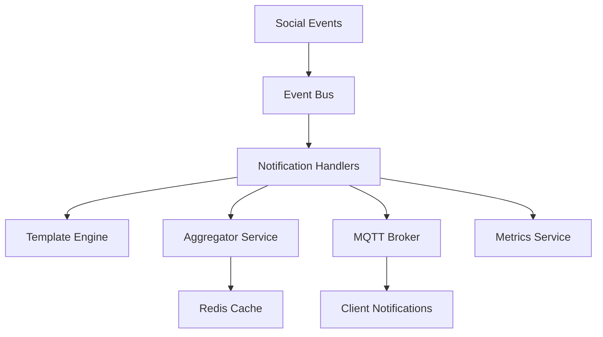

# Sprint 011: Social Notification System Implementation

## Sprint Information

**Goal**: Implement core notification features to enhance user engagement through real-time social interaction updates.

**Duration**: 2 weeks
**Story Points**: 19
**Team Velocity**: 20-25 points per sprint

## Business Value

- Increase user engagement through immediate feedback
- Improve user retention through social interaction awareness
- Enhance platform stickiness with real-time notifications
- Support viral growth through social proof

## Technical Design

### System Architecture Overview



### Common Components

1. **Core Interfaces and Types**:

```typescript
// Event interfaces
export interface Event {
  id: string;
  type: string;
  timestamp: Date;
  payload: unknown;
  metadata: EventMetadata;
}

export interface EventMetadata {
  userId: string;
  traceId: string;
  source: string;
  version: string;
}

// Notification interfaces
export interface Notification {
  id: string;
  type: NotificationType;
  userId: string;
  content: NotificationContent;
  metadata: NotificationMetadata;
  status: NotificationStatus;
  createdAt: Date;
  updatedAt: Date;
}

export interface NotificationContent {
  title: string;
  body: string;
  data: Record<string, unknown>;
  template: string;
  locale: string;
}

export interface NotificationMetadata {
  priority: NotificationPriority;
  ttl: number;
  groupKey?: string;
  deduplicationKey?: string;
}

// DTOs
export class CreateNotificationDto {
  @IsString()
  @IsNotEmpty()
  userId: string;

  @IsEnum(NotificationType)
  type: NotificationType;

  @ValidateNested()
  @Type(() => NotificationContentDto)
  content: NotificationContentDto;

  @ValidateNested()
  @Type(() => NotificationMetadataDto)
  metadata: NotificationMetadataDto;
}

export class NotificationPreferencesDto {
  @IsBoolean()
  enabled: boolean;

  @IsEnum(NotificationType, { each: true })
  enabledTypes: NotificationType[];

  @IsString()
  locale: string;

  @IsEnum(NotificationChannel, { each: true })
  channels: NotificationChannel[];
}
```

2. **Base Notification Handler**:

```typescript
@Injectable()
export abstract class BaseNotificationHandler<T extends Event> implements OnModuleInit {
  constructor(
    protected readonly logger: Logger,
    protected readonly templateEngine: NotificationTemplateEngine,
    protected readonly mqttService: MqttService,
    protected readonly redis: RedisService,
    protected readonly metrics: MetricsService,
    protected readonly userPreferences: UserPreferencesService,
  ) {
    this.logger.setContext(this.constructor.name);
  }

  @ValidateEvent()
  async process(event: T): Promise<void> {
    const timer = this.metrics.startTimer('notification_processing');
    const traceId = event.metadata.traceId;

    try {
      this.logger.debug(`Processing ${this.type} notification`, { traceId });

      // Check rate limits
      if (await this.isRateLimited(event)) {
        this.logger.warn(`Rate limit exceeded for ${this.type}`, { traceId });
        return;
      }

      // Check user preferences
      if (!await this.shouldNotifyUser(event)) {
        this.logger.debug(`Notification disabled for user`, { traceId });
        return;
      }

      // Generate notification
      const notification = await this.generateNotification(event);

      // Check for duplicates
      if (await this.isDuplicate(notification)) {
        this.logger.debug(`Duplicate notification detected`, { traceId });
        return;
      }

      // Store notification
      await this.storeNotification(notification);

      // Deliver notification
      await this.deliverNotification(notification);

      // Track metrics
      timer.end();
      this.metrics.incrementCounter('notifications_sent', { 
        type: this.type,
        status: 'success'
      });
    } catch (error) {
      this.metrics.incrementCounter('notifications_failed', { 
        type: this.type,
        error: error.name
      });
      await this.handleError(error, event);
    }
  }

  protected abstract generateNotification(event: T): Promise<Notification>;
  protected abstract get type(): NotificationType;

  protected async isRateLimited(event: T): Promise<boolean> {
    const key = `ratelimit:${this.type}:${event.metadata.userId}`;
    const limit = await this.getRateLimit();
    return this.redis.isRateLimited(key, limit);
  }

  protected async isDuplicate(notification: Notification): Promise<boolean> {
    if (!notification.metadata.deduplicationKey) return false;
    
    const key = `dedup:${notification.metadata.deduplicationKey}`;
    const ttl = notification.metadata.ttl || 3600;
    return this.redis.setNX(key, '1', ttl);
  }

  protected async storeNotification(notification: Notification): Promise<void> {
    await this.redis.hSet(
      `notifications:${notification.userId}`,
      notification.id,
      JSON.stringify(notification)
    );
  }

  protected async deliverNotification(notification: Notification): Promise<void> {
    const channels = await this.userPreferences.getNotificationChannels(
      notification.userId,
      notification.type
    );

    await Promise.all(
      channels.map(channel => this.deliverToChannel(notification, channel))
    );
  }

  protected async deliverToChannel(
    notification: Notification,
    channel: NotificationChannel
  ): Promise<void> {
    switch (channel) {
      case NotificationChannel.MQTT:
        await this.mqttService.publish(
          `notifications/${notification.userId}`,
          notification,
          { qos: 1 }
        );
        break;
      // Add other channels as needed
    }
  }

  protected async handleError(error: Error, event: T): Promise<void> {
    this.logger.error(
      `Failed to process ${this.type} notification`,
      error,
      { traceId: event.metadata.traceId }
    );

    // Store failed event for retry
    await this.redis.lPush(
      `notifications:failed:${this.type}`,
      JSON.stringify({ event, error: error.message })
    );
  }

  @OnModuleInit()
  async onModuleInit(): Promise<void> {
    // Register metrics
    this.metrics.registerCounter(`notifications_sent`, {
      help: `Total notifications sent by type`,
      labelNames: ['type', 'status']
    });

    this.metrics.registerCounter(`notifications_failed`, {
      help: `Total failed notifications by type`,
      labelNames: ['type', 'error']
    });

    this.metrics.registerHistogram(`notification_processing_duration`, {
      help: `Notification processing duration in seconds`,
      labelNames: ['type'],
      buckets: [0.1, 0.5, 1, 2, 5]
    });
  }
}
```

3. **Template Engine**:

```typescript
@Injectable()
export class NotificationTemplateEngine {
  private readonly cache: Map<string, CompiledTemplate>;
  private readonly defaultTTL = 3600; // 1 hour

  constructor(
    private readonly logger: Logger,
    private readonly redis: RedisService,
    private readonly i18n: I18nService,
    private readonly config: ConfigService,
    private readonly metrics: MetricsService,
  ) {
    this.logger.setContext(NotificationTemplateEngine.name);
    this.cache = new Map();
  }

  @Cacheable('notification:templates', { ttl: 3600 })
  async render(
    templateName: string,
    data: NotificationData,
    options: RenderOptions = {}
  ): Promise<string> {
    const timer = this.metrics.startTimer('template_rendering');

    try {
      const template = await this.getTemplate(
        templateName,
        data.locale || this.config.get('defaultLocale')
      );

      const rendered = await template.compile({
        ...data,
        i18n: this.i18n.getTranslations(data.locale),
        helpers: this.getTemplateHelpers()
      });

      timer.end();
      return rendered;
    } catch (error) {
      this.metrics.incrementCounter('template_errors', {
        template: templateName,
        error: error.name
      });
      throw new TemplateRenderingError(
        `Failed to render template ${templateName}`,
        error
      );
    }
  }

  private async getTemplate(
    name: string,
    locale: string
  ): Promise<CompiledTemplate> {
    const cacheKey = `template:${name}:${locale}`;
    
    // Check memory cache first
    let template = this.cache.get(cacheKey);
    if (template) return template;

    // Check Redis cache
    const cached = await this.redis.get(cacheKey);
    if (cached) {
      template = this.compileTemplate(JSON.parse(cached));
      this.cache.set(cacheKey, template);
      return template;
    }

    // Load and compile template
    template = await this.loadAndCompileTemplate(name, locale);
    
    // Cache in Redis and memory
    await this.redis.setEx(
      cacheKey,
      this.defaultTTL,
      JSON.stringify(template.source)
    );
    this.cache.set(cacheKey, template);

    return template;
  }

  private async loadAndCompileTemplate(
    name: string,
    locale: string
  ): Promise<CompiledTemplate> {
    const source = await this.loadTemplateSource(name, locale);
    return this.compileTemplate(source);
  }

  private getTemplateHelpers(): Record<string, Function> {
    return {
      formatDate: (date: Date, format?: string) => {
        return dayjs(date).format(format || 'YYYY-MM-DD HH:mm:ss');
      },
      truncate: (text: string, length: number) => {
        return text.length > length
          ? text.substring(0, length - 3) + '...'
          : text;
      },
      // Add more helpers as needed
    };
  }

  @OnModuleInit()
  async onModuleInit(): Promise<void> {
    // Register metrics
    this.metrics.registerHistogram('template_rendering_duration', {
      help: 'Template rendering duration in seconds',
      labelNames: ['template'],
      buckets: [0.01, 0.05, 0.1, 0.5, 1]
    });

    this.metrics.registerCounter('template_errors', {
      help: 'Template rendering errors',
      labelNames: ['template', 'error']
    });
  }
}
```

4. **MQTT Service**:

```typescript
@Injectable()
export class MqttService implements OnModuleInit, OnModuleDestroy {
  private client: mqtt.Client;
  private readonly subscriptions = new Map<string, Function[]>();
  private readonly reconnectDelay = 1000;
  private readonly maxReconnectAttempts = 10;

  constructor(
    private readonly logger: Logger,
    private readonly config: ConfigService,
    private readonly metrics: MetricsService,
  ) {
    this.logger.setContext(MqttService.name);
  }

  async publish(
    topic: string,
    message: unknown,
    options: mqtt.IClientPublishOptions = {}
  ): Promise<void> {
    const timer = this.metrics.startTimer('mqtt_publish');

    try {
      const payload = typeof message === 'string'
        ? message
        : JSON.stringify(message);

      await new Promise<void>((resolve, reject) => {
        this.client.publish(
          topic,
          payload,
          { qos: 1, ...options },
          (error) => {
            if (error) {
              reject(error);
              return;
            }
            resolve();
          }
        );
      });

      timer.end();
      this.metrics.incrementCounter('mqtt_messages_published', { topic });
    } catch (error) {
      this.metrics.incrementCounter('mqtt_publish_errors', {
        topic,
        error: error.name
      });
      throw new MqttPublishError(
        `Failed to publish message to ${topic}`,
        error
      );
    }
  }

  async batchPublish(
    messages: { topic: string; payload: unknown }[],
    options: mqtt.IClientPublishOptions = {}
  ): Promise<void> {
    const timer = this.metrics.startTimer('mqtt_batch_publish');

    try {
      await Promise.all(
        messages.map(msg => this.publish(msg.topic, msg.payload, options))
      );

      timer.end();
      this.metrics.incrementCounter('mqtt_batch_messages_published', {
        count: messages.length.toString()
      });
    } catch (error) {
      this.metrics.incrementCounter('mqtt_batch_publish_errors', {
        error: error.name
      });
      throw new MqttBatchPublishError(
        `Failed to publish batch messages`,
        error
      );
    }
  }

  @OnModuleInit()
  async onModuleInit(): Promise<void> {
    await this.connect();

    // Register metrics
    this.metrics.registerHistogram('mqtt_publish_duration', {
      help: 'MQTT message publish duration in seconds',
      labelNames: ['topic'],
      buckets: [0.01, 0.05, 0.1, 0.5, 1]
    });

    this.metrics.registerCounter('mqtt_messages_published', {
      help: 'Total MQTT messages published',
      labelNames: ['topic']
    });

    this.metrics.registerCounter('mqtt_publish_errors', {
      help: 'MQTT publish errors',
      labelNames: ['topic', 'error']
    });
  }

  @OnModuleDestroy()
  async onModuleDestroy(): Promise<void> {
    await this.disconnect();
  }

  private async connect(): Promise<void> {
    const config = this.config.get('mqtt');

    this.client = mqtt.connect(config.url, {
      ...config.options,
      reconnectPeriod: this.reconnectDelay,
      connectTimeout: 5000,
    });

    this.client.on('connect', () => {
      this.logger.log('Connected to MQTT broker');
      this.metrics.incrementCounter('mqtt_connections');
    });

    this.client.on('error', (error) => {
      this.logger.error('MQTT client error', error);
      this.metrics.incrementCounter('mqtt_errors', {
        type: error.name
      });
    });

    this.client.on('offline', () => {
      this.logger.warn('MQTT client offline');
      this.metrics.incrementCounter('mqtt_disconnections');
    });

    await new Promise<void>((resolve, reject) => {
      this.client.once('connect', resolve);
      this.client.once('error', reject);
    });
  }

  private async disconnect(): Promise<void> {
    if (!this.client) return;

    await new Promise<void>((resolve) => {
      this.client.end(true, {}, () => resolve());
    });
  }
}
```

These common components provide a robust foundation for the notification system with:

- Type-safe event handling
- Efficient template rendering with caching
- Reliable MQTT message delivery
- Comprehensive error handling
- Detailed metrics and monitoring
- Rate limiting and deduplication
- Multi-channel delivery support
- Internationalization support
- Performance optimization

## Tasks

### NOT-003.2: Like Notification Implementation

**Metadata**:
  Type: Feature
  Component: Backend
  Priority: High
  Risk Level: Medium
  Story Points: 3
  Sprint: 011
  Change Type: New Feature

**Time Tracking**:
  Estimated Hours: 12
  Start Date: TBD
  Due Date: TBD

**Integration Analysis**:
  Integration Type: New Feature
  Affected Systems:
    - Like Service
    - Notification Service
    - MQTT Broker
    - Redis Cache
  Current Implementation:
    - Like system with distributed locking
    - Event system with type safety
    - Basic notification infrastructure
  Integration Points:
    - Like event handlers
    - Notification templates
    - MQTT channels
    - User preferences
  Breaking Changes: None

**Quick Start**:
  Similar Feature: src/social/notifications/comment
  Example Test: src/notification/tests/like-notification.spec.ts
  Key Files:
    - src/social/events/like-events.ts
    - src/notification/handlers/like-notification.handler.ts
    - src/notification/templates/like-notification.template.ts
  Setup Steps:
    1. Review like event system
    2. Set up notification templates
    3. Configure MQTT channels

**Pre-Implementation Checklist**:
  Code Analysis:
    - [ ] Review like event structure
    - [ ] Analyze notification templates
    - [ ] Plan MQTT topics
    - [ ] Design aggregation logic
  Design Review:
    - [ ] Template structure
    - [ ] Performance impact
    - [ ] Scaling strategy
    - [ ] Error handling
  Integration Planning:
    - [ ] Event flow mapping
    - [ ] Template system
    - [ ] MQTT configuration
    - [ ] Redis caching

**Technical Design**:

1. **Like Event Handler**:

```typescript
@Injectable()
export class LikeNotificationHandler extends BaseNotificationHandler<LikeCreatedEvent> {
  constructor(
    templateEngine: NotificationTemplateEngine,
    mqttService: MqttService,
    redis: RedisService,
    metrics: MetricsService,
    private readonly aggregator: NotificationAggregator,
  ) {
    super(templateEngine, mqttService, redis, metrics);
  }

  protected get type(): string {
    return 'like';
  }

  protected async generateNotification(event: LikeCreatedEvent): Promise<Notification> {
    // Aggregate likes within time window
    const aggregatedLikes = await this.aggregator.aggregateLikes({
      targetUserId: event.targetUserId,
      contentId: event.contentId,
      timeWindow: 5 * 60 * 1000 // 5 minutes
    });

    // Generate notification content
    return this.templateEngine.render('like.notification', {
      ...aggregatedLikes,
      locale: await this.getUserLocale(event.targetUserId)
    });
  }
}
```

2. **Like Aggregator Service**:

```typescript
@Injectable()
export class NotificationAggregator {
  constructor(
    private readonly redis: RedisService,
    private readonly metrics: MetricsService,
  ) {}

  async aggregateLikes(params: AggregationParams): Promise<AggregatedLikes> {
    const key = `likes:${params.contentId}:${params.timeWindow}`;
    
    // Use Redis Sorted Set for time-based aggregation
    const recentLikes = await this.redis.zrangebyscore(
      key,
      Date.now() - params.timeWindow,
      Date.now()
    );

    return this.processLikes(recentLikes);
  }

  private async processLikes(likes: RawLike[]): Promise<AggregatedLikes> {
    // Group likes by user type (friend, follower, other)
    const grouped = await this.groupByUserType(likes);
    
    return {
      totalCount: likes.length,
      friendLikes: grouped.friends,
      followerLikes: grouped.followers,
      otherLikes: grouped.others,
      sample: await this.getSampleUsers(grouped)
    };
  }
}
```

**Technical Notes**:

- Use Redis for notification caching
- Implement proper error handling
- Add comprehensive monitoring
- Follow security best practices
- Consider mobile optimization
- Plan for high volume

### NOT-003.3: Comment Notification Implementation

**Metadata**:
  Type: Feature
  Component: Backend
  Priority: High
  Risk Level: Medium
  Story Points: 3
  Sprint: 011
  Change Type: New Feature

**Time Tracking**:
  Estimated Hours: 12
  Start Date: TBD
  Due Date: TBD

**Integration Analysis**:
  Integration Type: New Feature
  Affected Systems:
    - Like Service
    - Notification Service
    - MQTT Broker
    - Redis Cache
  Current Implementation:
    - Like system with distributed locking
    - Event system with type safety
    - Basic notification infrastructure
  Integration Points:
    - Like event handlers
    - Notification templates
    - MQTT channels
    - User preferences
  Breaking Changes: None

**Quick Start**:
  Similar Feature: src/social/notifications/comment
  Example Test: src/notification/tests/like-notification.spec.ts
  Key Files:
    - src/social/events/like-events.ts
    - src/notification/handlers/like-notification.handler.ts
    - src/notification/templates/like-notification.template.ts
  Setup Steps:
    1. Review like event system
    2. Set up notification templates
    3. Configure MQTT channels

**Pre-Implementation Checklist**:
  Code Analysis:
    - [ ] Review like event structure
    - [ ] Analyze notification templates
    - [ ] Plan MQTT topics
    - [ ] Design aggregation logic
  Design Review:
    - [ ] Template structure
    - [ ] Performance impact
    - [ ] Scaling strategy
    - [ ] Error handling
  Integration Planning:
    - [ ] Event flow mapping
    - [ ] Template system
    - [ ] MQTT configuration
    - [ ] Redis caching

**Technical Design**:

1. **Comment Content Processor**:

```typescript
@Injectable()
export class CommentContentProcessor {
  constructor(
    private readonly markdownService: MarkdownService,
    private readonly mentionService: MentionService,
  ) {}

  async processComment(comment: string): Promise<ProcessedComment> {
    // Extract mentions
    const mentions = await this.mentionService.extractMentions(comment);
    
    // Process markdown
    const plainText = await this.markdownService.toPlainText(comment);
    
    // Generate preview
    const preview = this.generatePreview(plainText);
    
    return {
      originalContent: comment,
      plainText,
      preview,
      mentions,
      hasMore: plainText.length > preview.length
    };
  }
}
```

2. **Comment Notification Handler**:

```typescript
@Injectable()
export class CommentNotificationHandler extends BaseNotificationHandler<CommentCreatedEvent> {
  constructor(
    templateEngine: NotificationTemplateEngine,
    mqttService: MqttService,
    redis: RedisService,
    metrics: MetricsService,
    private readonly contentProcessor: CommentContentProcessor,
  ) {
    super(templateEngine, mqttService, redis, metrics);
  }

  protected get type(): string {
    return 'comment';
  }

  protected async generateNotification(event: CommentCreatedEvent): Promise<Notification> {
    // Process comment content
    const processedComment = await this.contentProcessor.processComment(event.content);

    // Handle mentions separately
    if (processedComment.mentions.length > 0) {
      await this.handleMentions(processedComment.mentions, event);
    }

    return this.templateEngine.render('comment.notification', {
      author: event.authorId,
      comment: processedComment,
      postId: event.postId,
      timestamp: event.timestamp
    });
  }
}
```

**Technical Notes**:

- Use Redis for notification caching
- Implement proper error handling
- Add comprehensive monitoring
- Follow security best practices
- Consider mobile optimization
- Plan for high volume

### NOT-003.4: Follower Content Notification Implementation

**Metadata**:
  Type: Feature
  Component: Backend
  Priority: High
  Risk Level: Medium
  Story Points: 5
  Sprint: 011
  Change Type: New Feature

**Time Tracking**:
  Estimated Hours: 12
  Start Date: TBD
  Due Date: TBD

**Integration Analysis**:
  Integration Type: New Feature
  Affected Systems:
    - Like Service
    - Notification Service
    - MQTT Broker
    - Redis Cache
  Current Implementation:
    - Like system with distributed locking
    - Event system with type safety
    - Basic notification infrastructure
  Integration Points:
    - Like event handlers
    - Notification templates
    - MQTT channels
    - User preferences
  Breaking Changes: None

**Quick Start**:
  Similar Feature: src/social/notifications/comment
  Example Test: src/notification/tests/like-notification.spec.ts
  Key Files:
    - src/social/events/like-events.ts
    - src/notification/handlers/like-notification.handler.ts
    - src/notification/templates/like-notification.template.ts
  Setup Steps:
    1. Review like event system
    2. Set up notification templates
    3. Configure MQTT channels

**Pre-Implementation Checklist**:
  Code Analysis:
    - [ ] Review like event structure
    - [ ] Analyze notification templates
    - [ ] Plan MQTT topics
    - [ ] Design aggregation logic
  Design Review:
    - [ ] Template structure
    - [ ] Performance impact
    - [ ] Scaling strategy
    - [ ] Error handling
  Integration Planning:
    - [ ] Event flow mapping
    - [ ] Template system
    - [ ] MQTT configuration
    - [ ] Redis caching

**Technical Design**:

1. **Follower Batch Processor**:

```typescript
@Injectable()
export class FollowerBatchProcessor {
  private readonly BATCH_SIZE = 1000;
  private readonly CONCURRENT_BATCHES = 5;

  constructor(
    private readonly followerService: FollowerService,
    private readonly redis: RedisService,
    private readonly bull: Queue,
  ) {}

  async processNewContent(content: NewContentEvent): Promise<void> {
    // Get follower count
    const followerCount = await this.followerService.getFollowerCount(content.authorId);
    
    // If small number of followers, process directly
    if (followerCount < this.BATCH_SIZE) {
      await this.processFollowerBatch(content, 0, followerCount);
      return;
    }

    // For large follower counts, create batched jobs
    const batches = Math.ceil(followerCount / this.BATCH_SIZE);
    
    for (let i = 0; i < batches; i++) {
      await this.bull.add('process_follower_batch', {
        content,
        batchIndex: i,
        batchSize: this.BATCH_SIZE
      }, {
        priority: i === 0 ? 'high' : 'low',
        attempts: 3,
        backoff: {
          type: 'exponential',
          delay: 1000
        }
      });
    }
  }
}
```

2. **Follower Notification Worker**:

```typescript
@Processor('follower_notifications')
export class FollowerNotificationWorker {
  constructor(
    private readonly followerService: FollowerService,
    private readonly templateEngine: NotificationTemplateEngine,
    private readonly mqttService: MqttService,
    private readonly metrics: MetricsService,
  ) {}

  @Process('process_follower_batch')
  async processBatch(job: Job<FollowerBatchData>): Promise<void> {
    const { content, batchIndex, batchSize } = job.data;
    
    // Get followers for this batch
    const followers = await this.followerService.getFollowersBatch(
      content.authorId,
      batchIndex * batchSize,
      batchSize
    );

    // Process each follower
    const notifications = await Promise.all(
      followers.map(async (follower) => {
        if (!await this.shouldNotifyFollower(follower, content)) {
          return null;
        }

        return {
          topic: `notifications/${follower.id}`,
          payload: await this.templateEngine.render(
            'new_content.notification',
            {
              content,
              follower,
              locale: follower.locale
            }
          )
        };
      })
    );

    // Batch publish to MQTT
    await this.mqttService.batchPublish(
      notifications.filter(Boolean),
      { qos: 1 }
    );
  }
}
```

**Technical Notes**:

- Use Redis for notification caching
- Implement proper error handling
- Add comprehensive monitoring
- Follow security best practices
- Consider mobile optimization
- Plan for high volume

### EVT-001.1: Event Type System Enhancement

**Metadata**:
  Type: Enhancement
  Component: Backend
  Priority: High
  Risk Level: Medium
  Story Points: 5
  Sprint: 011
  Change Type: Enhancement

**Technical Design**:

1. **Event Type Registry**:

```typescript
@Injectable()
export class EventTypeRegistry {
  private readonly registry = new Map<string, EventSchema>();

  @PostConstruct()
  initialize() {
    // Register core event types
    this.registerEventType('social.like.created', LikeCreatedEventSchema);
    this.registerEventType('social.comment.created', CommentCreatedEventSchema);
    this.registerEventType('social.content.created', ContentCreatedEventSchema);
  }

  registerEventType(eventName: string, schema: ZodSchema): void {
    if (this.registry.has(eventName)) {
      throw new Error(`Event type ${eventName} already registered`);
    }
    this.registry.set(eventName, schema);
  }

  validateEvent(eventName: string, payload: unknown): void {
    const schema = this.registry.get(eventName);
    if (!schema) {
      throw new Error(`Unknown event type: ${eventName}`);
    }
    schema.parse(payload);
  }
}
```

2. **Event Validation Decorator**:

```typescript
export function ValidateEvent() {
  return function (
    target: any,
    propertyKey: string,
    descriptor: PropertyDescriptor
  ) {
    const originalMethod = descriptor.value;

    descriptor.value = async function (...args: any[]) {
      const event = args[0];
      const eventRegistry = Container.get(EventTypeRegistry);

      try {
        eventRegistry.validateEvent(event.type, event.payload);
      } catch (error) {
        throw new EventValidationError(error.message);
      }

      return originalMethod.apply(this, args);
    };

    return descriptor;
  };
}
```

## Implementation Strategy

1. **Phase 1: Core Infrastructure (Week 1)**
   - Set up base notification handler
   - Implement template engine
   - Configure MQTT broker
   - Set up monitoring

2. **Phase 2: Feature Implementation (Week 1-2)**
   - Implement like notifications
   - Add comment notifications
   - Create follower notifications
   - Enhance event system

3. **Phase 3: Testing & Optimization (Week 2)**
   - Unit testing
   - Integration testing
   - Performance testing
   - Documentation

## Testing Strategy

1. **Unit Tests**:
   - Test each handler in isolation
   - Verify template rendering
   - Test aggregation logic
   - Validate event handling

2. **Integration Tests**:
   - Test end-to-end notification flow
   - Verify MQTT delivery
   - Test batch processing
   - Validate error handling

3. **Performance Tests**:
   - Measure notification latency
   - Test under high load
   - Verify batch processing
   - Monitor resource usage

## Monitoring Strategy

1. **Key Metrics**:
   - Notification delivery time
   - Template rendering time
   - Queue length
   - Error rates
   - Resource usage

2. **Alerts**:
   - Delivery delays > 5s
   - Error rates > 1%
   - Queue backup
   - Resource exhaustion

## Rollout Strategy

1. **Stage 1: Infrastructure**
   - Deploy base components
   - Configure monitoring
   - Verify connectivity

2. **Stage 2: Features**
   - Roll out like notifications
   - Add comment notifications
   - Enable follower notifications
   - Monitor performance

3. **Stage 3: Optimization**
   - Tune performance
   - Adjust batch sizes
   - Optimize resource usage
   - Fine-tune alerts

## Quality Requirements

1. Performance:
   - Notification delivery < 1s
   - Event processing < 100ms
   - Template rendering < 50ms
   - Aggregation processing < 500ms

2. Reliability:
   - 99.9% delivery success rate
   - Proper error handling
   - Automatic retry mechanism
   - Dead letter queue

3. Scalability:
   - Handle 1000 notifications/second
   - Support 100k concurrent users
   - Efficient resource usage
   - Horizontal scaling ready

## Monitoring Requirements

1. Metrics:
   - Notification delivery time
   - Success/failure rates
   - Template rendering time
   - Queue lengths

2. Alerts:
   - Delivery delays > 5s
   - Error rates > 1%
   - Queue backup
   - Resource usage

## Documentation Requirements

1. Technical:
   - Architecture diagrams
   - Event flow documentation
   - API specifications
   - Performance guidelines

2. Operational:
   - Deployment guide
   - Monitoring guide
   - Troubleshooting guide
   - Recovery procedures
